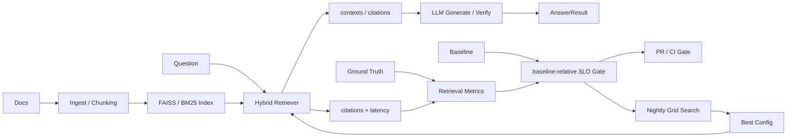
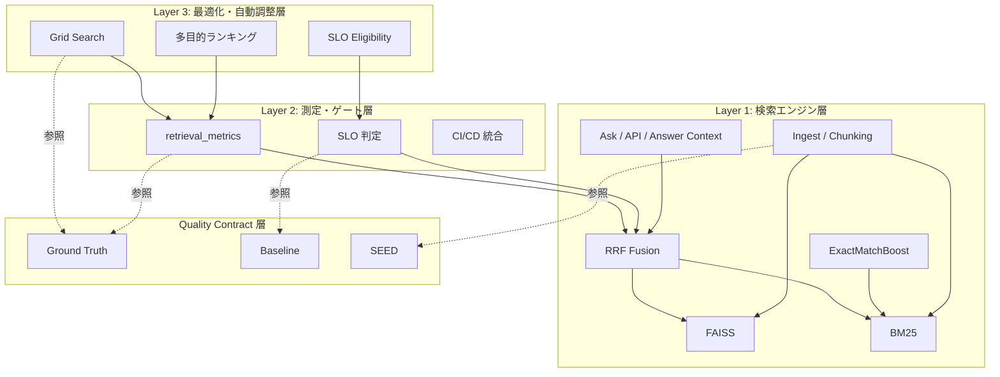
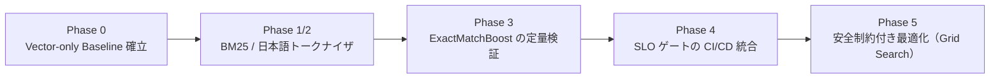
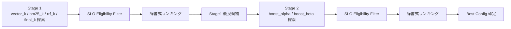

# Retrieval品質管理システム（Retrieval Quality Management）

> 仕様書QA向けRAGにおけるRetrieval品質管理の運用基盤

## 関連プロジェクトと設計上の位置づけ

本リポジトリは、生成AIを業務システムへ安全に導入するための
「品質保証・動的制御・運用統治」からなる3層アーキテクチャのうち、
**品質保証レイヤー** を担います。

| プロジェクト | 主な責務 |
|---|---|
| **本リポジトリ（Retrieval品質管理システム）** | **品質保証** |
| [Agentic RAG with Control Plane](https://github.com/mlprototype/ai-agent-rag) | 動的制御 |
| [Policy-Aware Multi-LLM Gateway](https://github.com/mlprototype/policy-aware-llm-gateway) | 運用統治 |

## 解決する課題

- Retrieval 改善のたびに品質が揺れる問題
- 「それっぽく良くなった」に依存した主観的な判断
- 変更前後を同じ条件で比較できない問題
- 検索劣化を見逃したまま CI/CD を通してしまう問題
- Retrieval の問題と LLM 生成の問題が混同される問題

本システムは、Retrieval 評価を LLM 回答評価から分離し、検索品質そのものを機械的に測定できるようにします。  
その結果、品質回帰防止、比較可能性、安全制約付き最適化を一つの運用ループとして扱えます。

## システム概要

RAG の改善は、チャンク設計、BM25 設定、ハイブリッド検索の重み付けを少し変えるだけでも品質が動きます。  
一方で、評価が属人的だと「良くなったのか」「安全に悪化していないか」を継続的に判断できません。

このプロジェクトは、Retrieval を固定条件で評価できる ground truth と baseline を持ち、Recall@K、MRR、FailureRate、Latency を用いて検索品質を継続管理します。  
そのうえで、SLO を満たす変更だけを CI で通し、SLO 制約の中で Grid Search により改善候補を探索できるようにしています。

## 想定ユースケース

#### 仕様書・社内文書QAにおけるRAG検索品質の継続的な管理

社内の仕様書、業務マニュアル、FAQ、設計書などを対象にしたRAG型QAシステムを運用するケースを想定。

RAGアプリケーションでは、回答品質の前段にあるRetrieval品質が重要になる。  
しかし、Embeddingモデル、Chunk分割、検索パラメータ、ランキングロジックを変更した際に、検索精度が改善したのか、劣化したのかを人手で判断するのは難しい。

このシステムでは、Ground Truthを用いた評価データと、Recall@K / MRR / SLOによる定量評価により、RAG検索品質を継続的に測定・比較・管理する。

## アーキテクチャ

このシステムは、RAG の回答生成そのものよりも、Retrieval 品質を継続的に測定・比較・最適化するための品質管理ループを中心に設計しています。

### データフロー

入力文書は index 化され、質問に対して Hybrid Retriever が contexts / citations を返します。  
通常の質問応答では contexts が LLM 生成・検証へ進み、品質管理では citations と latency が Ground Truth / Baseline と照合され、SLO Gate、CI、Grid Search へ流れます。



### 責務分離

上の図は実行時と評価時のデータフローを示しています。実装上は、検索、測定、最適化、評価条件の固定を次のように分離しています。



各層の責務と主な実装要素は次の通りです。

| 層 | 責務 | 主な実装要素 |
|:---|:---|:---|
| Layer 1 | 文書を index 化し、Hybrid Retrieval と回答コンテキスト生成を行う | `src/ragqa/ingest.py`、`src/ragqa/hybrid_retriever.py`、`src/ragqa/bm25_store.py`、`src/ragqa/service.py` |
| Layer 2 | citations と latency を測定し、指標化してゲート判定する | `src/ragqa/retrieval_metrics.py`、`scripts/run_phase4_retrieval_eval.py`、`.github/workflows/ragqa-quality-gate.yml` |
| Layer 3 | SLO 制約下で候補を探索し、最良設定を決める | `scripts/run_phase5_grid_search.py`、`ranking_key()`、`is_eligible()` |
| Quality Contract | 比較条件を固定し、実験と評価の不変式を与える | `data/eval/ground_truth*.json`、`data/eval/phase0_vector_baseline*.json`、`SEED=20260223` |

Layer 1 には検索エンジン層を直接利用する CLI / API エンドポイント向けの回答コンテキスト生成も含めています。  
Layer 2 は意図的に Layer 1 の内部アルゴリズムを知りません。`compute_retrieval_metrics()` が受け取るのは `id`、`citations`、`latency_ms` を持つ details リストであり、FAISS、BM25、RRF の実装詳細には依存しないため、検索アルゴリズムの変更と品質判定の基準を疎結合に保てます。

## 設計思想

このシステムの設計思想は、比較可能性と監査可能性を優先することにあります。主要な設計判断は次の 4 点です。

#### 1. Retrieval評価とLLM評価の完全分離（関心事の分離）
* **アプローチ**: `expected_sources` による検索エンジン性能（インフラ層）の機械評価と、`expected_verdict / assertion` による回答品質（アプリケーション層）のLLM評価を明確に分離。
* **トレードオフ**: 検索品質のデグレードと、最終的なLLM応答品質との間の定性的な因果関係の切り分けは、上位レイヤーのベンチマーク環境に委ねる設計を選択。

#### 2. 3層構造 × Quality Contract による疎結合設計（非依存性の担保）
* **アプローチ**: 測定レイヤーは `citations`（参照ソース）と `latency`（応答速度）のメタデータのみを監視して合否を判定。背後の検索アルゴリズムやハイパーパラメータの具体的実装を直接参照しない設計。
* **トレードオフ**: レイヤー間の結合度を極限まで下げる引き換えとして、層間契約（Interface）の定義および管理コストを許容。

#### 3. 監査証跡を重視した決定論的 Grid Search の採用（再現性の担保）
* **アプローチ**: ベイズ最適化（Bayesian Optimization）などの確率的探索をあえて避け、設定した全探索点を決定論的に評価。CI/CDプロセスにおいて、いつ、どのパラメータで、なぜそのスコアが出たかの完全な監査証跡（Audit Trail）を保持。
* **トレードオフ**: 過去の履歴に依存する適応型探索（履歴依存探索）と比較し、パラメータ空間の探索における計算効率（時間・コスト）の劣後を許容。

#### 4. baseline-relative SLO による品質ラチェット機構（継続的向上の自動化）
* **アプローチ**: 絶対値による閾値管理ではなく、過去の最良スコア（Baseline）の更新に追随して自動的に合格基準が引き上がる「品質ラチェット機構」を導入。
* **トレードオフ**: システム性能向上に伴うSLOの自動厳格化と引き換えに、意図的なベースライン更新・リセット時における明確な運用フロー（ガバナンス）の追加を許容。


## 技術スタック

| カテゴリ | 技術 | 概要 / 役割 |
|:---|:---|:---|
| **言語** | Python | システム開発、評価スクリプトの実装 |
| **検索ライブラリ** | FAISS (`faiss-cpu`) | 密ベクトル検索（Layer 1） |
| **日本語解析** | `fugashi`, `unidic-lite` | 日本語トークナイザーの実装（Layer 1） |
| **モデル・埋め込み** | `sentence-transformers` | テキストのベクトル埋め込み（Layer 1） |
| **LLM統合** | OpenAI API (`openai`) | 回答品質の評価（Layer 2 / evaluate.py） |
| **Webフレームワーク** | FastAPI, Uvicorn | APIサーバーの提供 |
| **テスト・評価** | pytest | 検索ロジックおよび評価ロジックのテスト |
| **トラッキング** | LangSmith (`langsmith`) | 評価結果・トレースの可視化 |

## Phase 進化

このシステムの Phase は、機能追加の履歴というより、比較の信頼性を段階的に強化してきた履歴です。



| Phase | 目的 | 主要成果物 |
|:---|:---|:---|
| Phase 0 | 比較の起点となる Vector-only baseline を固定する | `scripts/run_phase0_expanded_baseline.py`、`data/eval/phase0_vector_baseline_expanded.json`、`data/eval/ground_truth_phase0_expanded.json` |
| Phase 1/2 | スパース検索と日本語トークナイズを加え、比較対象の検索基盤を増やす | `src/ragqa/bm25_store.py`、`src/ragqa/tokenizer_ja.py`、`tests/test_bm25.py`、`tests/test_tokenizer.py` |
| Phase 3 | exact match boost が Recall@5 に効くかを定量で確認する | `scripts/run_phase3_boost_verification.py`、`data/eval/phase3_boost_verification.json` |
| Phase 4 | baseline-relative SLO を CI/CD に接続し、回帰を自動停止する | `scripts/run_phase4_retrieval_eval.py`、`.github/workflows/ragqa-quality-gate.yml` |
| Phase 5 | SLO を守ったまま探索空間を走査し、最良設定を選ぶ | `scripts/run_phase5_grid_search.py`、`.github/workflows/phase5-grid-search.yml`、`data/eval/phase5_best_config.json` |

## 品質統治機構

### Quality Contract（不変式の管理）

Quality Contract は、評価条件を固定して比較可能性を守るための不変式です。

| 要素 | 役割 | 実装上の根拠 |
|:---|:---|:---|
| Ground Truth | 何を正解とみなすかを固定する | `data/eval/ground_truth.json`、`data/eval/ground_truth_phase0_expanded.json` |
| Baseline | どの水準から改善・劣化を判定するかを固定する | `data/eval/phase0_vector_baseline.json`、`data/eval/phase0_vector_baseline_expanded.json` |
| SEED | コーパス生成と baseline 再生成の入力条件を固定する | `scripts/run_phase0_expanded_baseline.py` の `SEED = 20260223` |

### 品質ラチェット機構

Retrieval SLO は absolute 値ではなく baseline 比率で定義されます。`run_phase4_retrieval_eval.py` と `run_phase5_grid_search.py` は baseline の `recall_at_5`、`mrr`、`failure_rate` から下限・上限を再計算し、実装上は `RETRIEVAL_RECALL5_MIN_RATIO`、`RETRIEVAL_MRR_MIN_RATIO`、`RETRIEVAL_FAILURE_MAX_RATIO` で制御されます。baseline を更新すると次回以降の合格基準も自動で引き上がるため、品質を下げにくいラチェット構造になります。

### PR ゲート vs Nightly 探索の責務分離

| 観点 | PR ゲート | Nightly Grid Search |
|:---|:---|:---|
| トリガー | `pull_request`、`push`、`workflow_dispatch` | `schedule (0 2 * * *)`、`workflow_dispatch` |
| 責務 | 既存品質を破壊しない保守的チェック（unit-test → retrieval-gate → evaluate の3段直列によるフェイルファスト構成） | 新しい最良設定を探す積極的探索 |
| 性質 | 守り | 攻め |
| 計算コスト | 低〜中: 固定設定の評価と SLO 判定が中心 | 高: 複数 trial を走査し全候補を比較する |

### 3軸の再現性担保

| 軸 | 機構 | 保証すること |
|:---|:---|:---|
| データ再現性 | SEED 固定の決定論的コーパス生成 | 同じ seed なら同じ合成コーパスと baseline を再生成できる |
| 評価再現性 | Ground Truth / Baseline JSON のリポジトリ固定 | 比較条件を後から追跡でき、指標差分の根拠が残る |
| モデル再現性 | `TRANSFORMERS_OFFLINE` + `actions/cache` | CI で同じ埋め込みモデルを安定して再利用できる |

## 最適化の考え方

最適化は「とにかく指標を上げる」ではなく、「SLO を満たした範囲で改善する」方針です。現実装では `is_eligible()` が Recall@5、MRR、FailureRate の閾値を同時に満たす候補だけを通し、その後 `ranking_key()` で辞書式に順位付けします。

| 優先順 | 指標 | ソート方向 | 表明する価値判断 |
|:---:|:---|:---:|:---|
| 1 | Recall@5 | 降順 | 必要な情報を見つけられるかが最重要 |
| 2 | MRR | 降順 | できれば最初の1件で見つかってほしい |
| 3 | FailureRate | 昇順 | 取りこぼしは少ないほど良い |
| 4 | P95 Latency | 昇順 | ユーザー体験の劣化を抑える |
| 5 | Recall@1 | 降順 | 一発命中の精度 |
| 6 | trial_id | 昇順 | 同一指標なら早い試行を優先し、安定に決着させる |

この優先順位自体が、何を守り、何を後順位に置くかというシステムの価値判断を構造として表明しています。

探索は 2 段階です。



1. stage1:
   `vector_candidate_k`、`bm25_candidate_k`、`rrf_k`、`final_top_k` を探索する
2. stage2:
   stage1 の最良候補を固定し、`boost_alpha` と `boost_beta` を探索する

現実装が Bayesian Optimization ではなく Grid Search を採用している理由は、探索点が最初から明示され、全 trial が決定論的に評価され、結果が JSON / Markdown レポートとして完全な監査証跡に残るためです。履歴依存の探索より計算効率は劣る一方、再現性と説明可能性は高く保てます。
なお、これらの指標が真の品質を完全には代表しないという Goodhart's Law 的リスクを意識し、既知の制限にて4観点のリスクを管理対象として明示している。

## Quick Start

### セットアップ

```bash
python -m venv .venv
source .venv/bin/activate
pip install -r requirements.txt
```

### 最小の質問応答を試す

```bash
PYTHONPATH=src python -m ragqa.ingest
PYTHONPATH=src python -m ragqa.ask "この仕様の例外条件は？"
```

### Retrieval SLO ゲートを実行する

```bash
RAGQA_DOCS_DIR=data/phase0_expanded/docs \
PYTHONPATH=src \
python -m ragqa.ingest

RAGQA_DOCS_DIR=data/phase0_expanded/docs \
RETRIEVAL_GROUND_TRUTH_PATH=data/eval/ground_truth_phase0_expanded.json \
RETRIEVAL_BASELINE_PATH=data/eval/phase0_vector_baseline_expanded.json \
PYTHONPATH=src \
python scripts/run_phase4_retrieval_eval.py
```

### 回答品質評価を実行する

```bash
OPENAI_API_KEY=your_api_key \
PYTHONPATH=src \
python -m ragqa.evaluate
```

### Grid Search を実行する

```bash
RAGQA_DOCS_DIR=data/phase0_expanded/docs \
RETRIEVAL_GROUND_TRUTH_PATH=data/eval/ground_truth_phase0_expanded.json \
RETRIEVAL_BASELINE_PATH=data/eval/phase0_vector_baseline_expanded.json \
PYTHONPATH=src \
python scripts/run_phase5_grid_search.py --topn 10
```

## エントリーポイント

- `python -m ragqa.ingest`
  文書を ingest して vector / BM25 index と manifest を生成する
- `python -m ragqa.ask "<question>"`
  質問応答を実行し、sources・answer・verification を表示する
- `python -m ragqa.evaluate`
  回答品質評価を実行し、`data/eval/report.json` と `data/eval/trend.csv` を更新する
- `uvicorn ragqa.server:app --host 0.0.0.0 --port 8000`
  API サーバを起動する
- `python scripts/run_phase0_expanded_baseline.py`
  拡張コーパスの baseline を再生成する
- `python scripts/run_phase3_boost_verification.py`
  BM25 exact match boost の効果を検証する
- `python scripts/run_phase4_retrieval_eval.py`
  baseline-relative の Retrieval SLO ゲートを実行する
- `python scripts/run_phase5_grid_search.py --topn 10`
  2 段階 Grid Search を実行し、best config とレポートを出力する

## ディレクトリ構成

```text
spec-rag-qa/
├── .github/
│   └── workflows/
│       ├── phase5-grid-search.yml          # Phase 5: Grid Search用CI
│       └── ragqa-quality-gate.yml          # 品質ゲート（PRフック）
├── data/                                   # データディレクトリ
│   ├── docs/                               # インジェスト元ドキュメント
│   ├── eval/                               # 評価データ群 (Ground Truth / Baseline)
│   ├── index/                              # 構築済みインデックス (FAISS / BM25)
│   └── phase0_expanded/                    # Phase0拡張コーパス
├── docs/                                   # 設計ドキュメント類
├── scripts/                                # バッチスクリプト
│   ├── run_phase0_expanded_baseline.py     # ベースライン作成
│   ├── run_phase3_boost_verification.py    # BM25 Boost効果検証
│   ├── run_phase4_retrieval_eval.py        # 検索評価実行
│   └── run_phase5_grid_search.py           # グリッドサーチ実行
├── src/
│   ├── evaluator/                          # カスタム評価用ロジック
│   │   ├── evaluator.py
│   │   └── fail_detector.py
│   ├── ragqa/                              # コアパッケージ
│   │   ├── ask.py                          # 質問応答（CLI）
│   │   ├── bm25_store.py                   # BM25 実装
│   │   ├── chunking.py                     # チャンキング処理
│   │   ├── config.py                       # 設定ファイル
│   │   ├── embedder.py                     # 埋め込みモデル
│   │   ├── evaluate.py                     # 回答評価ロジック
│   │   ├── hybrid_retriever.py             # 検索ロジック (Vector + Keyword)
│   │   ├── improvement_catalog.py          # 改善カタログ
│   │   ├── ingest.py                       # 取り込みロジック
│   │   ├── llm.py                          # LLM呼び出し
│   │   ├── prompt.py                       # プロンプト管理
│   │   ├── retrieval_metrics.py            # Retrieval指標評価
│   │   ├── schemas.py                      # データ構造定義
│   │   ├── server.py                       # FastAPIサーバ
│   │   ├── service.py                      # サービスロジック
│   │   ├── tokenizer_ja.py                 # 日本語トークナイザ
│   │   ├── utils.py                        # ユーティリティ
│   │   └── vectorstore.py                  # ベクターストア (FAISS)
│   └── schemas/                            # スキーマ定義
│       ├── answer.py
│       └── evaluation.py
├── tests/                                  # テストコード
│   ├── fixtures/
│   ├── test_bm25.py
│   ├── test_chunking.py
│   ├── test_exact_match_boost_integration.py
│   ├── test_hybrid_retriever.py
│   ├── test_phase5_grid_search.py
│   ├── test_retrieval_metrics.py
│   ├── test_tokenizer.py
│   └── test_utils.py
├── README.md                               # プロジェクト概要
└── requirements.txt                        # 依存ライブラリ
```

## Agent評価

Phase 6の決定論的Agent評価は、20件の公開可能な合成ケースをFixture、保存Trace、Subprocess Adapterから同じ評価パイプラインへ入力します。APIキーなしの標準実行は、評価、集計、JSON／Markdown report、Baseline比較、品質Gateを一括して行います。

```bash
PYTHONPATH=src python scripts/run_agent_evaluation.py --runner fixture
```

保存Traceを再評価するときは `--runner trace-file`、実 `ai-agent-rag` を実行するときは `--runner subprocess --subprocess-command "python scripts/run_agent_trace.py" --subprocess-cwd ../ai-agent-rag` を指定します。標準reportはGit管理されない `.artifacts/agent-quality/report.json` と `report.md` です。Git管理する出力例は `data/agent_eval/reports/example.json` と `example.md` に分離しています。終了コードはGate合格が0、評価済みTraceの品質Gate不合格が1、事前検査またはRunnerの `execution_error` が2です。

Gateの閾値は [config/agent_quality_gate.yml](config/agent_quality_gate.yml) に集約しています。CriticalのTask Success／Format、Runner error、必須Tool、Tool schema、Citation Validityは絶対Gateであり、平均点による相殺を許しません。全体Task SuccessとRoute Accuracyはreview済みBaselineからの低下を許容せず、p95 latencyはBaselineの110%までを許容します。対象ケースがなく分母が0の指標は `N/A` のまま保持し、100%とは表示しません。

Baselineは通常実行で変更されません。評価契約とTraceをreviewしたうえで、次の明示操作を行った場合だけ `data/agent_eval/baseline/agent_baseline.json` を更新します。

```bash
PYTHONPATH=src python scripts/run_agent_evaluation.py \
  --runner fixture \
  --update-baseline
```

[Agent Quality Gate workflow](.github/workflows/agent-quality-gate.yml) のPR JobはFixtureと保存済みBaselineだけを使うため、外部APIキーを必要としません。実行前に `.artifacts/agent-quality/` を作り直し、JSON／Markdown reportと実行ログを成功・失敗にかかわらずartifactへ保存します。実Agent評価は `workflow_dispatch` の `run_real_agent` を明示的に有効化した場合だけ、`ai_agent_ref` で指定したbranch／tag／commitを別Jobで実行します。

合成Fixtureは契約回帰を決定論的に検出するためのもので、LLMの揺らぎ、実トラフィック比率、実ネットワークlatency、全Tool、認証・再試行、Citation内容の意味的支持を代表しません。本番判断では匿名化した実質問、実Trace、人手判定、障害注入、セキュリティ評価を追加してください。ケース一覧、Runner契約、事前検査、詳細な限界は [docs/agent_evaluation_dataset.md](docs/agent_evaluation_dataset.md) を参照してください。

### 高度評価（monitor-only）

Groundedness、repeat-run Stability、version付き価格表によるCostは、既存PR Gateから分離した高度評価CLIで実行します。APIキーなしのMock Judgeはschema、retry、集計、report経路の確認用です。

```bash
PYTHONPATH=src python scripts/run_agent_advanced_evaluation.py \
  --runner fixture \
  --judge mock
```

出力は `.artifacts/agent-advanced/report.json` と `report.md` です。GroundednessとAnswer Semantic Consistencyは独立Judgeを使い、Judge model／prompt version／実行日時を保存します。Tool Evidenceは明示的なdeterministic Structured Query factsだけを許可するdefault denyです。Costは [agent_pricing.json](config/agent_pricing.json) の `pricing_version` とmodel別token単価を記録し、usageまたは実model IDの欠損を `N/A` とします。Agentのtarget名をmodel名として価格付けしません。

外部JudgeはPRでは実行しません。手動 `Advanced Agent Monitoring` JobはGitHub Environment `agent-evaluation` の承認後だけ起動し、URL・model・許可hostをVariables、API keyをSecretから取得します。外部Judgeには質問、回答、Source snippet、許可されたTool factsが送信されるため、送信先とデータ取扱条件の承認が必要です。schema、計算式、信頼境界、HTTP契約、既知の限界は [Phase 6 高度Agent評価](docs/agent_advanced_evaluation.md) を参照してください。

## 既知の制限

現在の品質管理は有効ですが、Goodhart's Law を避けるには「測っている指標が真の品質を完全には代表しない」ことを明示しておく必要があります。以下の制約は、既知のリスクとして管理対象に含めるべきものです。

| リスク | 発生メカニズム | 緩和策 | 残存リスク |
|:---|:---|:---|:---|
| 評価セットへの過学習 | 25ケースへの適合最大化 | 8種のクエリタイプ混在 | 定量的カバレッジ保証なし |
| 評価指標の不完全さ | doc 粒度 hit 判定の楽観バイアス | `parse_source_ref()` の chunk 粒度対応 | chunk 粒度 ground truth 未整備 |
| 合成コーパスのギャップ | 人工文書が実仕様書の構造を再現しない | 意図的な曖昧語彙挿入 | 実コーパスとの相関未検証 |
| ベンチマーク陳腐化 | コーパス拡張時に ground truth が古い事実を期待 | Ground Truth 固定 | 自動更新メカニズムなし |

これらのリスクを README に明記すること自体が、指標運用の限界を認識したうえで品質統治を行う設計方針の表明でもあります。

## 今後の展望

- Chunk 単位 ground truth のアノテーション:
  `parse_source_ref()` はすでに `doc_id#chunk_id` を扱えるため、ground truth 側へ chunk_id を持ち込める
- Chunk 単位評価:
  chunk 粒度の正解を使い、chunking 戦略や boost 設定へ直接フィードバックできるようにする
- Embedding モデル比較:
  `Embedder(model_name)` と baseline script の `EMBEDDING_MODEL` を使い、埋め込みモデル差分を同一ベンチマークで比較する
- Latency-Budget 設計:
  いまは観測値とランキング項目に留まる `p95_latency_ms` を、`max_p95_latency_ms` のような SLO 制約へ昇格させる
- Pareto Frontier 最適化:
  辞書式ランキングは"最優先指標が最大な一点"しか選ばないため、trial レポートから支配されない試行集合を抽出し、設計者が明示的にトレードオフを選択できる設計資料として可視化する

## 用語集

- Quality Contract:
  Ground Truth、Baseline、SEED によって評価条件を固定し、比較可能性を守る枠組み。
- 品質ラチェット:
  baseline-relative SLO により、baseline 更新後の合格基準も自動で引き上がる構造。
- SLO Eligibility:
  Recall@5、MRR、FailureRate の閾値を全て満たした candidate だけを最適化対象に残す判定。
- ExactMatchBoost:
  識別子やエラーコードの完全一致を BM25 スコアへ加点する仕組み。
- RRF Fusion:
  vector search と BM25 search の順位情報を Reciprocal Rank Fusion で統合する方式。
- コーパスアライメント:
  ground truth が期待する `doc_id` と、index に載っている `doc_id` が一致していること。
