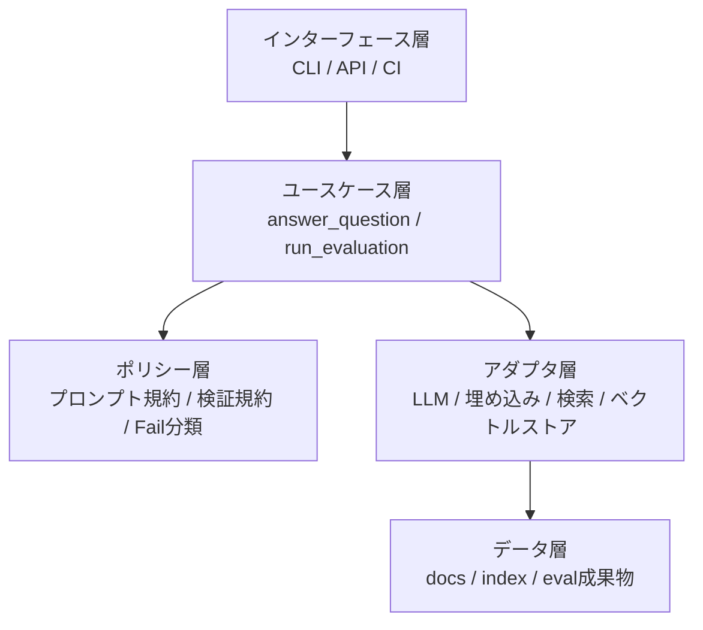
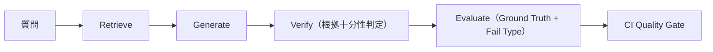

# Spec RAG QA

RAGアプリケーションの業務ロジックと、品質統治（Quality Governance）を分離した
拡張可能なLLMアプリ基盤です。

本プロジェクトは、単に「回答できる」だけでなく、
CI/CD上で「運用上信頼できる回答品質」を維持することを目的としています。

## 1. プロジェクト概要（何を解決するか）

多くのRAGシステムは、生成結果を人手でレビューする運用に留まりがちです。
本プロジェクトは、品質を継続的に制御するループを標準搭載します。

- 根拠付き回答
- 十分性検証（Verify）
- ポリシー駆動の評価（Evaluate）
- CIでの回帰ブロック（Gate）

これにより、LLM品質を主観評価から、工学的に制御可能なプロセスへ変換します。

## 2. 設計思想（品質と業務ロジックの分離）

中核の設計判断は、業務フローと品質フローを分離することです。

- 業務フロー: `Retrieve -> Generate`
- 品質フロー: `Verify -> Evaluate -> Gate`

この分離により、ドメイン要件の進化と品質ポリシーの進化を独立に進められます。

## 3. アーキテクチャ概要（依存方向と差し替え耐性）



依存方向は一方向に制御しています。

- Interface は Use Case に依存
- Use Case は Policy と Adapter に依存
- Adapter は外部システムに依存
- ドメイン判断はCLI/API/CI詳細に依存しない

これにより、LLM・Retriever・インフラ選択に対する高い差し替え耐性を確保します。

## 4. コアフロー（Retrieve -> Generate -> Verify -> Gate）



- `Retrieve`: メタデータ付きで関連チャンクを取得
- `Generate`: 引用制約付きで回答を生成
- `Verify`: 回答主張が根拠で支持されるか判定
- `Gate`: 品質回帰をCIで停止

## 5. テスト戦略（概要）

品質検証は層別で実行します。

- ロジック単体テスト（分類・判定ルール）
- パイプライン挙動テスト（ingest -> answer -> verify）
- ポリシーケース評価（評価用ケース群）
- CIゲート（`report.json` と閾値判定）

これにより、プロンプトやモデル変更時のサイレント劣化を抑えます。

## 6. 拡張性（LLM/VectorDB/Policy Pack差し替え）

本設計は密結合ではなく、交換可能性を前提にしています。

- LLM差し替え（OpenAI から他プロバイダへ）
- ベクトル基盤差し替え（FAISS から管理型Vector DBへ）
- Policy Pack差し替え（仕様QA、法務QA、サポートQAなど）

実運用上は、「共通品質フレームワーク + ドメイン別RAG」の再利用が可能になります。

## 7. 将来ビジョン（品質フレームワークとしての再利用）

将来的には、RAG/LLMアプリ向けの再利用可能な品質統治基盤へ発展させます。

- 標準化されたFail Taxonomy
- Policy Pack駆動の評価
- プロダクト横断の品質トレンド比較
- デリバリーパイプライン標準としてのQuality Gate

目標は、プロンプト改善の積み重ねではなく、
LLM品質を継続運用できる「品質OS」を提供することです。

## Quickstart

```bash
python -m venv .venv
source .venv/bin/activate
pip install -r requirements.txt

PYTHONPATH=src python -m ragqa.ingest
PYTHONPATH=src python -m ragqa.ask "この仕様の例外条件は？"
PYTHONPATH=src python -m ragqa.evaluate
```

## エントリーポイント

- CLI ask: `python -m ragqa.ask "<question>"`
- CLI ingest: `python -m ragqa.ingest`
- CLI evaluate: `python -m ragqa.evaluate`
- API server: `uvicorn ragqa.server:app --host 0.0.0.0 --port 8000`
