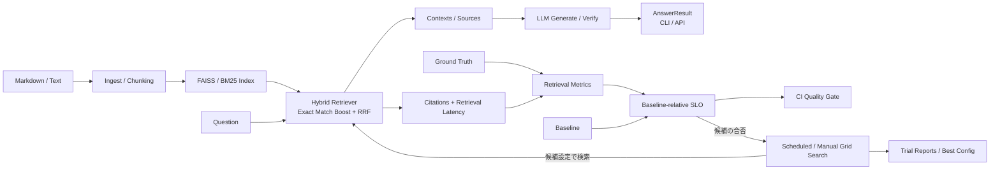

# 仕様書QA向けHybrid RAG・Retrieval品質管理（spec-rag-qa）

仕様書をHybrid Retrievalで検索し、参照元と検証結果を伴う回答を生成するPythonシステムです。**Retrieval品質をLLM回答評価から分離し、Ground Truth・Baseline・Metrics・CI Quality Gateで再現可能な評価として継続管理する**ことを中心に設計しています。

## Problem — 解決する課題

RAGは、Embedding、Chunking、検索候補数、ランキングを変えるだけで検索品質が動きます。回答の読みやすさだけで改善を判断すると、必要な根拠の取りこぼしや検索順位の悪化を見逃し、Retrievalの問題とLLM生成の問題を混同します。

このリポジトリは、検索変更を同じ評価条件で測定・比較し、許容範囲を超える回帰をCIで検出するために作りました。検索結果とケース別の指標を保存し、「どの質問で、どの根拠を取得できなかったか」を追えるようにします。

仕様書、設計書、業務マニュアルなどのQAを検証対象としています。

## What This System Does

- **文書の検索基盤**：Markdown／テキストをChunkに分割し、FAISSとBM25のindex、文書hashを含むmanifestを生成します。
- **Hybrid Retrieval**：ベクトル検索と日本語BM25検索をRRFで統合し、エラーコード・API名・識別子にはExact Match Boostを適用します。
- **仕様書QA**：取得した根拠をLLMへ渡し、回答とEvidence Checkを別々に返します。CLIとFastAPIから同じQA処理を利用できます。
- **独立したRetrieval評価**：LLMを呼ばず、Ground Truthに対するRecall@K、MRR、Failure Rate、Latencyを測定します。
- **Regression Detection**：保存済みBaselineからSLOを計算し、未達時に評価を異常終了させ、GitHub Actionsを失敗させます。
- **SLO制約下の探索**：2段階Grid Searchで検索設定を比較し、試行結果・選択された設定をJSON／Markdownに保存します。

## Architecture

QAの実行経路と品質評価の経路を分けています。検索エンジンは根拠を取得し、評価処理はその結果をGround Truthと照合します。Grid Searchは同じ測定・SLOを使って候補を選びます。


```mermaid
flowchart LR
  DOC["Markdown / Text"] --> ING["Ingest / Chunking"]
  ING --> IDX["FAISS / BM25 Index"]
  IDX --> RET["Hybrid Retriever<br/>Exact Match Boost + RRF"]
  Q["Question"] --> RET
  RET --> CTX["Contexts / Sources"]
  CTX --> LLM["LLM Generate / Verify"]
  LLM --> ANS["AnswerResult<br/>CLI / API"]

  RET --> OBS["Citations + Retrieval Latency"]
  GT["Ground Truth"] --> MET["Retrieval Metrics"]
  OBS --> MET
  MET --> SLO["Baseline-relative SLO"]
  BL["Baseline"] --> SLO
  SLO --> CI["CI Quality Gate"]
  GS["Scheduled / Manual Grid Search"] -->|候補設定で検索| RET
  SLO -->|候補の合否| GS
  GS --> REP["Trial Reports / Best Config"]
```

検索・測定・探索を分離する境界は、`id`、`citations`、`latency_ms` を持つ観測データです。測定関数はFAISSやBM25の内部実装を参照しません。

## Key Engineering Decisions

| Decision | Why | Trade-off |
|---|---|---|
| **Retrieval評価とLLM回答評価を分離** | 検索結果は `expected_sources` と機械的に照合し、回答は `expected_verdict`／`assertion` で別に判定する。検索missと生成・判定の揺らぎを切り分ける。 | Retrievalの改善だけでは最終回答の正しさを保証できず、回答評価も必要。 |
| **Quality Contractで比較条件を固定** | Ground Truth、Baseline、コーパス、生成SEEDを保存し、比較の前提を追跡する。 | ケースや基準を更新する際は比較条件を見直す必要があり、固定データは評価範囲を限定する。 |
| **列挙可能なGrid Searchと試行レポートを採用** | 探索候補と選択規則を明示し、試行別の設定・指標・SLO適合可否を保存する。候補を選んだ理由を後から検証できるようにする。 | 探索コストが増える。実測Latencyは変動するため、結果や選択候補の完全一致は保証しない。 |
| **Baseline-relative SLOで回帰を検出** | Recall@5、MRR、Failure Rateの3条件を同時に判定し、保存済み基準からの劣化をCIで検出する。 | Baselineや閾値の妥当性はレビューが必要。一定の劣化を許容し、評価ごとの最良値を自動でBaselineへ昇格させる仕組みはない。 |

## Evaluation / Quality Control

### Ground Truth・Baseline・比較条件

拡張Retrievalベンチマークは、**15文書の合成コーパスと25ケース**です。基本的な事実確認、言い換え、文書横断、曖昧な質問、誤誘導など8種の質問タイプを含みます。

- [Ground Truth](data/eval/ground_truth_phase0_expanded.json) は質問・正解ソース・回答判定条件を定義します。正解ソースがある20ケースをRetrieval精度の分母とし、残り5ケースはRecall／MRRの計算対象にしません。
- [Vector-only Baseline](data/eval/phase0_vector_baseline_expanded.json) は比較基準です。生成スクリプトの `SEED=20260223`、Embeddingモデル名、取得件数、ケース別結果も保存します。
- Retrieval評価前に、Ground Truthが期待する `doc_id` がindexに存在するかを検査します。コーパスと正解データの取り違えを、検索品質の劣化として扱わないためです。

**Quality Contract**は、この評価条件を固定して比較可能性を守る枠組みです。同じコーパス・Ground Truth・モデル・設定で比較し、条件を変えた実験はその差を明示する必要があります。

### 何を測定するか

| 指標 | この実装での定義・用途 |
|---|---|
| **Recall@K（K=1, 5）** | 上位K件に正解ソースが**1件以上**含まれるケースの割合。複数の正解ソースをすべて取得した割合ではありません。 |
| **MRR** | 最初の正解ソースの順位の逆数を平均。取得結果に正解がなければ、そのケースは0。 |
| **Failure Rate** | `1 − Recall@5`。上位5件で根拠を取得できなかった割合であり、APIのエラー率ではありません。 |
| **Latency** | Retrieval専用評価では、クエリのEmbeddingと検索を含む `retrieve()` の時間を測定し、p50／p95／平均を記録。モデル・indexの初期ロードやLLM生成時間は含みません。 |

現在の拡張Ground Truthは文書単位です。検索結果がChunk単位でも、期待する文書のいずれかに一致すればhitになります。Chunkを指定する参照形式にも測定関数は対応しますが、現データではChunk単位の正解位置を検証していません。

LLM回答評価は [ragqa.evaluate](src/ragqa/evaluate.py) が別に実行します。回答のVerdictとAssertionを判定し、失敗分類・担当領域・改善候補をJSONレポートとCSV履歴へ記録します。このレポートのLatencyはQA全体の処理時間なので、Retrieval専用評価のLatencyと区別します。

### SLO・CI Quality Gate

[Retrieval Gate](scripts/run_phase4_retrieval_eval.py) の既定閾値は次の通りです。3条件をすべて満たす必要があります。

| 条件 | 既定値 | 保存済みBaselineから算出した閾値 |
|---|---|---|
| Recall@5 | Baselineの90%以上 | `≥ 0.72` |
| MRR | Baselineの90%以上 | `≥ 0.40275` |
| Failure Rate | Baselineの120%以下 | `≤ 0.24` |

比率は環境変数で変更できます。Baselineが存在しない場合、Retrieval Gateは絶対閾値へfallbackします。Grid SearchはBaselineを必須とします。**RetrievalのLatencyは現在SLOの合否条件に含まれません。**

Baselineを明示的に更新すると次回の閾値も再計算されますが、通常のRetrieval評価やGrid SearchはBaselineを自動更新しません。SLOは設定した基準に対する回帰検出であり、毎回の改善を要求する条件ではありません。

| Workflow | 実行条件 | 品質管理上の役割 |
|---|---|---|
| [RAG Quality Gate](.github/workflows/ragqa-quality-gate.yml) | `main` 向けPR、`main` へのpush、手動 | Unit tests → 拡張コーパスのRetrieval Gate → LLM回答評価を直列実行。回答評価後のRetrieval monitorも実行し、レポートをartifactへ保存。 |
| [Grid Search](.github/workflows/phase5-grid-search.yml) | 日次schedule、手動 | SLOに適合する設定候補を探索し、試行レポート・Best Configをartifactへ保存。 |

検索変更による回帰は、Ground Truth・Baseline・SLOを組み合わせたCI失敗として検出します。PRのマージを必須チェックで制限するには、GitHub側のbranch protection／ruleset設定が別途必要です。

Retrieval GateはLLMを呼びません。一方、RAG Quality Gateの後段にある回答評価には `OPENAI_API_KEY` が必要です。両者の失敗は、検索側のSLO違反と回答側の判定失敗として分けて確認できます。

### 保存済みEvidenceとGrid Search

リポジトリに保存された同じ拡張ベンチマークの結果は次の通りです。今回の数値は保存済みartifactの値で、実行環境を揃えた再測定値ではありません。

| 保存済み結果 | Recall@1 | Recall@5 | MRR | Failure Rate |
|---|---:|---:|---:|---:|
| [Vector-only Baseline](data/eval/phase0_vector_baseline_expanded.json) | 0.30 | 0.80 | 0.4475 | 0.20 |
| [Hybrid Retrieval Gate](data/eval/phase4_hybrid_retrieval_report.json) | 0.60 | 0.90 | 0.7000 | 0.10 |
| [Grid Searchの選択候補](data/eval/phase5_best_config.json) | 0.60 | 0.90 | 0.6908 | 0.10 |

この評価セットでは、保存済みHybrid結果がVector-only Baselineより高いRecall@5／MRRを示しています。実コーパスでの改善や、全パラメータ空間の最適性を示すものではありません。

Grid Searchは、まず検索候補数・RRF・最終取得件数を探索し、次にその段階の最良候補を固定してBoost係数を探索します。SLO適合候補をRecall@5、MRR、Failure Rate、p95 Latencyなどの辞書式規則で順位付けします。

候補の列挙と選択規則は固定されていますが、同じ精度でも実測Latencyによって選択が変わり得ます。また、2段階の探索は全パラメータを同時に総当たりするものではありません。保存済み [探索レポート](data/eval/phase5_grid_search_report.json) は**Stage 1の2試行分**であり、既定の2段階探索を完走したEvidenceではありません。

試行ID・設定・指標・SLO適合可否を保存することで、選択理由を後から検証できます。出力したBest Configはレビュー対象で、現行Retrieverが自動読み込みして適用するものではありません。探索の実装と選択規則は [Grid Searchスクリプト](scripts/run_phase5_grid_search.py) を参照してください。

### 実装を検証するテスト

| 検証対象 | 既存テストが確認すること |
|---|---|
| [Retrieval Metrics](tests/test_retrieval_metrics.py) | 文書／Chunkのhit判定、MRR、正解ソースなし、percentile計算。 |
| [Hybrid Retriever](tests/test_hybrid_retriever.py)・[Exact Match Boost](tests/test_exact_match_boost_integration.py) | RRF統合、取得件数、識別子検出とBoostのスコア・順位への作用。 |
| [Grid Search](tests/test_phase5_grid_search.py) | 探索候補の構成、SLO適合判定、与えられた指標に対する候補選択とtie-break。 |

これらは評価処理の契約を検証するテストです。実トラフィック上の品質や外部サービスの可用性を示すEvidenceとは区別します。

## Tech Stack

| 用途 | 技術 |
|---|---|
| 言語・実行環境 | Python 3.11（CI）、依存パッケージは [requirements.txt](requirements.txt) に固定 |
| Dense Retrieval | `sentence-transformers`、`all-MiniLM-L6-v2`、`faiss-cpu` |
| Sparse／Hybrid Retrieval | 自前BM25、Exact Match Boost、RRF、`fugashi`／`unidic-lite` |
| 回答生成・検証／回答評価 | OpenAI API、任意のLangSmith tracing |
| API | FastAPI、Uvicorn |
| QAデータ構造 | Pydantic |
| 品質管理 | pytest、GitHub Actions、JSON／Markdownレポート、回答評価のCSV履歴 |

## Quick Start

リポジトリのルートで実行します。Python 3.11を用い、最初にLLM不要のRetrieval評価を試します。初回はEmbeddingモデルのダウンロードが必要です。

```bash
python3.11 -m venv .venv
source .venv/bin/activate
python -m pip install -r requirements.txt

export PYTHONPATH=src
export RAGQA_DOCS_DIR=data/phase0_expanded/docs
export RETRIEVAL_GROUND_TRUTH_PATH=data/eval/ground_truth_phase0_expanded.json
export RETRIEVAL_BASELINE_PATH=data/eval/phase0_vector_baseline_expanded.json
export RETRIEVAL_REPORT_PATH=.artifacts/retrieval-quality/report.json

python -m ragqa.ingest
python scripts/run_phase4_retrieval_eval.py
```

`data/index/` にindexを構築し、SLO判定とケース別結果を `.artifacts/retrieval-quality/report.json` へ保存します。APIキーは不要です。正解ソースとindexが不整合の場合やSLO未達の場合は、終了コード1になります。

同じindexでQAを試すには、次を実行します。

```bash
python -m ragqa.ask "POST /api/signup でメールアドレスが重複した場合のステータスコードは？"
```

`OPENAI_API_KEY` を設定するとLLMによる回答生成・Evidence Checkを実行します。未設定時は取得した関連箇所を表示するfallbackで動作し、生成回答の品質評価にはなりません。APIは `uvicorn ragqa.server:app` で起動し、`POST /api/v1/chat` に `{"query": "質問文"}` を送ると同じQA処理を呼び出せます。

## Known Limitations — 既知の制限

### Retrieval・ベンチマーク

- **評価セットへの過学習**：25ケース・15合成文書での探索なので、同じセットへの適合が進んでも一般化は保証できません。8種の質問タイプは含みますが、業務領域全体のカバレッジを定量保証していません。
- **指標と真の品質の差**：現在は文書単位で、正解のいずれかがhitすれば成功です。必要なChunkの取得、複数根拠の網羅、回答の正しさを完全には表しません。Failure RateもRecall@5の補数で、独立した品質軸ではありません。
- **Synthetic corpusと実文書のgap**：実仕様書の規模、語彙、更新頻度、矛盾、アクセス権を代表しておらず、実コーパスとの品質相関は未検証です。
- **Benchmark陳腐化**：コーパス更新にGround Truthを自動追従させる機構はありません。文書IDの存在検査だけでは、期待する事実の変化を検出できません。
- **再現性の範囲**：SEED・データ・候補列挙は固定できますが、モデル名の指定とCI cacheはモデルrevisionの不変性を保証しません。Latencyは環境やwarm-upで変動し、Retrieval SLOにはLatency上限がありません。

### QA・LLM回答評価

- **LLM依存**：QAのVerifierと回答評価もモデルによる判定です。出力・判定の揺らぎや、正しい根拠を取得した後の誤回答を排除する保証はありません。

## Related Projects / Further Documentation

| プロジェクト | 責務 |
|---|---|
| **spec-rag-qa（本リポジトリ）** | **品質保証**：RAG Retrieval品質の評価・比較・CI Quality Gate |
| [Agentic RAG with Control Plane](https://github.com/mlprototype/ai-agent-rag) | **動的制御**：Agent実行 |
| [Policy-Aware Multi-LLM Gateway](https://github.com/mlprototype/policy-aware-llm-gateway) | **運用統治**：Gateway・Guardrail実装 |

詳細な設計意図・評価契約・実行手順は既存ドキュメントへ進めます。現在の判定条件や実行条件は、リンク先の実装・設定・workflowを参照してください。

- [指標とQuality Contractの説明](docs/METRICS_EXPLANATION.md)
- [Retrieval品質管理の設計資料](docs/retrieval_quality_management_system_design.md)
- [QAの設計・処理フロー](docs/design_document.md)
- [Agent評価データセット・Runner・Baseline更新](docs/agent_evaluation_dataset.md)／[Agent Gate設定](config/agent_quality_gate.yml)
- [高度Agent評価・Judge・Stability・Cost](docs/agent_advanced_evaluation.md)／[評価用価格表](config/agent_pricing.json)
- [Gateway Guardrail評価・HTTP接続・観測限界](docs/guardrail_evaluation.md)／[Guardrail Gate設定](config/guardrail_quality_gate.yml)
