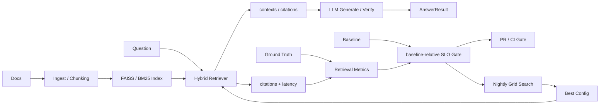
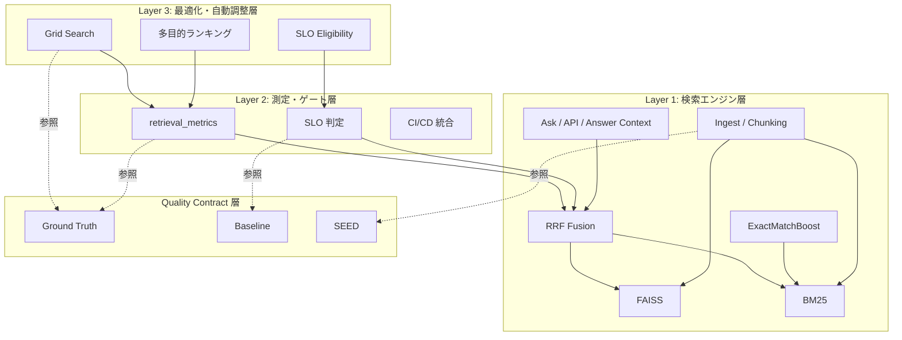
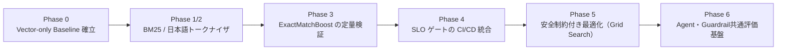
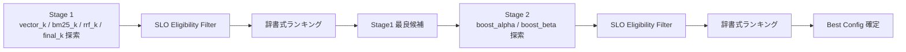

# 仕様書QA向けHybrid RAG・AI品質評価基盤（spec-rag-qa）

> 仕様書をHybrid Searchで検索して根拠付き回答を生成し、Retrieval・Agent・Guardrailの品質をBaseline比較とCI Gateで継続管理するシステム

`spec-rag-qa` は、社内仕様書、設計書、業務マニュアルなどに対する質問へ、関連箇所と引用元を提示しながら回答するHybrid RAGシステムです。文書のIngest／Chunkingから検索、LLMによる回答生成・検証、CLI／APIでの応答までをこのリポジトリ内に実装しています。

検索では、FAISSによるベクトル検索とBM25によるキーワード検索を、日本語トークナイズ、Exact Match Boost、RRF Fusionで統合します。自然文だけでなく、エラーコード、API名、識別子を含む技術文書からも回答コンテキストとCitationを組み立てます。

Retrieval品質を感覚ではなく継続的に管理するため、Ground Truth、Baseline、Recall@K、MRR、Failure Rate、レイテンシ、SLO Gate、Grid Searchを組み込んでいます。評価条件はQuality Contractとして固定し、検索変更を同じ基準で比較します。

さらに、このRetrieval品質管理の設計を、Agentic RAGのRoute／Tool／Citation／Task Successと、LLM GatewayのGuardrailへ拡張しました。評価契約、Fixture、Baseline、レポート、Quality Gateを本リポジトリに集約し、Offline PR Gateと実システム・外部Judgeを使う手動評価を分離しています。

## 関連プロジェクトと設計上の位置づけ

本リポジトリは、生成AIを業務システムへ安全に導入するための
「品質保証・動的制御・運用統治」からなる3層アーキテクチャのうち、
**品質保証レイヤー** を担います。

| プロジェクト | 主な責務 |
|---|---|
| **本リポジトリ（spec-rag-qa）** | **仕様書QA向けHybrid RAG、Retrieval品質管理、共通AI品質評価** |
| [Agentic RAG with Control Plane](https://github.com/mlprototype/ai-agent-rag) | 動的制御、Agent実行 |
| [Policy-Aware Multi-LLM Gateway](https://github.com/mlprototype/policy-aware-llm-gateway) | 運用統治、Guardrail実装 |

`spec-rag-qa` は検証用Hybrid RAG本体を持つと同時に、`ai-agent-rag` をAgent評価の実行対象、`policy-aware-llm-gateway` をGuardrail評価の実行対象として接続します。評価ケース、Fixture、保存Trace、Baseline、レポート、Quality Gateは本リポジトリで管理します。

## 解決する課題

- Retrieval 改善のたびに品質が揺れる問題
- 「それっぽく良くなった」に依存した主観的な判断
- 変更前後を同じ条件で比較できない問題
- 検索劣化を見逃したまま CI/CD を通してしまう問題
- Retrieval の問題と LLM 生成の問題が混同される問題

Retrieval品質管理を起点に、共通AI品質評価では次の課題も扱います。

- AgentのRoute、Tool、Citation、回答形式の回帰を検出しにくい問題
- Guardrailの過検知と検知漏れを同じ基準で比較しにくい問題
- 実システムや外部JudgeをPRごとに実行した場合の再現性、コスト、Secret管理の問題
- 評価結果がレポートだけで終わり、CIのQuality Gateへ接続されない問題
- Criticalな失敗が平均値に埋もれる問題

本システムは、Retrieval 評価を LLM 回答評価から分離し、検索品質そのものを機械的に測定できるようにします。  
その結果、品質回帰防止、比較可能性、安全制約付き最適化を一つの運用ループとして扱えます。

Agent／Guardrail評価でも、実行系をRunner／Adapterで評価ロジックから分離し、Critical指標の絶対Gate、review済みBaselineとの比較、分母0の `N/A` を明示的に扱います。

## システム概要

RAG の改善は、チャンク設計、BM25 設定、ハイブリッド検索の重み付けを少し変えるだけでも品質が動きます。  
一方で、評価が属人的だと「良くなったのか」「安全に悪化していないか」を継続的に判断できません。

このプロジェクトは、Retrievalを固定条件で評価できるGround TruthとBaselineを持ち、Recall@K、MRR、Failure Rate、レイテンシを用いて検索品質を継続管理します。
そのうえで、SLO を満たす変更だけを CI で通し、SLO 制約の中で Grid Search により改善候補を探索できるようにしています。

この品質管理ループを拡張し、Agentの決定論的評価、外部Judgeを利用できるmonitor-only高度評価、Gateway Guardrail評価も提供します。Fixtureを使うOffline PR Gateと、実Agent／実Gatewayを接続する手動Jobは役割を分離しています。

## 想定ユースケース

#### 仕様書・社内文書QAにおけるRAG検索品質の継続的な管理

社内の仕様書、業務マニュアル、FAQ、設計書などを対象にしたRAG型QAシステムを運用するケースを想定。

RAGアプリケーションでは、回答品質の前段にあるRetrieval品質が重要になる。  
しかし、Embeddingモデル、Chunk分割、検索パラメータ、ランキングロジックを変更した際に、検索精度が改善したのか、劣化したのかを人手で判断するのは難しい。

このシステムでは、Ground Truthを用いた評価データと、Recall@K / MRR / SLOによる定量評価により、RAG検索品質を継続的に測定・比較・管理する。

## アーキテクチャ

このシステムは、RAG の回答生成そのものよりも、Retrieval 品質を継続的に測定・比較・最適化するための品質管理ループを中心に設計しています。

### データフロー

入力文書は index 化され、質問に対して Hybrid Retriever が contexts / citations を返します。  
通常の質問応答では contexts が LLM 生成・検証へ進み、品質管理では citations と latency が Ground Truth / Baseline と照合され、SLO Gate、CI、Grid Search へ流れます。


```mermaid
flowchart LR
  DOC["Docs"] --> ING["Ingest / Chunking"]
  ING --> IDX["FAISS / BM25 Index"]

  Q["Question"] --> RET["Hybrid Retriever"]
  IDX --> RET

  RET --> CTX["contexts / citations"]
  CTX --> GEN["LLM Generate / Verify"]
  GEN --> ANS["AnswerResult"]

  RET --> DET["citations + latency"]
  GT["Ground Truth"] --> MET["Retrieval Metrics"]
  DET --> MET
  BL["Baseline"] --> SLO["baseline-relative SLO Gate"]
  MET --> SLO

  SLO --> CI["PR / CI Gate"]
  SLO --> GS["Nightly Grid Search"]
  GS --> CFG["Best Config"]
  CFG --> RET
```

このHybrid RAGのRetrieval評価を起点として、後続のAgent評価では実行Traceを、Guardrail評価では検知結果とActionを各評価契約へ接続しています。すべてを同一schemaへ統合せず、Agent／Guardrail系だけが `AgentRunTrace` 系を共有します。詳細はREADME後半の「共通AI品質評価基盤」を参照してください。

### 責務分離

上の図は実行時と評価時のデータフローを示しています。実装上は、検索、測定、最適化、評価条件の固定を次のように分離しています。


```mermaid
flowchart TB
  subgraph L3["Layer 3: 最適化・自動調整層"]
    GS["Grid Search"]
    MR["多目的ランキング"]
    EL["SLO Eligibility"]
  end

  subgraph L2["Layer 2: 測定・ゲート層"]
    RM["retrieval_metrics"]
    SG["SLO 判定"]
    CI["CI/CD 統合"]
  end

  subgraph L1["Layer 1: 検索エンジン層"]
    IN["Ingest / Chunking"]
    FA["FAISS"]
    BM["BM25"]
    EX["ExactMatchBoost"]
    RF["RRF Fusion"]
    AQ["Ask / API / Answer Context"]
  end

  subgraph QC["Quality Contract 層"]
    GT["Ground Truth"]
    BL["Baseline"]
    SD["SEED"]
  end

  GS --> RM
  MR --> RM
  EL --> SG
  RM --> RF
  SG --> RF
  RF --> BM
  RF --> FA
  EX --> BM
  AQ --> RF
  IN --> FA
  IN --> BM

  GS -.参照.-> GT
  RM -.参照.-> GT
  SG -.参照.-> BL
  IN -.参照.-> SD
```

各層の責務と主な実装要素は次の通りです。

| 層 | 責務 | 主な実装要素 |
|:---|:---|:---|
| Layer 1 | 文書を index 化し、Hybrid Retrieval と回答コンテキスト生成を行う | `src/ragqa/ingest.py`、`src/ragqa/hybrid_retriever.py`、`src/ragqa/bm25_store.py`、`src/ragqa/service.py` |
| Layer 2 | citations と latency を測定し、指標化してゲート判定する | `src/ragqa/retrieval_metrics.py`、`scripts/run_phase4_retrieval_eval.py`、`.github/workflows/ragqa-quality-gate.yml` |
| Layer 3 | SLO 制約下で候補を探索し、最良設定を決める | `scripts/run_phase5_grid_search.py`、`ranking_key()`、`is_eligible()` |
| Quality Contract | 比較条件を固定し、実験と評価の不変式を与える | `data/eval/ground_truth*.json`、`data/eval/phase0_vector_baseline*.json`、`SEED=20260223` |

Layer 1 には検索エンジン層を直接利用する CLI / API エンドポイント向けの回答コンテキスト生成も含めています。  
Layer 2 は意図的に Layer 1 の内部アルゴリズムを知りません。`compute_retrieval_metrics()` が受け取るのは `id`、`citations`、`latency_ms` を持つ details リストであり、FAISS、BM25、RRF の実装詳細には依存しないため、検索アルゴリズムの変更と品質判定の基準を疎結合に保てます。

## 設計思想

このシステムの設計思想は、比較可能性と監査可能性を優先することにあります。主要な設計判断は次の 4 点です。

#### 1. Retrieval評価とLLM評価の完全分離（関心事の分離）
* **アプローチ**: `expected_sources` による検索エンジン性能（インフラ層）の機械評価と、`expected_verdict / assertion` による回答品質（アプリケーション層）のLLM評価を明確に分離。
* **トレードオフ**: 検索品質のデグレードと、最終的なLLM応答品質との間の定性的な因果関係の切り分けは、上位レイヤーのベンチマーク環境に委ねる設計を選択。

#### 2. 3層構造 × Quality Contract による疎結合設計（非依存性の担保）
* **アプローチ**: 測定レイヤーは `citations`（参照ソース）と `latency`（応答速度）のメタデータのみを監視して合否を判定。背後の検索アルゴリズムやハイパーパラメータの具体的実装を直接参照しない設計。
* **トレードオフ**: レイヤー間の結合度を極限まで下げる引き換えとして、層間契約（Interface）の定義および管理コストを許容。

#### 3. 監査証跡を重視した決定論的 Grid Search の採用（再現性の担保）
* **アプローチ**: ベイズ最適化（Bayesian Optimization）などの確率的探索をあえて避け、設定した全探索点を決定論的に評価。CI/CDプロセスにおいて、いつ、どのパラメータで、なぜそのスコアが出たかの完全な監査証跡（Audit Trail）を保持。
* **トレードオフ**: 過去の履歴に依存する適応型探索（履歴依存探索）と比較し、パラメータ空間の探索における計算効率（時間・コスト）の劣後を許容。

#### 4. baseline-relative SLO による品質ラチェット機構（継続的向上の自動化）
* **アプローチ**: 絶対値による閾値管理ではなく、過去の最良スコア（Baseline）の更新に追随して自動的に合格基準が引き上がる「品質ラチェット機構」を導入。
* **トレードオフ**: システム性能向上に伴うSLOの自動厳格化と引き換えに、意図的なベースライン更新・リセット時における明確な運用フロー（ガバナンス）の追加を許容。


## 技術スタック

| カテゴリ | 技術 | 概要 / 役割 |
|:---|:---|:---|
| **言語** | Python | システム開発、評価スクリプトの実装 |
| **検索ライブラリ** | FAISS (`faiss-cpu`) | 密ベクトル検索（Layer 1） |
| **検索統合** | BM25、Exact Match Boost、RRF Fusion | キーワード検索とベクトル検索の順位統合（Layer 1） |
| **日本語解析** | `fugashi`, `unidic-lite` | 日本語トークナイザーの実装（Layer 1） |
| **モデル・埋め込み** | `sentence-transformers` | テキストのベクトル埋め込み（Layer 1） |
| **LLM統合** | OpenAI API (`openai`) | 回答生成・検証、RAG回答評価 |
| **Webフレームワーク** | FastAPI, Uvicorn | APIサーバーの提供 |
| **Agent評価** | Pydantic、JSON Schema、PyYAML | Trace契約、事前検査、集計、設定ベースのQuality Gate |
| **Trace／Adapter** | Fixture、JSON Trace、Subprocess | 保存結果と実Agentを評価契約へ正規化 |
| **LLM Judge** | Mock／provider-neutral HTTP (`httpx`) | Groundedness、Semantic Consistency、Stabilityの評価 |
| **Guardrail評価** | 共通 `AgentRunTrace.guardrail` | PII／Injection検知、Action、MASK証跡の評価 |
| **レポート** | JSON、Markdown | Agent／Guardrail評価結果とGate判定の保存 |
| **テスト・評価** | pytest | Retrieval、Agent、Guardrail評価ロジックのテスト |
| **CI/CD** | GitHub Actions | Offline PR Gate、手動実システム評価、Nightly Grid Search |
| **設定管理** | YAML、JSON | Gate閾値、Baseline、Judge／pricing versionの追跡 |
| **トラッキング** | LangSmith (`langsmith`) | 評価結果・トレースの可視化 |

## Phase 進化

このシステムの Phase は、機能追加の履歴というより、比較の信頼性を段階的に強化してきた履歴です。


```mermaid
flowchart LR
  P0["Phase 0<br/>Vector-only Baseline 確立"] --> P12["Phase 1/2<br/>BM25 / 日本語トークナイザ"] --> P3["Phase 3<br/>ExactMatchBoost の定量検証"] --> P4["Phase 4<br/>SLO ゲートの CI/CD 統合"] --> P5["Phase 5<br/>安全制約付き最適化（Grid Search）"] --> P6["Phase 6<br/>Agent・Guardrail共通評価基盤"]
```

| Phase | 目的 | 主要成果物 |
|:---|:---|:---|
| Phase 0 | 比較の起点となる Vector-only baseline を固定する | `scripts/run_phase0_expanded_baseline.py`、`data/eval/phase0_vector_baseline_expanded.json`、`data/eval/ground_truth_phase0_expanded.json` |
| Phase 1/2 | スパース検索と日本語トークナイズを加え、比較対象の検索基盤を増やす | `src/ragqa/bm25_store.py`、`src/ragqa/tokenizer_ja.py`、`tests/test_bm25.py`、`tests/test_tokenizer.py` |
| Phase 3 | exact match boost が Recall@5 に効くかを定量で確認する | `scripts/run_phase3_boost_verification.py`、`data/eval/phase3_boost_verification.json` |
| Phase 4 | baseline-relative SLO を CI/CD に接続し、回帰を自動停止する | `scripts/run_phase4_retrieval_eval.py`、`.github/workflows/ragqa-quality-gate.yml` |
| Phase 5 | SLO を守ったまま探索空間を走査し、最良設定を選ぶ | `scripts/run_phase5_grid_search.py`、`.github/workflows/phase5-grid-search.yml`、`data/eval/phase5_best_config.json` |
| Phase 6 | 共通Trace／評価契約へFixture・保存Trace・実システムRunnerを接続し、Agent品質、monitor-only高度評価、Guardrailをレポート・Baseline比較・CI Gateへ統合する | `src/ragqa/agent_eval/`、`scripts/run_agent_evaluation.py`、`scripts/run_agent_advanced_evaluation.py`、`scripts/run_guardrail_evaluation.py`、`.github/workflows/agent-quality-gate.yml` |

## 品質統治機構

### Quality Contract（不変式の管理）

Quality Contract は、評価条件を固定して比較可能性を守るための不変式です。

| 要素 | 役割 | 実装上の根拠 |
|:---|:---|:---|
| Ground Truth | 何を正解とみなすかを固定する | `data/eval/ground_truth.json`、`data/eval/ground_truth_phase0_expanded.json` |
| Baseline | どの水準から改善・劣化を判定するかを固定する | `data/eval/phase0_vector_baseline.json`、`data/eval/phase0_vector_baseline_expanded.json` |
| SEED | コーパス生成と baseline 再生成の入力条件を固定する | `scripts/run_phase0_expanded_baseline.py` の `SEED = 20260223` |

#### Retrievalから共通AI評価へ拡張されたQuality Contract

Retrievalでは、`id`、`citations`、`latency_ms` を持つdetailsリストをGround Truth／Baselineと照合する独立した評価契約を使います。Agent／Guardrail系は `AgentRunTrace` を利用し、Guardrailの観測値は `AgentRunTrace.guardrail` へ格納します。両者は評価思想を共有しますが、同一schemaではありません。

| 評価系 | 比較条件を固定する要素 |
|:---|:---|
| Retrieval | Ground Truth、Baseline、固定SEED、index対象コーパス |
| Agent品質 | 評価ケース、Fixture／保存Trace、Trace schema、Gate設定、review済みBaseline |
| Agent高度評価 | 評価ケース、Trace schema、Judge model、prompt version、pricing version |
| Guardrail | 評価ケース、Fixture、`AgentRunTrace.guardrail`、Guardrail Gate設定 |

通常のAgent評価はBaselineを読み取るだけで更新しません。高度評価はJudge model／prompt version／評価日時、Cost評価は `config/agent_pricing.json` の `pricing_version` をレポートに残し、比較条件の追跡を可能にします。GuardrailはBaseline比較を行わず、合成Fixtureに対する絶対Gateとして運用します。

### 品質ラチェット機構

Retrieval SLO は absolute 値ではなく baseline 比率で定義されます。`run_phase4_retrieval_eval.py` と `run_phase5_grid_search.py` は baseline の `recall_at_5`、`mrr`、`failure_rate` から下限・上限を再計算し、実装上は `RETRIEVAL_RECALL5_MIN_RATIO`、`RETRIEVAL_MRR_MIN_RATIO`、`RETRIEVAL_FAILURE_MAX_RATIO` で制御されます。baseline を更新すると次回以降の合格基準も自動で引き上がるため、品質を下げにくいラチェット構造になります。

### PR ゲート vs Nightly 探索の責務分離

| 観点 | PR ゲート | Nightly Grid Search |
|:---|:---|:---|
| トリガー | `pull_request`、`push`、`workflow_dispatch` | `schedule (0 2 * * *)`、`workflow_dispatch` |
| 責務 | 既存品質を破壊しない保守的チェック（unit-test → retrieval-gate → evaluate の3段直列によるフェイルファスト構成） | 新しい最良設定を探す積極的探索 |
| 性質 | 守り | 攻め |
| 計算コスト | 低〜中: 固定設定の評価と SLO 判定が中心 | 高: 複数 trial を走査し全候補を比較する |

Agent／GuardrailのPR JobはFixtureと保存済みBaseline／Gate設定でOffline実行します。実Agent、外部Judgeを使う高度評価、実Gateway評価は `workflow_dispatch` の明示入力で起動する別Jobに分離し、外部Judgeを使う高度指標はmonitor-onlyとしてPRをblockしません。

### 3軸の再現性担保

| 軸 | 機構 | 保証すること |
|:---|:---|:---|
| データ再現性 | SEED 固定の決定論的コーパス生成 | 同じ seed なら同じ合成コーパスと baseline を再生成できる |
| 評価再現性 | Ground Truth / Baseline JSON のリポジトリ固定 | 比較条件を後から追跡でき、指標差分の根拠が残る |
| モデル再現性 | `TRANSFORMERS_OFFLINE` + `actions/cache` | CI で同じ埋め込みモデルを安定して再利用できる |

Phase 6では、Fixtureと保存Traceをリポジトリに固定し、Runner／AdapterをEvaluatorから分離することで、同じ観測結果を再評価できます。ただし、実Agent、実Gateway、外部Judgeの出力自体は外部サービスやモデル更新の影響を受けます。

## 最適化の考え方

最適化は「とにかく指標を上げる」ではなく、「SLO を満たした範囲で改善する」方針です。現実装では `is_eligible()` が Recall@5、MRR、Failure Rate の閾値を同時に満たす候補だけを通し、その後 `ranking_key()` で辞書式に順位付けします。

| 優先順 | 指標 | ソート方向 | 表明する価値判断 |
|:---:|:---|:---:|:---|
| 1 | Recall@5 | 降順 | 必要な情報を見つけられるかが最重要 |
| 2 | MRR | 降順 | できれば最初の1件で見つかってほしい |
| 3 | Failure Rate | 昇順 | 取りこぼしは少ないほど良い |
| 4 | p95レイテンシ | 昇順 | ユーザー体験の劣化を抑える |
| 5 | Recall@1 | 降順 | 一発命中の精度 |
| 6 | trial_id | 昇順 | 同一指標なら早い試行を優先し、安定に決着させる |

この優先順位自体が、何を守り、何を後順位に置くかというシステムの価値判断を構造として表明しています。

探索は 2 段階です。


```mermaid
flowchart LR
  S1["Stage 1<br/>vector_k / bm25_k / rrf_k / final_k 探索"]
  S1 --> EL1["SLO Eligibility Filter"]
  EL1 --> RK1["辞書式ランキング"]
  RK1 --> BEST1["Stage1 最良候補"]
  BEST1 --> S2["Stage 2<br/>boost_alpha / boost_beta 探索"]
  S2 --> EL2["SLO Eligibility Filter"]
  EL2 --> RK2["辞書式ランキング"]
  RK2 --> FINAL["Best Config 確定"]
```

1. stage1:
   `vector_candidate_k`、`bm25_candidate_k`、`rrf_k`、`final_top_k` を探索する
2. stage2:
   stage1 の最良候補を固定し、`boost_alpha` と `boost_beta` を探索する

現実装が Bayesian Optimization ではなく Grid Search を採用している理由は、探索点が最初から明示され、全 trial が決定論的に評価され、結果が JSON / Markdown レポートとして完全な監査証跡に残るためです。履歴依存の探索より計算効率は劣る一方、再現性と説明可能性は高く保てます。
なお、これらの指標が真の品質を完全には代表しないという Goodhart's Law 的リスクを意識し、既知の制限にて4観点のリスクを管理対象として明示している。

## Quick Start

### セットアップ

```bash
python -m venv .venv
source .venv/bin/activate
pip install -r requirements.txt
```

### 最小の質問応答を試す

```bash
PYTHONPATH=src python -m ragqa.ingest
PYTHONPATH=src python -m ragqa.ask "この仕様の例外条件は？"
```

### Retrieval SLO ゲートを実行する

```bash
RAGQA_DOCS_DIR=data/phase0_expanded/docs \
PYTHONPATH=src \
python -m ragqa.ingest

RAGQA_DOCS_DIR=data/phase0_expanded/docs \
RETRIEVAL_GROUND_TRUTH_PATH=data/eval/ground_truth_phase0_expanded.json \
RETRIEVAL_BASELINE_PATH=data/eval/phase0_vector_baseline_expanded.json \
PYTHONPATH=src \
python scripts/run_phase4_retrieval_eval.py
```

### 回答品質評価を実行する

```bash
OPENAI_API_KEY=your_api_key \
PYTHONPATH=src \
python -m ragqa.evaluate
```

### Grid Search を実行する

```bash
RAGQA_DOCS_DIR=data/phase0_expanded/docs \
RETRIEVAL_GROUND_TRUTH_PATH=data/eval/ground_truth_phase0_expanded.json \
RETRIEVAL_BASELINE_PATH=data/eval/phase0_vector_baseline_expanded.json \
PYTHONPATH=src \
python scripts/run_phase5_grid_search.py --topn 10
```

### Agent品質評価

```bash
PYTHONPATH=src python scripts/run_agent_evaluation.py --runner fixture
```

### Agent高度評価（Mock Judge）

```bash
PYTHONPATH=src python scripts/run_agent_advanced_evaluation.py \
  --runner fixture \
  --judge mock
```

### Gateway Guardrail評価

```bash
PYTHONPATH=src python scripts/run_guardrail_evaluation.py --runner fixture
```

## エントリーポイント

- `python -m ragqa.ingest`
  文書を ingest して vector / BM25 index と manifest を生成する
- `python -m ragqa.ask "<question>"`
  質問応答を実行し、sources・answer・verification を表示する
- `python -m ragqa.evaluate`
  回答品質評価を実行し、`data/eval/report.json` と `data/eval/trend.csv` を更新する
- `uvicorn ragqa.server:app --host 0.0.0.0 --port 8000`
  API サーバを起動する
- `python scripts/run_phase0_expanded_baseline.py`
  拡張コーパスの baseline を再生成する
- `python scripts/run_phase3_boost_verification.py`
  BM25 exact match boost の効果を検証する
- `python scripts/run_phase4_retrieval_eval.py`
  baseline-relative の Retrieval SLO ゲートを実行する
- `python scripts/run_phase5_grid_search.py --topn 10`
  2 段階 Grid Search を実行し、best config とレポートを出力する
- `python scripts/run_agent_evaluation.py --runner fixture`
  決定論的Agent品質評価、Baseline比較、Quality Gateを実行する
- `python scripts/run_agent_advanced_evaluation.py --runner fixture --judge mock`
  Groundedness、Stability、Costのmonitor-only高度評価を実行する
- `python scripts/run_guardrail_evaluation.py --runner fixture`
  Gateway Guardrailの検知・Action・MASK証跡を評価する

## ディレクトリ構成

```text
spec-rag-qa/
├── .github/
│   └── workflows/
│       ├── agent-quality-gate.yml           # Agent／Guardrail PR Gate・手動評価
│       ├── phase5-grid-search.yml           # Phase 5: Grid Search用CI
│       └── ragqa-quality-gate.yml           # Retrieval／RAG品質ゲート（PRフック）
├── config/
│   ├── agent_quality_gate.yml               # Agent絶対／Baseline-relative Gate
│   ├── agent_pricing.json                   # 高度評価用version付き価格表
│   └── guardrail_quality_gate.yml           # Guardrail絶対Gate
├── data/                                   # データディレクトリ
│   ├── agent_eval/
│   │   ├── baseline/                        # review済みAgent Baseline
│   │   ├── cases/                           # Agent／Guardrail評価ケース
│   │   ├── fixtures/                        # Agent／Guardrail保存Trace
│   │   └── reports/                         # JSON／Markdownレポート例
│   ├── docs/                               # インジェスト元ドキュメント
│   ├── eval/                               # 評価データ群 (Ground Truth / Baseline)
│   ├── index/                              # 構築済みインデックス (FAISS / BM25)
│   └── phase0_expanded/                    # Phase0拡張コーパス
├── docs/                                   # 設計・評価契約・制約
│   ├── agent_advanced_evaluation.md         # 高度Agent評価・Judge・Cost
│   ├── agent_evaluation_dataset.md          # Agentケース・Runner・Trace契約
│   └── guardrail_evaluation.md              # Guardrail評価・実Gateway接続
├── scripts/                                # バッチスクリプト
│   ├── run_agent_advanced_evaluation.py     # monitor-only高度Agent評価
│   ├── run_agent_evaluation.py              # 決定論的Agent品質評価
│   ├── run_guardrail_evaluation.py          # Gateway Guardrail評価
│   ├── run_phase0_expanded_baseline.py     # ベースライン作成
│   ├── run_phase3_boost_verification.py    # BM25 Boost効果検証
│   ├── run_phase4_retrieval_eval.py        # 検索評価実行
│   └── run_phase5_grid_search.py           # グリッドサーチ実行
├── src/
│   ├── evaluator/                          # カスタム評価用ロジック
│   │   ├── evaluator.py
│   │   └── fail_detector.py
│   ├── ragqa/                              # コアパッケージ
│   │   ├── ask.py                          # 質問応答（CLI）
│   │   ├── agent_eval/                     # Agent／Guardrail評価コア
│   │   │   ├── adapters/                   # Fixture／Trace／Subprocess／Gateway
│   │   │   ├── metrics/                    # Route／Tool／Citation等の指標
│   │   │   ├── evaluator.py                # 決定論的Evaluator
│   │   │   ├── models.py                   # AgentRunTrace等のschema
│   │   │   └── runner.py                   # Agent Runner契約
│   │   ├── bm25_store.py                   # BM25 実装
│   │   ├── chunking.py                     # チャンキング処理
│   │   ├── config.py                       # 設定ファイル
│   │   ├── embedder.py                     # 埋め込みモデル
│   │   ├── evaluate.py                     # 回答評価ロジック
│   │   ├── hybrid_retriever.py             # 検索ロジック (Vector + Keyword)
│   │   ├── improvement_catalog.py          # 改善カタログ
│   │   ├── ingest.py                       # 取り込みロジック
│   │   ├── llm.py                          # LLM呼び出し
│   │   ├── prompt.py                       # プロンプト管理
│   │   ├── retrieval_metrics.py            # Retrieval指標評価
│   │   ├── schemas.py                      # データ構造定義
│   │   ├── server.py                       # FastAPIサーバ
│   │   ├── service.py                      # サービスロジック
│   │   ├── tokenizer_ja.py                 # 日本語トークナイザ
│   │   ├── utils.py                        # ユーティリティ
│   │   └── vectorstore.py                  # ベクターストア (FAISS)
│   └── schemas/                            # スキーマ定義
│       ├── answer.py
│       └── evaluation.py
├── tests/                                  # テストコード
│   ├── agent_eval/                          # Agent／Guardrail評価テスト
│   ├── fixtures/
│   ├── test_bm25.py
│   ├── test_chunking.py
│   ├── test_exact_match_boost_integration.py
│   ├── test_hybrid_retriever.py
│   ├── test_phase5_grid_search.py
│   ├── test_retrieval_metrics.py
│   ├── test_tokenizer.py
│   └── test_utils.py
├── README.md                               # プロジェクト概要
└── requirements.txt                        # 依存ライブラリ
```

## 共通AI品質評価基盤

Phase 0～5で構築したRetrieval品質管理を起点に、Phase 6では評価範囲をAgent実行とGateway Guardrailへ拡張しました。Fixture、保存Trace、実システム出力をRunner／Adapterで評価契約へ接続し、実行系とEvaluatorを分離しています。

Agent／Guardrail系では、評価、集計、JSON／Markdownレポート、Baseline比較、Quality Gateを再利用可能なコンポーネントとして分離しています。PRではAPIキー不要のFixtureを評価し、実Agent、実Gateway、外部Judgeを使う評価は手動Jobへ分けています。

すべてを無理に同じschemaへ統合してはいません。Retrievalは `id`、`citations`、`latency_ms` のdetailsリスト、Agentは `AgentRunTrace`、Guardrailはその `guardrail` フィールドを評価します。

| 評価領域 | 主な評価内容 | 実行方式 | PR Gate |
|:---|:---|:---|:---|
| Retrieval | Recall@1/5、MRR、Failure Rate、レイテンシ | Ground Truth + Hybrid Retriever | あり（Baseline-relative SLO） |
| Agent品質 | Task Success、Route、Tool、Citation、Format、レイテンシ | Fixture／保存Trace／Subprocess | あり（Offline Fixture） |
| Agent高度評価 | Groundedness、Answer Semantic Consistency、Stability、Cost | Mock／HTTP Judge | なし（monitor-only） |
| Gateway Guardrail | Precision、Recall、F1、FPR、Action、MASK証跡 | Fixture／Gateway HTTP | あり（PRはFixture） |

AgentではCritical Task Success／Format、必須Tool、Tool schema、Citationなどを絶対Gateとし、全体Task Success、Route Accuracy、p95レイテンシをreview済みBaselineと比較します。GuardrailはBaselineを使わず、Critical Recall、Precision／Recall／FPR、BLOCK／MASKなどの絶対Gateを適用します。対象ケースがなく分母0の指標は100%へ変換せず `N/A` として扱います。

詳細は、[Agent評価データセットとRunner](docs/agent_evaluation_dataset.md)、[高度Agent評価](docs/agent_advanced_evaluation.md)、[Gateway Guardrail評価](docs/guardrail_evaluation.md)、[Agent Quality Gate設定](config/agent_quality_gate.yml)、[Guardrail Quality Gate設定](config/guardrail_quality_gate.yml)を参照してください。

## Agent評価

Phase 6の決定論的Agent評価は、20件の公開可能な合成ケースを使い、Task Success、Route、Tool、Citation、回答形式、レイテンシを評価します。Fixture、保存Trace、実AgentのSubprocess出力を同じEvaluatorへ接続できます。

```bash
PYTHONPATH=src python scripts/run_agent_evaluation.py --runner fixture
```

- PRのOffline Fixture JobはAPIキーを使わず、Critical Task Success／Format、Runner error、必須Tool、Tool schema、Citation Validityを絶対Gateとして判定します。Criticalな失敗は平均点で相殺しません。
- 全体Task Success、Route Accuracy、p95レイテンシはreview済みBaselineと比較します。通常実行はBaselineを更新せず、分母0の指標は `N/A` のまま保持します。
- 標準レポートは `.artifacts/agent-quality/report.json` と `report.md`、Git管理する例は `data/agent_eval/reports/example.json` と `example.md` です。
- 実 `ai-agent-rag` の評価は、対象revisionを固定する手動のSubprocess Jobに分離しています。
- 合成Fixtureは契約回帰用であり、LLMの揺らぎ、実トラフィック、実ネットワーク、全Tool、Citationの意味的支持を代表しません。

Gate閾値は [config/agent_quality_gate.yml](config/agent_quality_gate.yml)、ケース、Runner／Trace契約、終了コード、Baseline更新、詳細な制約は [Agent評価データセットとRunner](docs/agent_evaluation_dataset.md) を参照してください。

### 高度評価（monitor-only）

Groundedness、Answer Semantic Consistency、repeat-run Stability、version付き価格表によるCostは、既存PR Gateから分離した高度評価CLIで記録します。

```bash
PYTHONPATH=src python scripts/run_agent_advanced_evaluation.py \
  --runner fixture \
  --judge mock
```

- 高度指標はすべてmonitor-onlyで、PRをblockしません。Mock Judgeはschema、retry、集計、レポート経路の確認専用であり、そのスコアを品質判断には使いません。
- 外部JudgeはPRでは実行せず、CIではGitHub Environmentに所属し、完全一致hostを検査する手動Jobに限定します。質問、回答、Source snippet、許可されたTool factsが外部送信されるため、送信先とデータ取扱条件の承認が必要です。
- 標準レポートは `.artifacts/agent-advanced/report.json` と `report.md` です。Judge model、prompt version、評価日時、`pricing_version` を記録します。
- usageまたは実model IDが欠けるCostは `N/A` とし、Agentのtarget名をmodel名として価格付けしません。

Judge schema、計算式、Tool Evidenceの信頼境界、HTTP契約、既知の制約は [高度Agent評価](docs/agent_advanced_evaluation.md)、評価用価格は [agent_pricing.json](config/agent_pricing.json) を参照してください。

### Gateway Guardrail評価

`policy-aware-llm-gateway`向けGuardrail評価は、Prompt Injection、PII、正常near-miss、複合入力からなる30件の公開可能な合成ケースを使い、検知とBLOCK／MASK／WARN／ALLOWを評価します。

```bash
PYTHONPATH=src python scripts/run_guardrail_evaluation.py --runner fixture
```

- PRでは保存済み `AgentRunTrace.guardrail` Fixtureだけを絶対Gateで評価するため、Gateway起動もAPIキーも不要です。通常のAgent Baselineは使いません。
- Precision、Recall、F1、FPRをoverall／PII／Injection別に集計し、期待Action、MASK置換証跡、Critical Recallを判定します。
- `unknown` と `execution_error` はALLOWやTNへ推測せず、分母0は `N/A` とします。
- 標準レポートは `.artifacts/guardrail-quality/report.json` と `report.md` です。
- 実Gateway評価はallowlist付きHTTP Runnerを使う手動Jobです。現行の公開HTTP契約では成功時ActionやMASK後のprovider入力を完全には観測できない場合があります。

Gate閾値は [guardrail_quality_gate.yml](config/guardrail_quality_gate.yml)、データ、Adapter、実Gateway手順、観測上の制約は [Gateway Guardrail評価](docs/guardrail_evaluation.md) を参照してください。

## 既知の制限

現在の品質管理は有効ですが、Goodhart's Law を避けるには「測っている指標が真の品質を完全には代表しない」ことを明示しておく必要があります。以下の制約は、既知のリスクとして管理対象に含めるべきものです。

| リスク | 発生メカニズム | 緩和策 | 残存リスク |
|:---|:---|:---|:---|
| 評価セットへの過学習 | 25ケースへの適合最大化 | 8種のクエリタイプ混在 | 定量的カバレッジ保証なし |
| 評価指標の不完全さ | doc 粒度 hit 判定の楽観バイアス | `parse_source_ref()` の chunk 粒度対応 | chunk 粒度 ground truth 未整備 |
| 合成コーパスのギャップ | 人工文書が実仕様書の構造を再現しない | 意図的な曖昧語彙挿入 | 実コーパスとの相関未検証 |
| ベンチマーク陳腐化 | コーパス拡張時に ground truth が古い事実を期待 | Ground Truth 固定 | 自動更新メカニズムなし |

これらのリスクを README に明記すること自体が、指標運用の限界を認識したうえで品質統治を行う設計方針の表明でもあります。

### Agent／Guardrail評価の制限

- 合成Fixtureは契約回帰のためのデータであり、実トラフィックの語彙、カテゴリ比率、権限、機密区分を代表しません。
- Fixture合格は、LLMの揺らぎ、実ネットワークのレイテンシ、認証・再試行、外部サービス障害を保証しません。
- 決定論的Citation評価はTraceと参照先の整合性を検査しますが、引用内容が回答を意味的に支持するかは保証しません。
- Mock Judgeは配線とschema確認専用です。外部Judgeの値もmodel／prompt変更の影響を受けます。
- 現行Gatewayの公開HTTP契約では、実providerへ送信されたMASK後入力や成功時Actionを完全には観測できない場合があります。
- `config/agent_pricing.json` は合成Fixture向けであり、実providerの最新価格を保証しません。usageや実model IDがなければCostは `N/A` です。

## 今後の展望

- Chunk 単位 ground truth のアノテーション:
  `parse_source_ref()` はすでに `doc_id#chunk_id` を扱えるため、ground truth 側へ chunk_id を持ち込める
- Chunk 単位評価:
  chunk 粒度の正解を使い、chunking 戦略や boost 設定へ直接フィードバックできるようにする
- Embedding モデル比較:
  `Embedder(model_name)` と baseline script の `EMBEDDING_MODEL` を使い、埋め込みモデル差分を同一ベンチマークで比較する
- Latency-Budget 設計:
  いまは観測値とランキング項目に留まる `p95_latency_ms` を、`max_p95_latency_ms` のような SLO 制約へ昇格させる
- Pareto Frontier 最適化:
  辞書式ランキングは"最優先指標が最大な一点"しか選ばないため、trial レポートから支配されない試行集合を抽出し、設計者が明示的にトレードオフを選択できる設計資料として可視化する

### 共通AI品質評価基盤

以下は未実装または運用データの蓄積が必要な将来項目です。

- 匿名化した実Traceと実トラフィック比率に基づく評価セットの整備
- Agent／Guardrail指標と人手評価の相関検証
- 外部サービス停止、timeout、再試行を含む障害注入評価
- Unicode難読化、多言語、認証・権限境界を含むセキュリティ評価セットの拡張
- Judge model／prompt変更によるdriftの継続監視
- `spec-rag-qa`、`ai-agent-rag`、`policy-aware-llm-gateway` 間のTrace互換性改善

## 用語集

- Quality Contract:
  Ground Truth、Baseline、SEED によって評価条件を固定し、比較可能性を守る枠組み。
- 品質ラチェット:
  baseline-relative SLO により、baseline 更新後の合格基準も自動で引き上がる構造。
- SLO Eligibility:
  Recall@5、MRR、Failure Rateの閾値を全て満たしたcandidateだけを最適化対象に残す判定。
- ExactMatchBoost:
  識別子やエラーコードの完全一致を BM25 スコアへ加点する仕組み。
- RRF Fusion:
  vector search と BM25 search の順位情報を Reciprocal Rank Fusion で統合する方式。
- コーパスアライメント:
  ground truth が期待する `doc_id` と、index に載っている `doc_id` が一致していること。
- AgentRunTrace:
  AgentのRoute、Tool、Source、Citation、レイテンシ、usage、Guardrail観測などを保持するPhase 6の共通Trace契約。
- Fixture:
  Runnerや外部APIを起動せず、保存済みTraceから決定論的に評価経路を再現する入力。
- Absolute Gate:
  Baselineとの比較ではなく、Critical指標や実行エラーなどを固定閾値で直接判定するQuality Gate。
- Baseline-relative Gate:
  review済みBaselineに対する比率や許容差から回帰を判定するQuality Gate。
- monitor-only:
  指標と失敗をレポートするが、現在はPRの合否に使用しない運用モード。
- Groundedness:
  Agent回答内の評価可能なclaimが、許可されたSourceまたはTool Evidenceに支持される割合。
- Guardrail FPR:
  正常なnear-miss入力をGuardrailが誤って検知した割合（False Positive Rate）。
- Judge version / Pricing version:
  高度評価の比較条件を追跡するJudge model／prompt versionと、Cost計算に使った価格表version。
