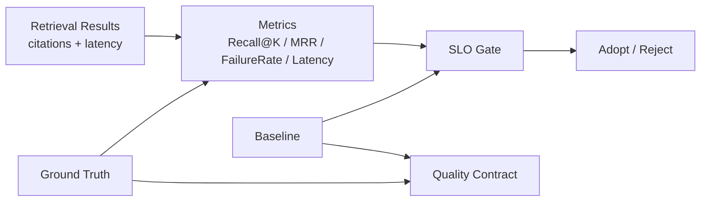

# Metrics Explanation

このドキュメントは、Spec RAG QA で使う Retrieval 品質指標と品質管理用語を理解するための説明です。
各項目について、「何か」「なぜ必要か」「何を防ぐか」を整理します。

## 全体像

Spec RAG QA の評価は、LLM の回答文そのものを先に採点するのではなく、
まず **正しい根拠文書に到達できたか** を測ります。
そのため、`Ground Truth`、`Recall@K`、`MRR`、`FailureRate`、`Latency` を使って Retrieval の状態を数値化し、
`Baseline`、`SLO`、`Quality Contract` で継続的な比較と回帰防止を行います。



## Ground Truth

### 何か

評価用に人間が固定した正解データです。
このプロジェクトでは、主に `question`、`expected_sources`、`expected_verdict`、`assertion` などを持ちます。
Retrieval 評価では、特に `expected_sources` が重要で、質問に対して取得されるべき根拠文書を表します。

例:

```json
{
  "id": "q1",
  "question": "パスワードリセット時の制約は？",
  "expected_sources": ["password_policy_faq.md", "auth_design_detail.md"]
}
```

### なぜ必要か

正解が固定されていないと、検索結果が良いのか悪いのかを機械的に判断できません。
Ground Truth があることで、同じ質問セットに対して、検索設定変更前後の品質を同じ条件で比較できます。

### 何を防ぐか

- 「なんとなく良さそう」という主観評価
- 評価するたびに正解条件が変わること
- 検索改善に見えるが、実は評価条件を変えただけという状態
- LLM の自然な文章に引っ張られて、根拠到達の失敗を見落とすこと

## Recall@K

### 何か

検索結果の上位 K 件の中に、Ground Truth の `expected_sources` が含まれている割合です。
たとえば `Recall@5` は、上位 5 件以内に正解ソースが 1 件以上入っていた評価ケースの比率です。

実装上は、`expected_sources` があるケースだけを評価対象にし、`citations` と照合します。
`doc_id#chunk_id` のように chunk が指定されている場合は chunk まで一致したときに hit とみなします。
chunk 指定がない場合は doc 単位で一致判定します。

### なぜ必要か

RAG では、LLM が回答する前に正しい根拠を読めている必要があります。
Recall@K は、「回答生成に渡される候補の中に、必要な根拠が入っているか」を測る基本指標です。

### 何を防ぐか

- 正解文書を検索できていないまま回答生成に進むこと
- 回答の失敗原因を LLM 側だけに求めてしまうこと
- 検索器の変更で重要な根拠文書が落ちたことを見逃すこと
- top-k の候補が広がっただけで、根拠到達を確認しない改善判断

## MRR

### 何か

MRR は Mean Reciprocal Rank の略で、最初に正解ソースが出てきた順位の逆数を平均した指標です。
正解が 1 位なら `1.0`、2 位なら `0.5`、3 位なら `0.333...`、見つからなければ `0.0` です。

### なぜ必要か

Recall@K は「上位 K 件に入っているか」を見ますが、正解が 1 位なのか 5 位なのかまでは強く区別しません。
MRR は、正解ソースがどれだけ上位に出ているかを測ります。
正解が上位にあるほど、LLM が重要な根拠を先に読みやすくなり、余計な文脈に埋もれにくくなります。

### 何を防ぐか

- 正解が top 5 に入っているだけで、実際には下位に埋もれている状態
- context budget をノイズで消費する検索結果
- Recall@K だけでは見えないランキング品質の劣化
- 「当たってはいるが、使いにくい検索結果」を改善済みとみなすこと

## FailureRate

### 何か

Retrieval の失敗率です。
このプロジェクトの `retrieval_metrics` では、`FailureRate = 1.0 - Recall@5` として計算されます。
つまり、上位 5 件以内に正解ソースが入らなかった評価ケースの比率です。

注意: ここでの FailureRate は、API エラー率やアプリケーション例外率ではなく、Retrieval miss の比率です。

### なぜ必要か

Recall@5 は成功率として読みやすい一方、運用リスクを見るときは失敗率のほうが直感的です。
「どれくらいの質問で正しい根拠に到達できなかったか」を見ることで、品質事故の可能性を判断しやすくなります。

### 何を防ぐか

- 平均スコアだけを見て、失敗ケースの多さを見落とすこと
- 正しい根拠がないまま LLM がもっともらしく回答すること
- 検索 miss が増えているのに改善として採用してしまうこと
- Grid Search が Recall の一部改善だけを見て、失敗率の悪化を無視すること

## Latency

### 何か

検索処理にかかった時間です。
このプロジェクトでは、各評価ケースの `latency_ms` を集め、`p50_latency_ms`、`p95_latency_ms`、`mean_latency_ms` を計算します。

- `p50_latency_ms`: 半分のリクエストがこの時間以下で終わる目安
- `p95_latency_ms`: 95% のリクエストがこの時間以下で終わる目安
- `mean_latency_ms`: 平均応答時間

### なぜ必要か

検索精度だけを上げても、応答が遅すぎると実運用では使いにくくなります。
Latency は、品質改善とユーザー体験のバランスを見るための指標です。
現状では `p95_latency_ms` は Grid Search のランキング項目に含まれますが、デフォルトの SLO ハード制約にはまだ含まれていません。

### 何を防ぐか

- 精度は上がったが、応答が遅すぎる設定を採用すること
- 平均は速いが、一部のリクエストだけ極端に遅い tail latency の見落とし
- candidate 数や top-k を増やしすぎて、運用上の応答時間が悪化すること
- 検索品質とユーザー体験を別々に議論してしまうこと

## Baseline

### 何か

比較の基準となる固定された品質値です。
このプロジェクトでは、Phase 0 の Vector-only 検索結果を baseline JSON として保存し、
`recall_at_5`、`mrr`、`failure_rate` などを後続評価の参照点にします。

代表例:

- `data/eval/phase0_vector_baseline.json`
- `data/eval/phase0_vector_baseline_expanded.json`

### なぜ必要か

新しい検索設定が良くなったかどうかは、比較対象がなければ判断できません。
Baseline があることで、変更前後を同じ評価条件で比較し、改善・劣化・横ばいを説明できます。

### 何を防ぐか

- 毎回違う基準で品質を判断すること
- 「前より良い」という主張に根拠がない状態
- 改善施策が実際には品質を下げていること
- 評価基準が動いて、長期的な品質推移が追えなくなること

## SLO

### 何か

SLO は Service Level Objective の略で、採用可能な品質の下限条件です。
このプロジェクトでは、absolute な固定値ではなく baseline-relative な SLO を使います。

デフォルトでは、Phase 4 / Phase 5 の Retrieval 評価で次の条件を使います。

```text
Recall@5    >= baseline.recall_at_5 * 0.90
MRR         >= baseline.mrr * 0.90
FailureRate <= baseline.failure_rate * 1.20
```

### なぜ必要か

改善探索では、ある指標を上げるために別の指標が悪化することがあります。
SLO は「この品質境界を下回る変更は採用しない」という安全境界です。
CI では SLO 違反を検知して、品質回帰をマージ前に止めます。

### 何を防ぐか

- Recall@5 だけ良くなり、MRR や FailureRate が悪化する設定の採用
- 検索品質を下げる PR が CI/CD を通過すること
- Grid Search が高スコアだが危険な候補を選ぶこと
- baseline 更新後も古い低い基準で合格してしまうこと

## Quality Contract

### 何か

Quality Contract は、評価の比較可能性を守るための不変式です。
このプロジェクトでは、主に次の要素で構成されます。

- Ground Truth: 何を正解とみなすか
- Baseline: どの水準と比較するか
- SEED: コーパス生成や baseline 再生成の入力条件をどう固定するか
- 評価ロジック: `retrieval_metrics` や SLO 判定のルール

### なぜ必要か

検索アルゴリズムを変えるたびに評価条件まで変えてしまうと、改善なのか基準変更なのかが分からなくなります。
Quality Contract は、実装変更の自由度を残しつつ、採用判断の座標軸を固定します。

### 何を防ぐか

- 改善と評価条件変更が混ざること
- 都合の良い ground truth や baseline に差し替えて品質を良く見せること
- 層ごとの責務が曖昧になり、検索実装と品質判定が密結合すること
- 後から結果を監査できない状態

## 指標の読み方まとめ

| 項目 | 良い方向 | 主に見るもの |
|:---|:---:|:---|
| Recall@K | 高いほど良い | 正解ソースが候補内に入ったか |
| MRR | 高いほど良い | 正解ソースが上位に出たか |
| FailureRate | 低いほど良い | 正解ソースを取り逃した割合 |
| Latency | 低いほど良い | 検索の応答時間 |
| Baseline | 固定されていることが重要 | 比較の参照点 |
| SLO | 満たすことが重要 | 採用可能な品質境界 |
| Quality Contract | 安定していることが重要 | 評価条件の不変性 |
