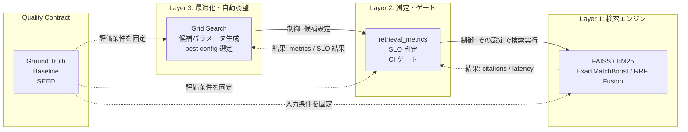
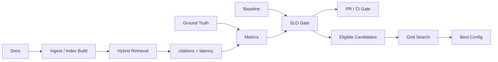
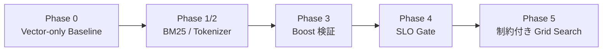

# Spec RAG QA Project One-Pager

Spec RAG QA は、仕様書 QA を題材にした RAG アプリではなく、
**Retrieval 品質を継続的に測定・比較・最適化・統治するための品質管理基盤**である。
Quality Contract、baseline-relative SLO、再現性担保、SLO 制約付き Grid Search により、
検索改善を属人的な判断から CI/CD に乗る運用プロセスへ変換する。

## 1. Executive Summary

| 観点 | 要点 |
|:---|:---|
| 何を作ったか | 仕様書 QA 用 RAG を題材に、Retrieval の品質を baseline と比較し、SLO で判定し、回帰を CI で止める仕組み |
| 何が主役か | 回答生成そのものではなく、根拠文書へ到達できているかを機械的に測る Retrieval 品質管理 |
| なぜ重要か | RAG 改善時に、検索設定・チャンク設計・BM25/Vector の重み変更で品質が揺れても、同じ条件で採用可否を判断できる |
| どう改善するか | Recall@5、MRR、FailureRate、Latency を測定し、SLO を満たす候補だけを Grid Search の最適化対象にする |
| 現在の位置づけ | 大規模本番運用前の設計検証段階だが、品質契約・CI ゲート・制約付き探索の骨格は実装済み |

## 2. 解決する問題

RAG の改善は、検索器・チャンク・重み・プロンプトの変更が絡み合うため、
「回答がそれらしくなった」という主観だけでは品質回帰を見逃しやすい。
さらに、検索 miss と LLM の幻覚・要約漏れ・判定揺れを混同すると、原因に合った改善ができない。

本システムは Retrieval 評価を LLM 回答評価から分離する。
`expected_sources` に基づき、まず正しい根拠文書へ到達できたかを機械評価し、
回答品質は `expected_verdict`、`assertion`、fail taxonomy で別に扱う。
これにより、検索品質の採用可否を再現可能な数値と SLO で判断できる。

## 3. 中核コンセプト

この図では、実線が「何を試すか・どう評価するか」の制御方向、
点線が「検索結果と評価結果が戻る」結果方向を表す。
Layer 3 が Layer 1 の処理結果を直接受け取るのではなく、
Layer 2 が Layer 1 の `citations` と `latency` を測定し、その metrics / SLO 結果を Layer 3 の選定に戻す。

Quality Contract は、評価条件を固定する不変式である。
実装上は、ground truth に含まれる `question`、`expected_sources`、
`expected_verdict`、`assertion` と、baseline JSON、固定 seed がこの契約を構成する。
この契約を変えない限り、検索アルゴリズムを変更しても同じ座標軸で比較できる。

## 4. 主要な設計判断

| 設計判断 | 狙い | トレードオフ |
|:---|:---|:---|
| Retrieval 評価と LLM 評価を分離 | 検索 miss と生成品質の問題を切り分ける | LLM 応答品質との因果分析は別ベンチが必要 |
| Layer 1/2/3 と Quality Contract を疎結合化 | 検索実装を変えても測定・判定条件を固定できる | 層間インターフェースの設計コストが増える |
| baseline-relative SLO を採用 | baseline 更新時に合格基準も引き上がり、品質ラチェットが働く | baseline 更新の承認・再生成フローが必要 |
| Bayesian Optimization ではなく Grid Search | 全 trial が決定論的に評価され、監査証跡として残る | 探索効率は履歴依存の最適化手法に劣る |
| PR ゲートと Nightly 探索を分離 | 日常開発では回帰防止、定期実行では改善探索に集中できる | ワークフローと成果物が増える |

## 5. 品質管理ループ

評価は、Recall@5、MRR、FailureRate、Latency を中心に行う。
PR では固定設定を baseline-relative SLO に通し、閾値未達ならマージ前に止める。
Grid Search では `is_eligible()` が Recall@5、MRR、FailureRate の条件を同時に満たす候補だけを残し、
`ranking_key()` が Recall@5、MRR、FailureRate、P95 Latency、Recall@1 の順で安定に順位付けする。

## 6. Phase の意味

このプロジェクトの Phase は、単なる機能追加の履歴ではなく、
Retrieval 改善を安全に採用するための品質保証能力を段階的に増やした履歴である。

| Phase | 意味 |
|:---|:---|
| Phase 0 | 比較の起点となる Vector-only baseline と expanded ground truth を固定 |
| Phase 1/2 | BM25 と日本語トークナイザを追加し、Hybrid Retrieval の基盤を整備 |
| Phase 3 | ExactMatchBoost が Recall@5 に効くかを定量検証 |
| Phase 4 | baseline-relative SLO を CI/CD に接続し、Retrieval 回帰を自動停止 |
| Phase 5 | SLO を満たす範囲で Grid Search し、監査可能な最良設定を選定 |

## 7. 想定ユースケース

- チャンク戦略、BM25 パラメータ、RRF、boost 係数を変更したときの採用可否判定
- PR 時に Retrieval 品質の回帰を自動で止める CI ゲート
- 定期 Grid Search による、SLO 制約内の改善候補探索
- 面談・設計レビュー・監査で、品質判断の根拠を baseline、指標、trial 履歴で説明する用途

口頭では、次の一文が最も伝わりやすい。

> 検索改善を「良さそう」ではなく、baseline と SLO に基づいて採用・却下できる運用可能な品質管理プロセスにした。

## 8. 現時点の制約とリスク

| 制約・リスク | 現状 |
|:---|:---|
| 評価対象の範囲 | 主にリポジトリ内の仕様書コーパスと ground truth に限定される |
| 評価ケース数 | Retrieval の拡張ベンチマークは 25 ケース、回答品質評価の CI 運用は 5 ケース中心 |
| 指標の限界 | Recall@5/MRR は正解文書への到達を測るが、取得チャンクが回答生成に十分かまでは直接保証しない |
| Goodhart's Law | 評価セットへの過学習、doc 粒度 hit 判定の楽観バイアス、合成コーパスと本番データの差分が残る |
| LLM 評価の揺らぎ | Retrieval ゲートは機械評価で安定している一方、回答品質側は LLM 判定に外部依存と非決定性がある |

したがって、本システムは「本番品質を完全保証する完成形」ではない。
現時点での正確な位置づけは、Retrieval 改善を安全制約付きで回し、
品質回帰を CI で検知できる実装済みの土台である。

## 9. 技術スタンス

このプロジェクトが体現しているのは、「動く RAG」よりも
「品質を継続的に守れる RAG 運用基盤」を重視する設計思想である。
エンタープライズ AI 導入で問われるのは、生成結果の自然さだけではなく、
根拠到達の再現性、評価の可観測性、変更時の退行防止、採用判断の説明責任である。

Spec RAG QA は、IR、MLOps、SRE、基幹システムのリリース判定の考え方を RAG の Retrieval に持ち込み、
検索品質を測定・比較・最適化・統治できる運用対象として扱う実装である。
詳細は `README.md`、Phase 別設計書（`docs/`）、CI ワークフロー（`.github/workflows/`）を参照する。
