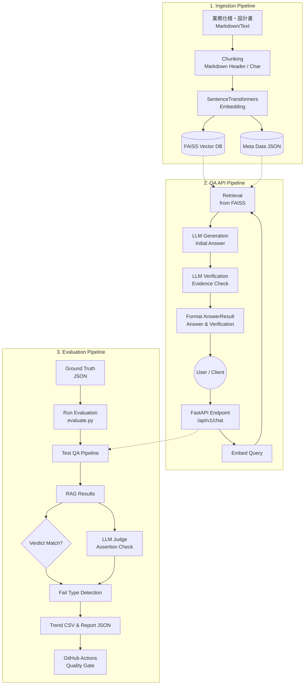
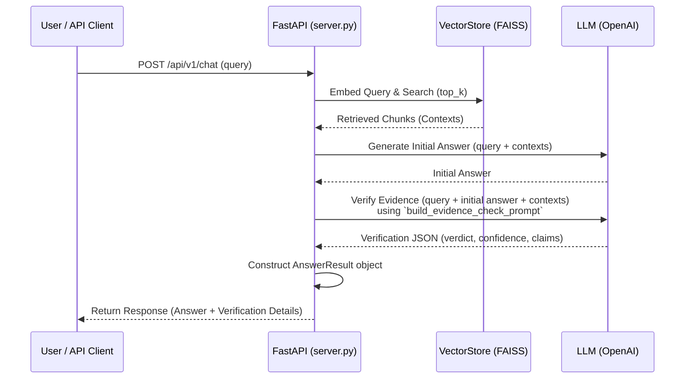

# spec-rag-qa システム設計書 (System Design Document)

## 1. システム概要 (Overview)
本システム「spec-rag-qa」は、業務仕様書や設計書（Markdown等）を対象としたRAG (Retrieval-Augmented Generation) ベースのQAシステムです。

最大の特徴は、単なる「文書検索と回答生成（QA）」にとどまらず、**回答の妥当性を自律的に検証（Verification）し、継続的に自動評価（Evaluation）を行う**ことで、実業務での意思決定に耐えうる極めて信頼性の高いシステムを目指している点にあります。嘘をつかない（ハルシネーションの排除）、重要な条件を隠蔽しない（記述漏れの防止）、主観的な意見を挟まない（意見ガード）といった、運用上のリスク排除としての堅牢なガードレールと品質管理プロセスを内包しています。

## 2. 技術スタック (Technology Stack)
- **バックエンド API:** FastAPI, Uvicorn (非同期対応、高速なAPIサーバー)
- **ベクトル検索・埋め込み:** FAISS (インメモリの高速ベクトル検索), SentenceTransformers (`all-MiniLM-L6-v2` 等によるローカルでの高速な埋め込み)
- **LLM・オーケストレーション:** OpenAI API (高精度なテキスト生成・評価), LangSmith対応 (プロンプトや処理のトレーサビリティ確保)
- **評価・CI/CD連携:** GitHub Actions (自動評価パイプラインによる厳格な Quality Gate 制御)

## 3. システムアーキテクチャ図 (Architecture Diagram)
システムは大きく分けて「ドキュメントのインジェスト」「QA実行」「自動評価」の3つのパイプラインで構成されています。



## 4. コア機能の仕様とデータフロー (Core Data Flow & Sequence Diagram)

### 4.1. QA実行フロー
QA時の処理は単にLLMへ投げるだけでなく、初期回答を生成した後に、その回答が検索されたチャンク（根拠）のみに基づいているかを再検証する自己検証機能（Verifier）を持っています。



### 4.2. 特徴的なチャンキング仕様 (`chunking.py`)
ドキュメントのチャンキングにおいて、ファイルごとに適切な分割手法を使い分けています。
- **Textベース分割 (`simple_char_chunks`)**: 指定の文字数 (`chunk_size`) とオーバーラップ (`chunk_overlap`) に基づく機械的な分割を行います（通常のテキストファイル向け）。
- **Markdownベース分割 (`markdown_header_chunks`)**: Markdownファイルの場合、単純な文字数ではなく、ヘッダー（`#`, `##`, `###`）を区切りとして意味のまとまり（セクション）ごとにチャンク化します。これにより、ある機能の仕様や制約条件という文脈が分断されにくくなり、LLMが正確に情報を拾い上げやすくなる工夫が施されています。

## 5. 自動評価パイプラインの設計 (Evaluation Pipeline)

本システムの最大の特徴は `eval_policy.md` および `evaluate.py` に定義された堅牢な評価方針にあります。単なる「正答率」を追うのではなく、「運用上のリスクを排除する」ことを目的として厳格な Quality Gate が設定されています。

### 4つの評価タイプ
1. **factual_basic (事実正確性)**: 仕様にないことを捏造（幻覚）していないか、事実を正確に出力しているかの基本チェック。
2. **omission_detection (記述漏れ検知)**: 例外条件や制約事項など、ユーザーの意思決定に致命的な影響を与える「重要な前提」を隠していないか。
3. **priority_conflict (横断整合性)**: 仕様書と設計書など、複数の資料に矛盾がある場合に優先順位のルールを正しく守って回答しているか。
4. **opinion_guard (意見ガード)**: AIとしての「使いやすい」などの主観的評価や助言を排除し、事実のみを淡々と提示しているか。

### 評価・Quality Gate の仕組み
評価は、**「RAG自身のVerdict機能」**と**「GPT-4o等の強力なLLMを用いたAssertion（意味判定）機能」**を組み合わせて行われます。
もしFAIL（不合格）が発生した場合、単純にエラーとするだけでなく `improvement_catalog.py` と連携し、原因が「検索漏れ（Retriever）」「プロンプト（Prompt）」「仕様書自体の漏れ（Spec）」のどこにあるかを特定し、推奨される打ち手までをレポートします（Trend CSV）。
CI/CD（GitHub Actions）上では、FAILが1件でも発生した場合、あるいはスコアが95点未満の場合は Quality Gate でブロック（エラー）となり、低品質な変更がデプロイされるのを防ぐ仕組みになっています。

## 6. 主要なディレクトリとファイル構成 (Directory Structure)

```text
spec-rag-qa/
├── data/
│   ├── docs/             # インジェスト対象の業務仕様書・設計書 (Markdownなど)
│   │   └── eval_policy.md # 評価ポリシー（FAIL基準の定義など）
│   ├── eval/             # 評価用データと出力結果
│   │   ├── ground_truth.json # 理想の回答やテストケース群
│   │   ├── report.json       # 最新の評価レポート
│   │   └── trend.csv         # 評価履歴（トレンド分析・改善アクション用）
│   └── index/            # インジェストされたFAISSインデックスとメタデータ
├── src/ragqa/            # RAG QAコアロジック
│   ├── server.py         # FastAPIのエンドポイント定義
│   ├── service.py        # 【コア】RAGのフロー（検索→生成→検証）を統括
│   ├── evaluate.py       # 自動評価パイプラインの実行スクリプト
│   ├── ingest.py         # ドキュメント読み込みとVectorStoreへのインデックス登録
│   ├── chunking.py       # 文字数とMarkdown構成に基づくチャンキングロジック
│   ├── improvement_catalog.py # FAIL種別ごとの改善アクションマトリクス
│   └── utils.py          # Evidence Check用プロンプト生成やJSON抽出など
└── .github/workflows/
    └── ragqa-quality-gate.yml # GitHub Actions の CI/CD Quality Gate 設定
```

## 7. 今後の改善点・拡張性 (Future Improvements)

システムアーキテクト視点での今後の拡張・改善案は以下の通りです。

- **検索機能の強化 (Hybrid Search / Multi-Query Retriever):**
  現在はFAISSと文埋め込みによるベクトル検索のみですが、BM25を用いたキーワード検索を併用するHybrid Searchを追加することで、特定の専門用語やエラーコード（409など）の検索漏れ（Recall不足）を大きく改善できます。また、Multi-Queryの導入で検索精度がさらに向上します。
- **非同期処理の最適化:**
  FastAPIを採用していますが、`service.py` 側のLLM呼び出しなどは同期処理になっています。これを `async/await` および非同期のOpenAIクライアントに書き換えることで、API全体のスループットを大幅に向上させることが可能です。
- **ベクトルデータベースの実運用化:**
  現在はローカルのFAISSインデックスファイルに保存していますが、クラウド環境や複数サーバーで運用・スケールアウトする前提であれば、Qdrant, Pinecone, ChromaDB、PGVectorなどの外部Vector DBへの移行が推奨されます。
- **ドキュメントの増分同期:**
  `ingest.py` が現状全件再作成となっているため、ドキュメント量が増大した際の処理時間を考慮し、差分のみを更新する仕組み（Incremental Indexing）の導入が望まれます。
