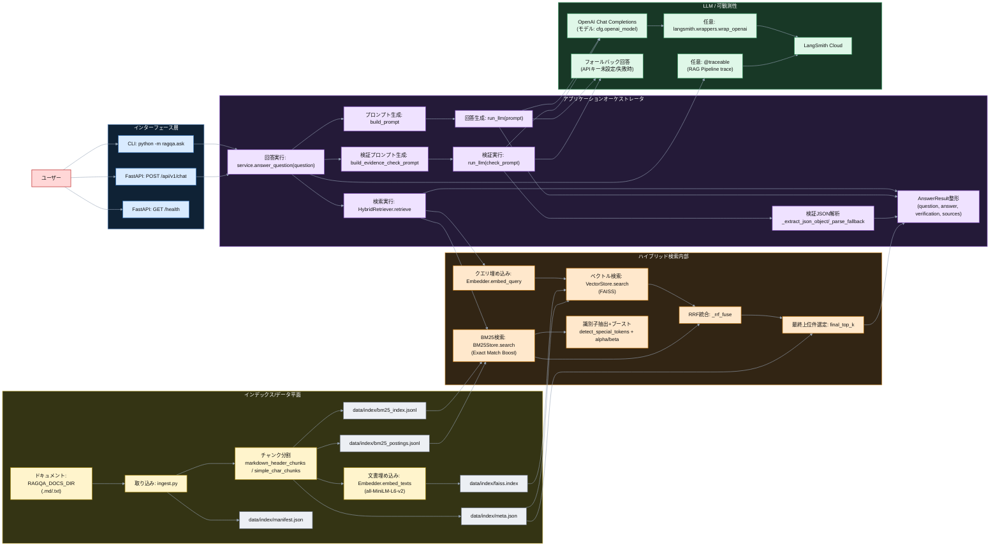

# 実行アーキテクチャ最新版（実装準拠）

この図は、以下の現行実装に基づく最新版です。
- アプリ実行: `src/ragqa/ask.py`, `src/ragqa/server.py`, `src/ragqa/service.py`
- 検索基盤: `src/ragqa/hybrid_retriever.py`, `src/ragqa/vectorstore.py`, `src/ragqa/bm25_store.py`, `src/ragqa/tokenizer_ja.py`
- インデックス構築: `src/ragqa/ingest.py`
- 評価/統治: `src/ragqa/evaluate.py`, `scripts/run_phase4_retrieval_eval.py`, `scripts/run_phase5_grid_search.py`
- CI: `.github/workflows/ragqa-quality-gate.yml`, `.github/workflows/phase5-grid-search.yml`

## 1. 実行時アーキテクチャ（実行系 + データ平面）

## 2. 品質統治アーキテクチャ（CI / 評価 / 最適化平面）

```mermaid
flowchart TB
    subgraph CI1["GitHub Actions: ragqa-quality-gate.yml"]
      Trigger1["トリガー: push / pull_request / workflow_dispatch"]
      UT["ジョブ: unit-test\nBM25/Tokenizer/Hybrid/RetrievalMetrics/Phase5 tests"]
      RG["ジョブ: retrieval-gate\n(拡張コーパス)"]
      EV["ジョブ: evaluate\n(5件 AI Judge)"]
      MON["検索指標モニタ\n(report.json)"]
      Art1["成果物\nphase4_hybrid_retrieval_report.json\nreport.json / trend.csv"]

      Trigger1 --> UT --> RG --> EV --> MON --> Art1
    end

    subgraph RGFlow["retrieval-gate 内部"]
      BuildExp["ingest 実行 (data/phase0_expanded/docs)"]
      P4Eval["scripts/run_phase4_retrieval_eval.py"]
      GTExp["正解データ: ground_truth_phase0_expanded.json"]
      BaseExp["ベースライン: phase0_vector_baseline_expanded.json"]
      SLOGate["SLOゲート\nRecall@5 / MRR / FailureRate"]

      BuildExp --> P4Eval
      GTExp --> P4Eval
      BaseExp --> P4Eval
      P4Eval --> SLOGate
    end

    RG --> BuildExp
    RG --> P4Eval

    subgraph EVFlow["evaluate ジョブ内部"]
      BuildSmall["ingest 実行 (data/docs)"]
      Judge["python -m ragqa.evaluate"]
      GTSmall["正解データ: ground_truth.json"]
      AssertLLM["LLMアサーション判定\n(evaluate.py内 gpt-4o)"]
      Report["data/eval/report.json\n(summary + retrieval + details)"]
      Trend["data/eval/trend.csv"]
      QGate["Quality Gate (evaluate.py)\nfailed>0 or score<95 => exit 1"]
      BaseSmall["ベースライン: phase0_vector_baseline.json"]

      BuildSmall --> Judge
      GTSmall --> Judge
      Judge --> AssertLLM
      Judge --> Report
      Judge --> Trend
      Judge --> QGate
      Report --> MON
      BaseSmall --> MON
    end

    EV --> BuildSmall
    EV --> Judge

    subgraph CI2["GitHub Actions: phase5-grid-search.yml"]
      Trigger2["トリガー: workflow_dispatch / nightly cron"]
      GSJob["ジョブ: phase5-grid-search"]
      BuildGS["ingest 実行 (data/phase0_expanded/docs)"]
      GSRun["scripts/run_phase5_grid_search.py 実行"]
      GSBase["ベースライン: phase0_vector_baseline_expanded.json"]
      GSOut["成果物\nphase5_grid_search_report.json\nphase5_best_config.json\nphase5_grid_search_report.md"]

      Trigger2 --> GSJob --> BuildGS --> GSRun --> GSOut
      GSBase --> GSRun
    end

    %% ===== 表示スタイル =====
    classDef trigger fill:#ffd7d7,stroke:#c53d3d,stroke-width:1.6px,color:#111;
    classDef pipeline fill:#d9ebff,stroke:#2c6db6,stroke-width:1.4px,color:#111;
    classDef script fill:#efe2ff,stroke:#7a46b8,stroke-width:1.4px,color:#111;
    classDef gate fill:#ffe8cc,stroke:#b86b00,stroke-width:1.4px,color:#111;
    classDef data fill:#fff4cc,stroke:#9a7b00,stroke-width:1.4px,color:#111;
    classDef artifact fill:#dff7e8,stroke:#2f8f59,stroke-width:1.4px,color:#111;
    classDef baseline fill:#eceff4,stroke:#596273,stroke-width:1.3px,color:#111;

    class Trigger1,Trigger2 trigger;
    class UT,RG,EV,GSJob pipeline;
    class P4Eval,Judge,GSRun script;
    class MON,SLOGate,QGate gate;
    class BuildExp,GTExp,BuildSmall,GTSmall,BuildGS data;
    class Art1,Report,Trend,GSOut artifact;
    class BaseExp,BaseSmall,GSBase baseline;

    style CI1 fill:#0f2235,stroke:#4f7fb5,stroke-width:1.4px,color:#fff;
    style RGFlow fill:#241a38,stroke:#8050bf,stroke-width:1.4px,color:#fff;
    style EVFlow fill:#322514,stroke:#cc8a2b,stroke-width:1.4px,color:#fff;
    style CI2 fill:#183826,stroke:#4aa573,stroke-width:1.4px,color:#fff;
    linkStyle default stroke:#97a6b8,stroke-width:1.2px;
```

## 3. 補足（この図の更新ポイント）

- **Vector-only構成** ではなく、`HybridRetriever`（Vector + BM25 + RRF + Exact Match Boost）が実行経路の中心です。
- **Verifierは別モデルではなく** `run_llm()` を再利用し、検証プロンプトで十分性判定を行います。
- CIは1本ではなく、`ragqa-quality-gate.yml`（PR/Push向け）と `phase5-grid-search.yml`（夜間最適化）の2系統です。
- 検索SLO監視は、expanded corpus と small corpus で役割分離しています。
