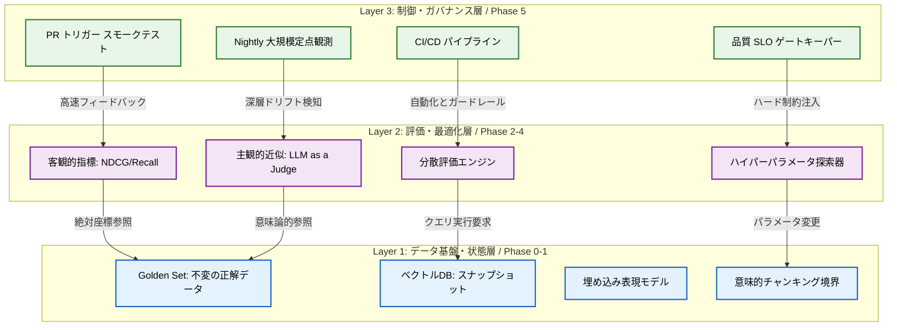
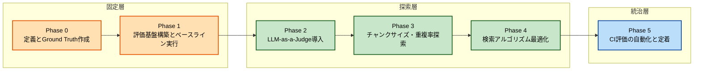
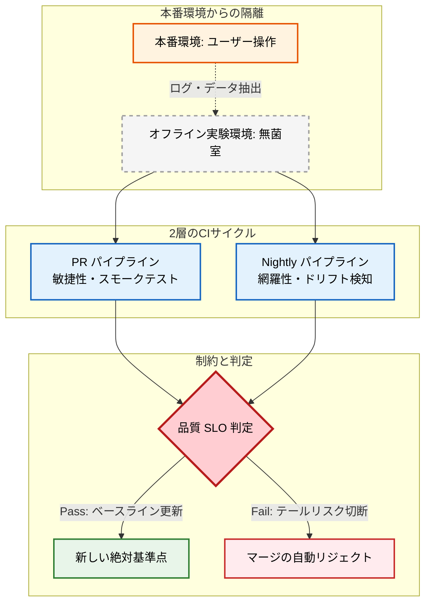
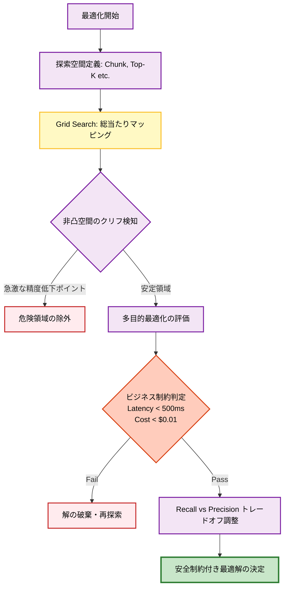
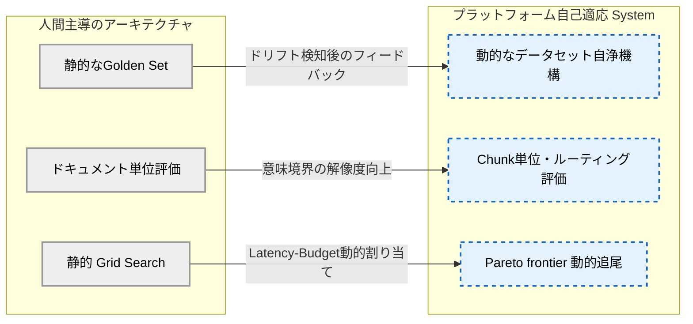

# Retrieval品質管理システム 情報構造化設計書

## 1. Executive Summary

> **【3行サマリー】**
> - **目的**: LLMの事実性を担保する「情報のアンカー（錨）」として稼働し、ハルシネーションを防ぐ最終防衛ライン。
> - **構造**: 一方向の依存関係を持つ3層アーキテクチャと、段階的に不確実性を排除するPhase0〜5のアプローチ。
> - **価値**: 全ての変更を定量的かつ安全に検証可能にし、ビジネス要件とAI精度のトレードオフを最適化する。

### システムの最終目的と存在意義

**【抽象度1：戦略・価値次元】**
*   **本質**: LLM時代におけるRetrievalシステムの最強の存在意義は、確率的テキスト生成に対する「**事実性のアンカー（錨）**」である。
*   **なぜ**: LLMは独立稼働させれば必然的に**ハルシネーション（幻覚）**を引き起こすため。
*   **結果**: 生成AIシステム全体がユーザーに提供する「情報の真実性と信頼性」を決定論的に守り抜くことができる。

**【抽象度2：構造・アーキテクチャ次元】**
*   **本質**: RAGアーキテクチャでは、「人間向けの情報推薦」から「**機械向けのコンテキスト絶対制御**」へと非連続な進化が求められる。
*   **なぜ**: 検索結果を直接解釈するのは批判的思考力を持たないLLMであり、無関係なノイズも真実として文脈構築に使われるため。
*   **結果**: LLMという機械が最も正確に事実を処理できる、高純度なコンテキスト注入機構が確立される。

**【抽象度3：アルゴリズム・演算次元】**
*   **本質**: ベクトル空間におけるユーザーの潜在的インテントとドキュメント距離の乖離を**数学的に定量化**する。
*   **なぜ**: 限られたコンテキストウィンドウ内に「純度の高い事実だけを高い密度で充填する」多次元ナップサック問題の最適解を導出するため。
*   **結果**: 演算と評価の反復によって、ハルシネーションの確率が数学的に最小化される。

---

## 2. 全体アーキテクチャ図（拡張版）

> **【3行サマリー】**
> - **構造**: データ基盤層、評価・最適化層、制御・ガバナンス層の明確な3層構造である。
> - **機能**: 下位層の状態を固定し、上位層がそれをメタ的に評価・制御する一方向制約を持つ。
> - **強度**: プラグ＆プレイの拡張性と「動かざる基準点」の提供により、アーキテクチャの自己矛盾を防ぐ。

---

## 3. レイヤー別責務表

> **【3行サマリー】**
> - **L1**: 全実験の「絶対座標系」として、不変の正解データとベクトル状態を提供する。
> - **L2**: パラメータを網羅的に探索し、指標を算出する「演算中枢」として機能する。
> - **L3**: 品質要件を監視・ブロックする「門番」として、システムの劣化を自動的に防ぐ。

### アーキテクチャの責務分離と強み

**【抽象度2：構造・アーキテクチャ次元】**
*   **本質**: インターフェースが高度に抽象化・疎結合化された「**プラグ＆プレイの拡張性（Extensibility）**」である。
*   **なぜ**: Embeddingモデルの差し替えやハイブリッド検索の追加など、ドラスティックな骨格変更に追従するため。
*   **結果**: 評価機構自体は1行のコード修正もなく再稼働・追従できる靭性を獲得する。

| レイヤー | 抽象度・次元 | 責務と役割 | 本質的な存在理由（なぜ必要か） | もたらされる結果（強み・防御力） |
| :--- | :--- | :--- | :--- | :--- |
| **Layer 1** データ基盤 | 【抽象度1:価値】 絶対座標系 | データチャンキング、Embedding変換、Golden Set（正解データ）の不変管理。 | 実験において基準が変動すると、精度劣化の原因がデータかコードか切り分けられないため。 | **厳密な再現性（Reproducibility）** 特定のハッシュツリーで過去の最適解を完全にロールバック・再証明できる。 |
| **Layer 2** 評価と最適化 | 【抽象度3:演算】 演算中枢 | Grid Search等によるパラメータ探索。 客観的MetricsとLLMによる主観的近似の算出。 | 複雑に絡み合うパラメータ空間の中で、システムが現在の精度を自己定量化する必要があるため。 | **因果の特定（Fault Localization）** どのパラメータが精度向上・低下に寄与したかを数理的に局所化できる。 |
| **Layer 3** ガバナンス | 【抽象度2:構造】 システムの門番 | CI/CDとの統合、SLO逸脱の監視・自動ブロック機構。PRおよびNightlyのトリガー制御。 | 属人的な注意等による検証は破綻するため。品質後退を許さない自動防衛機構が必要だから。 | **不可逆なパラダイムシフト** 検証が自動化されることで、リスクを取った野心的なAI拡張への強力な防弾チョッキとなる。 |

---

## 4. フェーズ進化マップ

> **【3行サマリー】**
> - **概念**: 不確実性を排除するため、Layer1からLayer3へ向かって段階的に前提を固定していく。
> - **構造**: 前フェーズの出力を「不変の定理」として扱い、次フェーズの変数のみを動かす設計である。
> - **効果**: 変数を一つずつ定数化することで、原因の局所化（Fault Localization）を数学的に可能にする。

### 段階的構築の設計思想

**【抽象度1：戦略・価値次元】**
*   **本質**: 全機能の一括構築を避け、「**不確実性の分離と、品質保証の段階的積み上げ**」を採用する。
*   **なぜ**: AIは複数のブラックボックスが絡み合う複雑系であり、土台が崩れた状態での最適化は砂上の楼閣となるため。
*   **結果**: 各フェーズでの成果が確固たる基盤となり、後戻りのない着実な価値創出を実現する。

**【抽象度2：構造・アーキテクチャ次元】**
*   **本質**: 前フェーズの出力を「**不変の定理**」として扱う、「依存性逆転の回避」の時系列プロセスである。
*   **なぜ**: データセット（物差し）が確定して初めて、パラメータ最適化（探索）が意味を持つから。
*   **結果**: 探索から自動化への階層的アプローチにより、手戻りコストが構造的に最小化される。

**【抽象度3：アルゴリズム・演算次元】**
*   **本質**: 高次元パラメータ空間の変数を一つずつ定数化し、「**偏微分可能で解釈可能な状態**」を維持する。
*   **なぜ**: データと探索アルゴリズムを同時に変更すると、指標向上の真の要因が数学的に特定不能になるため。
*   **結果**: バグや精度劣化が発生した際、原因の局所化（Fault Localization）が即座に行える。

---

## 5. 品質統治構造図

> **【3行サマリー】**
> - **概念**: 実験環境（無菌室）と本番環境を厳密に分離し、安全なストレステストを実現する。
> - **機構**: PRごとの敏捷なスモークテストと、Nightlyの深層ドリフト検知の2層サイクルを持つ。
> - **基準**: ベースラインを絶対座標として固定し、確率的挙動に対し決定論的ブレーキ（SLO）を導入する。

### オフライン分離とCI/CDの思想

**【抽象度1：戦略・価値次元】**
*   **本質**: テスト自動化に留まらない、「**組織知識の属人化排除**」と「**品質劣化への自動防衛**」である。
*   **なぜ**: 本番環境での直接テストは、致命的なシステムリスク（破局的忘却や精度崩壊）によるユーザーの信頼喪失を招くため。
*   **結果**: プラットフォームが「安全に失敗できる無菌室」となり、開発体制の心理的・システム的安全性を担保する。

**【抽象度2：構造・アーキテクチャ次元】**
*   **本質**: **ベースラインの固定**と、時間軸・スコープの異なる「**2層のCIサイクル（PRとNightly）**」の分離である。
*   **なぜ**: 評価基準がブレると差分（Delta）の観測性が失われ、敏捷性と網羅性は一つのサイクルでは両立しないため。
*   **結果**: 数分での致命的エラー検知と、数時間での微細な精度ドリフト抽出のトレードオフが解消される。

**【抽象度3：アルゴリズム・演算次元】**
*   **本質**: 単なる目標値ではなく、「**硬質なSLO（Service Level Objective）**」というハード制約をシステムに設ける。
*   **なぜ**: 確率的挙動を示すAIの分散の裾野（テールリスク）を、決定論的なアーキテクチャで強制的に切り落とすため。
*   **結果**: 全乱数シードの固定やVCR化などのハイスループット保証基盤により、Flaky Tests（外部環境起因のエラー）が根絶される。

---

## 6. 最適化制御フロー図

> **【3行サマリー】**
> - **概念**: 品質最適化とは「ビジネス上の制約」と「AIの理想的精度」のバランスポイントを証明付きで導出することである。
> - **手法**: Retrieval空間特有の非凸性（クリフ）を把握するため、初期はGrid Searchによる網羅的探索を強制する。
> - **制約**: PrecisionとRecallの背反を管理し、レイテンシやコストの不等式ハード制約を満たす「安全制約付き最適化」を行う。

### オプティマイザの設計思想

**【抽象度2：構造・アーキテクチャ次元】**
*   **本質**: 初期段階において「**Grid Search（グリッドサーチ）**」ベースの空間地図（サーチスペースマップ）の描像を徹底する。
*   **なぜ**: RetrievalのLoss関数空間は「**非凸（Non-convex）**」であり、特定の変数組み合わせで急激に精度を落とすクリフ（崖）が存在するため。
*   **結果**: ベイズ最適化等による局所最適解の罠を回避し、全体の空間構造をアーキテクトが完全に把握できる基盤が整う。

### 【表】多目的最適化におけるトレードオフマトリクス

**【抽象度3：アルゴリズム・演算次元】**
最適化は必然的に「多目的最適化」となる。単一指標の追及は別の致命的劣化を引き起こすため、「**安全制約付き最適化（ハード制約下でのメタメトリクス最大化）**」を志向する。

| 最適化変数の操作 | ポジティブな効果（向上する指標） | ネガティブな効果（悪化する指標・リスク） | 本質的理由（なぜ相反するのか） |
| :--- | :--- | :--- | :--- |
| **Top-K変数の増加** (コンテキスト量の拡大) | **Recall（再現率）向上** 必要な情報が含まれる確率が上がる。 | **Precision（適合率）低下** ノイズ混入リスク増大。 **Lost in the Middle現象**の誘発。 | LLMのコンテキストウィンドウには情報処理能力の限界（アテンションの希釈）が存在するため。 |
| **重厚なモデルの採用** (埋め込み次元数の増加) | **意味的正確性向上** 微妙なニュアンスの捕捉力が上がる。 | **Latency増大 / 制約超過** APIコスト跳ね上がりと体験の悪化（レスポンス遅延）。 | 豊かなベクトル表現は、計算量と保存空間（ストレージやメモリ周波数）を物理的に圧迫するため。 |
| **チャンクサイズの縮小** (粒度の細分化) | **命中率・密度の向上** ノイズの少ない高純度なベクトルが生成される。 | **文脈（コンテキスト）の喪失** 代名詞の指す先や前提条件が失われ、LLMが解釈不能になる。 | 意味的分節は固定文字数ではなく、文章本来のセマンティクス構造に依存して形成されるため。 |

---

## 7. リスク管理マトリクス

> **【3行サマリー】**
> - **概念**: アーキテクチャが高度化することで、逆に発生しうる構造的・アルゴリズム的アキレス腱を定義する。
> - **リスク**: 評価指標への過剰依存、時間経過によるデータセットの陳腐化、変数の過学習による汎化性能の崩壊。
> - **対策**: 単一KPIの盲信を避け、正解データの鮮度を維持し、汎化性能を検証する未知データのテスト機構を備える。

### 【表】アーキテクチャが内包する潜在的リスク

当システムが優秀に稼働し続けることで、逆説的に以下のシステム・ビジネスリスクが増大する。これらはアーキテクチャ上の「技術的負債」として管理されるべきである。

| 抽象度・次元 | リスクの名称 | リスクの本質（なぜ発生するか） | もたらされる最悪の結果 | アーキテクトとしての認識・対策 |
| :--- | :--- | :--- | :--- | :--- |
| **【抽象度1】** 戦略・価値 | **評価指標への過剰依存** （Goodhartの法則の罠） | マネジメント層が単一KPIを盲信し、エンジニアが「ベンチマークハック」に注力し始めるため。 | システムのスコアと、実際のユーザー体験（セマンティック・ギャップ）の致命的な乖離が放置される。 | KPIは手段であり、真の価値提供指標を見失わない人間側のアウェアネスの維持が不可欠。 |
| **【抽象度2】** 構造・アーキ | **ベンチマーク劣化** （Dataset Decay） | 静的固定されたGolden Setは絶対座標系だが、現実のユーザーの検索トピックは日々動的に変化するため。 | 半年後、「過去のユーザー動向に完璧に最適化された、現代では役立たずの検索器」が完成する。 | Phase5までの構造には「正解の自動自浄メカニズム」がないことをシステムのアキレス腱と捉える。 |
| **【抽象度3】** 演算・アルゴ | **ハイパーパラメータの過学習** （Overfitting） | Grid Searchが、特定データセットの微細な偏りに対して局所的にバランスをチューニングしすぎてしまうため。 | 未知の概念やロングテールクエリが入力された瞬間、汎化性能が崩壊し精度がランダムに拡散する。 | 現在のスコアが「特定の限られた空間でしか機能しない過敏なバランス」であることを強く警戒する。 |

---

## 8. 将来拡張ロードマップ

> **【3行サマリー】**
> - **概念**: Phase5までが「守りの完了」であり、Phase6以降は環境変動を自律検知する「攻めの自動進化」へ移行する。
> - **構造**: ドキュメント単位の評価を解体し、「Chunk単位評価」と動的な「知識ルーティング層」へ次元拡張する。
> - **アルゴ**: 連続的強化学習等を用い、限界トレードオフ上（パレート境界）を自律的にサーフィンする演算器へ進化する。

### 自己適応型システムへの布石

**【抽象度1：戦略・価値次元】**
*   **本質**: 「人間がアーキテクチャを検証する」フェーズを脱却し、「**Self-Adaptive System（自己適応型システム）**」を目指す。
*   **なぜ**: アプリケーション規模とユーザー動向の変化速度が、人間の手動調整能力の限界を物理的に超えるため。
*   **結果**: システム自体が自律的に評価の枠組みを拡張し、継続的な「攻めの自動進化」へと移行する。

**【抽象度2：構造・アーキテクチャ次元】**
*   **本質**: 「ドキュメント単位の評価基盤の解体」と、「**知識ルーティング層の追加余白**」の確保である。
*   **なぜ**: クエリの文脈に応じて、軽量Embeddingと重量級Cross-Encoderを動的に切り替える要求が発生するため。
*   **結果**: 単純な検索から、意味境界を理解した「Chunk単位の評価と高度な再ランク機構」へのシームレスな次元拡張が可能になる。

**【抽象度3：アルゴリズム・演算次元】**
*   **本質**: 「**Latency-Budget動的割り当て**」と、「**Pareto frontier（パレート境界）自動追尾アルゴリズム**」への進化である。
*   **なぜ**: Grid Searchは静的であり、リアルタイムの負荷状況に応じた動的なトレードオフ調整ができないため。
*   **結果**: ベイズ最適化等の連続的強化学習が行い、「残り50msならK変数を増やす」といった判断で限界曲線上を常にサーフィンし続ける演算器となる。

---

## 9. 用語集

> **【3行サマリー】**
> - **概念**: システムを理解するためのメタ言語と抽象概念を定義する。
> - **構造**: 一般的なAI用語ではなく、本アーキテクチャにおける独自の役割や文脈を併記する。
> - **機能**: チーム間での認識のズレを防ぐ、セマンティックな共通基盤として機能する。

| 専門用語 | 本アーキテクチャにおける定義と文脈 |
| :--- | :--- |
| **ハルシネーション** (Hallucination) | LLMが事実とは異なる嘘を生成する現象。**本システムが根絶すべき最大の敵**。 |
| **事実性のアンカー** (Epistemological Anchor) | 確率の波の中で事実という錨を下ろし、真理性を担保する本システムの最重要概念。 |
| **Golden Set** (正解データセット) | 評価の「絶対座標系」。システムが正しく振る舞ったか判定するための不変の理想データ。 |
| **Grid Search** (グリッドサーチ) | 変数の組み合わせを総当たりで検証する手法。未知空間の**クリフ（崖）**を地図化するために必須。 |
| **Lost in the middle** (中間情報の忘却) | コンテキスト増大時にLLMが中間の情報を読み落とす現象。Recall追求の副作用。 |
| **Goodhartの法則の罠** | 「KPIが目的化すると良い指標ではなくなる」法則。エンジニアの**スコアハック**リスクを指す。 |
| **Flaky Tests** (フラッパー) | 環境要因でランダムに失敗するテスト。CIの信用を失墜させるため**厳密なオフライン分離**で防ぐ。 |
| **Pareto frontier** (パレート境界) | 複数指標の**トレードオフの限界曲線**。将来はこの曲線上を自律的に動く制御を目指す。 |
