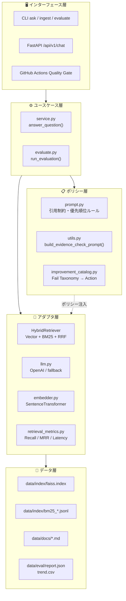
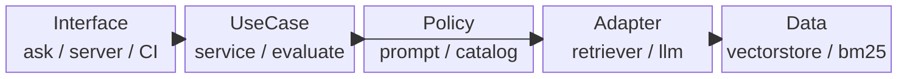
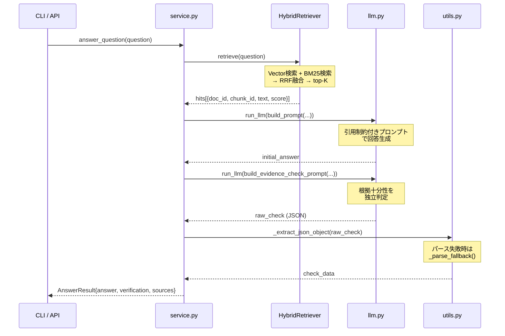
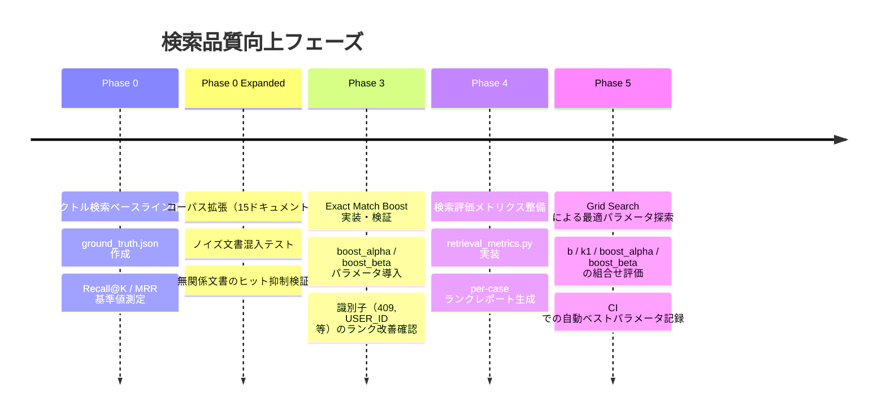
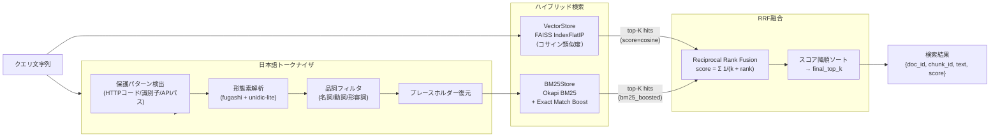
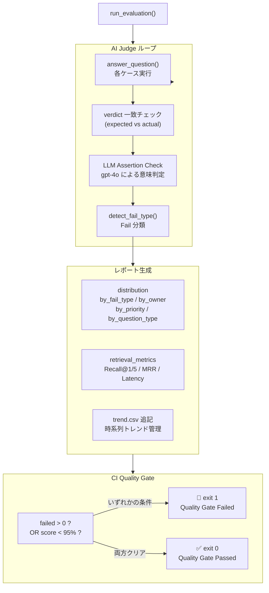
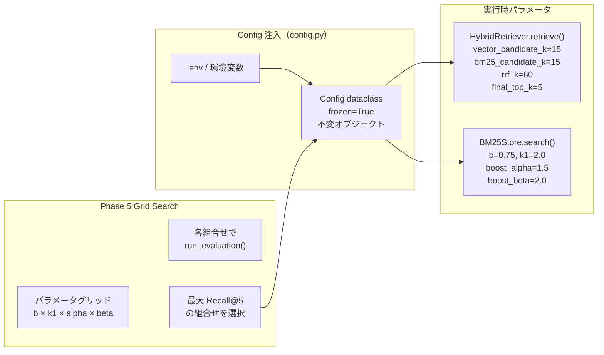
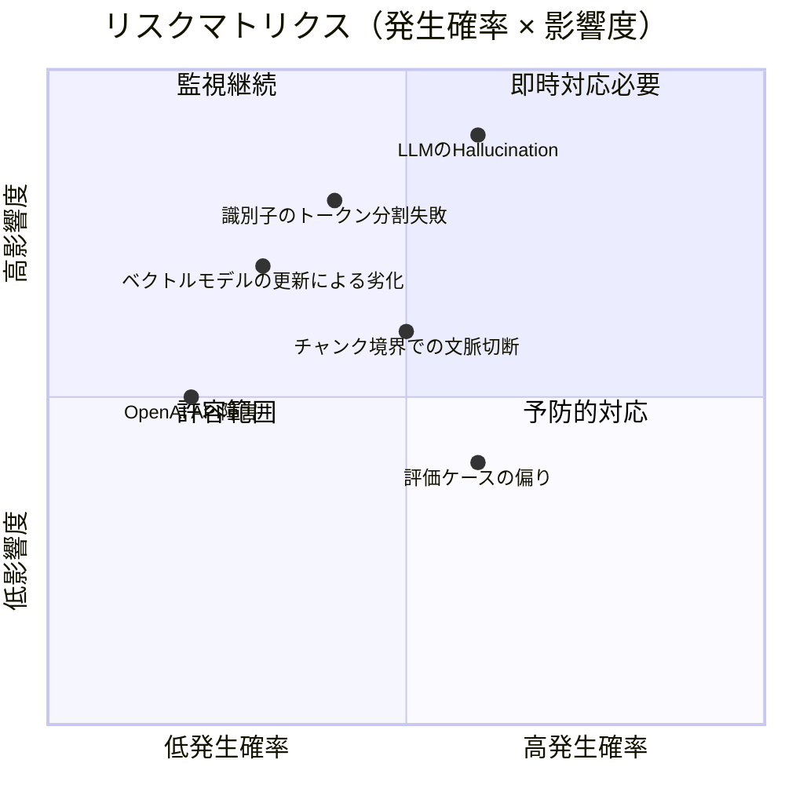
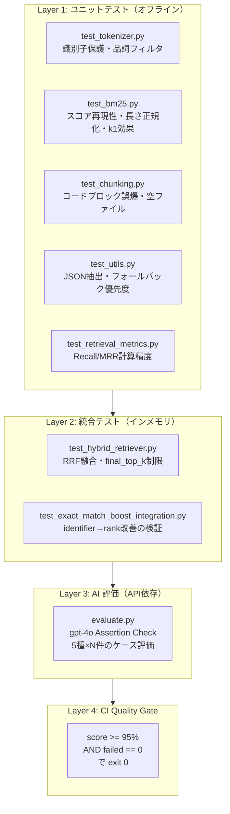

# Spec RAG QA — 情報設計書

> **版**: 1.0 / 対象実装: `_all_project_code.txt` より生成

---

## Executive Summary

**本システムは「仕様書QA」と「品質統治」を工学的に分離した RAG アプリ基盤である。**

- 単なる「回答できる」RAG ではなく、**CI/CD パイプライン上で品質回帰を自動検知・停止する** ことを目的とする。
- **業務フロー**（Retrieve → Generate）と**品質フロー**（Verify → Evaluate → Gate）を独立レイヤーで実装し、片方の変更が片方に波及しない設計を採用している。
- LLM・ベクトル基盤・評価ポリシーのいずれも差し替え可能な**アダプタ構造**を持ち、ドメイン別 RAG の共通フレームワークとして再利用できる。

### 本書の位置づけ

| 観点 | 説明 |
|------|------|
| **本質** | LLM 品質を「主観的レビュー」から「工学的制御プロセス」へ変換する設計思想 |
| **なぜ** | プロンプト改善の積み重ねだけでは、サイレント劣化を防げないため |
| **結果** | CI が品質ゲートとして機能し、回帰を自動的にブロックできる |

---

## 1. 全体アーキテクチャ図（拡張版）

### 3行サマリー

依存方向を一方向に制御した4レイヤー構造を採用する。
インターフェース層（CLI/API/CI）はユースケース層にのみ依存し、外部システムの詳細は末端のアダプタ層に閉じ込める。
この設計により、LLM・Retriever・インフラの選択変更がドメインロジックに影響しない。



### 依存方向の制約

- **Interface → UseCase のみ**：CLI/API は `answer_question()` と `run_evaluation()` だけを呼ぶ
- **UseCase → Policy/Adapter**：ドメイン判断は CLI/API の詳細に依存しない
- **Adapter → Data**：外部システムへの接触はアダプタ層に閉じる
- **逆方向依存禁止**：下位層が上位層をインポートしない

---

## 2. レイヤー別責務表

### 3行サマリー

各レイヤーは明確な単一責務を持ち、それ以外の関心事を持たない。
責務の逸脱はレイヤー境界の侵食を招き、差し替え耐性を損なう。
責務表はリファクタリング・レビュー時の判断基準として機能する。

| レイヤー | 責務 | 主要モジュール | 持ってはいけないもの |
|---------|------|--------------|-------------------|
| **インターフェース層** | 入出力の整形・エラー表示 | `ask.py`, `server.py`, `evaluate.py`（CI部） | ビジネスロジック、LLM 呼び出し |
| **ユースケース層** | RAG パイプラインの制御フロー | `service.py` | DB 詳細、HTTP 詳細 |
| **ポリシー層** | プロンプト規約・評価基準・Fail 分類 | `prompt.py`, `utils.py`, `improvement_catalog.py` | 検索実装、モデル呼び出し |
| **アダプタ層** | 外部システムとのプロトコル変換 | `hybrid_retriever.py`, `llm.py`, `embedder.py`, `retrieval_metrics.py` | ビジネスルール |
| **データ層** | 永続化・インデックス管理 | `vectorstore.py`, `bm25_store.py`, `ingest.py` | 回答ロジック |



---

## 3. コアフロー詳細

### 3行サマリー

RAG の実行は5ステップで構成され、「回答生成」と「品質検証」が明確に分離されている。
検証ステップ（Verify）は独立したLLM呼び出しとして実装され、回答を書き換えない純粋な判定機として機能する。
この分離により、回答品質と検証精度を独立して改善できる。



#### ステップ別説明

**Step 1 — Retrieve（検索）**

`HybridRetriever.retrieve()` がベクトル検索と BM25 検索を並列実行し、**RRF（Reciprocal Rank Fusion）** で統合する。

`Exact Match Boost` により、クエリ中の**特殊識別子**（HTTPステータスコード・大文字識別子・APIパス等）に一致するチャンクのスコアが補正される。

**Step 2 — Generate（回答生成）**

`build_prompt()` が生成する引用制約付きプロンプトは、以下を強制する：

- `[source: doc.md#chunk_id]` タグの引用
- 根拠のない内容は「仕様書に記載がないため不明」と回答
- 現状仕様と将来予定の厳格な区別
- 主観的判断の禁止

**Step 3 — Verify（根拠十分性検証）**

`build_evidence_check_prompt()` による独立した LLM 呼び出しで、回答主張が根拠チャンクで支持されているかを判定する。

**重要な設計判断**：Verifier による回答書き換え（merge）は廃止。`AnswerResult` に純粋な回答と検証結果を分離格納する。

**Step 4 — JSON 解析と Fallback**

LLM 出力の JSON 解析には3段階のフォールバックがある：

- 直接 `json.loads()`
- コードフェンス ```` ```json ``` ```` 内の抽出
- 正規表現による最初の `{...}` の抽出
- 全て失敗時 → `_parse_fallback()` でテキストから `verdict` を推定（安全側 = `insufficient`）

**Step 5 — Return（結果返却）**

`AnswerResult` スキーマでパッキングして返却。UI 依存（print 等）は一切持たない。

---

## 4. フェーズ進化マップ

### 3行サマリー

本プロジェクトはフェーズ別にシステムの検索品質を段階的に向上させる戦略をとる。
各フェーズには独立した評価スクリプトとベースライン記録が存在し、回帰の有無を客観的に判定できる。
フェーズ設計はシステムの改善仮説を検証可能な単位に分割する工学的アプローチである。



| フェーズ | 目標 | 主要成果物 | 評価基準 |
|--------|------|----------|---------|
| **Phase 0** | ベクトル検索ベースライン | `phase0_vector_baseline_report.md` | Recall@5 基準値 |
| **Phase 0 Expanded** | コーパス拡張でのロバスト性 | `ground_truth_phase0_expanded.json` | ノイズ文書混入時の精度 |
| **Phase 3** | Exact Match Boost 有効性確認 | `phase3_boost_verification.json` | boost前後のランク変化 |
| **Phase 4** | 検索指標の整備 | `retrieval_metrics.py` | MRR, Recall@1/5, P95レイテンシ |
| **Phase 5** | ハイパーパラメータ最適化 | Grid Search レポート | 最大 Recall@5 のパラメータセット |

---

## 5. ハイブリッド検索アーキテクチャ

### 3行サマリー

ベクトル検索の意味的マッチングと BM25 の語彙的マッチングを RRF で融合することで、単一手法の弱点を補完する。
特に**識別子（エラーコード・API パス・大文字略語）**はベクトル空間での表現が難しく、BM25 + Exact Match Boost が補完する。
日本語形態素解析では専門識別子が分割されるリスクがあるため、プレースホルダー保護機構を実装している。



#### Exact Match Boost の計算式

```
bm25_boosted = bm25_raw
             + boost_alpha × exact_hit_count
             + boost_beta  × all_hit_flag
```

- **`exact_hit_count`**: クエリ中の特殊識別子がチャンクに含まれる数
- **`all_hit_flag`**: 全識別子がヒットした場合に 1
- **`boost_alpha`** (default: 1.5): 部分ヒットの補正係数
- **`boost_beta`** (default: 2.0): 全ヒット時のボーナス係数

#### トレードオフ: 検索手法の比較

| 手法 | 強み | 弱み |
|------|------|------|
| **ベクトル検索（FAISS）** | 意味的な言い換えに強い。「ステータスコード」と「HTTP Code」を同一概念として扱える | 識別子（"409", "USER_ID"）の数値・記号的一致に弱い |
| **BM25** | 語彙的完全一致に強い。識別子・コード番号のマッチが確実 | 言い換えや同義語に対応できない。文書長の偏りに敏感 |
| **RRF 融合** | 両手法の順位情報を統合することで補完関係を活かせる | パラメータ（rrf_k, boost_alpha, boost_beta）のチューニングが必要 |
| **Exact Match Boost** | 識別子の欠落（Phase 0 失敗パターン）を直接補正できる | 過剰な boost で関係のないチャンクが上位に来るリスクがある |

---

## 6. 品質統治構造図

### 3行サマリー

品質統治は「評価実行 → Fail 分類 → 改善アクション特定 → CI ゲート」の4段階サイクルで構成される。
Fail タイプ分類は**オーナー**（spec/rag/prompt/system）と**優先度**（CRITICAL/HIGH/MEDIUM）で構造化され、改善責任を明示する。
CI ゲートはスコアと個別 FAIL 件数の両方を検査し、どちらかの条件違反でパイプラインを停止する。



#### Fail タイプ タクソノミー（全8分類）

| Fail Type | オーナー | 優先度 | 根本原因 |
|-----------|---------|-------|---------|
| `EMPTY_ANSWER` | system | CRITICAL | システムエラーまたは過剰フィルタリング |
| `RETRIEVAL_FAILURE (Evidence Missing)` | rag | HIGH | 関連ドキュメントが検索できていない |
| `HALLUCINATION / OVERCONFIDENCE` | prompt | HIGH | 根拠なしに断定回答（幻覚） |
| `VERDICT_MISMATCH` | prompt | MEDIUM | 自己評価と期待値のズレ |
| `OMISSION (Critical Condition Missing)` | spec | HIGH | 例外条件・制約の検索・記載漏れ |
| `PRIORITY_ERROR (Wrong Rule Applied)` | spec | MEDIUM | 仕様間の優先順位が不明確 |
| `OPINION_LEAK (Subjective)` | prompt | CRITICAL | AI が主観的判断を行っている |
| `FACTUAL_ERROR (Keyword Missing)` | rag | HIGH | 必須キーワードが回答に含まれていない |

---

## 7. 最適化制御フロー図

### 3行サマリー

BM25 と RRF のハイパーパラメータは Phase 5 の Grid Search で最適化される。
最適化は CI ワークフロー（`phase5-grid-search.yml`）として自動化されており、評価実行と記録が継続的に行われる。
Config クラスはイミュータブル（`frozen=True`）で、環境変数経由での注入に対応している。



#### 設定パラメータ一覧

| パラメータ | デフォルト値 | 効果 |
|-----------|------------|------|
| `chunk_size` | 700文字 | テキストチャンクの最大長（.txt 用） |
| `chunk_overlap` | 120文字 | チャンク間のオーバーラップ |
| `top_k` | 5 | 最終的に返す検索結果数 |
| `bm25_b` | 0.75 | 文書長正規化の強さ（0=無効, 1=完全正規化） |
| `bm25_k1` | 2.0 | TF 飽和点の制御（高いほど多出現語を優遇） |
| `rrf_k` | 60 | RRF スコアの平滑化係数 |
| `boost_alpha` | 1.5 | 識別子部分ヒット補正 |
| `boost_beta` | 2.0 | 識別子全ヒットボーナス |

---

## 8. リスク管理マトリクス

### 3行サマリー

システムは4つの主要リスク領域（検索・生成・評価・インフラ）を抱える。
各リスクには発生確率と影響度の評価、および具体的な軽減策が設計されている。
現行実装で対処済みのリスクと、将来対応が必要なリスクを区別して管理する。



| リスク | 発生確率 | 影響度 | 現行の軽減策 | 残余リスク |
|--------|---------|-------|------------|-----------|
| **識別子のトークン分割失敗** | 中 | 高 | プレースホルダー保護機構（`tokenizer_ja.py`） | 新パターンの追加漏れ |
| **LLM の Hallucination** | 高 | 最高 | 根拠引用強制プロンプト + Verify ステップ | プロンプト注入耐性 |
| **チャンク境界での文脈切断** | 中 | 中 | Markdown ヘッダー単位分割、オーバーラップ設定 | 長大セクションの分割 |
| **ベクトルモデル更新による劣化** | 低 | 高 | `manifest.json` で埋め込みモデル記録 | 再 ingest 運用の徹底 |
| **OpenAI API 障害** | 低 | 中 | `fallback_answer()` による検索結果表示 | 評価ステップは API 依存のまま |
| **評価ケース（ground truth）の偏り** | 高 | 中 | 複数タイプのケース設計（factual/omission/opinion 等） | カバレッジ不足は継続リスク |
| **JSON 解析失敗** | 中 | 低 | 3段階フォールバック + `_parse_fallback()` | 信頼度が低いまま通過するリスク |

---

## 9. テスト戦略

### 3行サマリー

テストは「ユニット → 統合 → AI 評価 → CI ゲート」の4層で構成され、それぞれが異なる品質側面を検証する。
ユニット・統合テストはオフライン実行可能で、ネットワーク依存を `conftest.py` で強制排除している。
AI 評価層は `gpt-4o` による意味判定を組み込み、ルールベースでは検出できない意味的劣化を検知する。



#### テストカテゴリ別の品質観点

| テストカテゴリ | 検証観点 | 実行コスト | CI 統合 |
|--------------|---------|----------|---------|
| **トークナイザ** | 識別子保護の正確性、品詞フィルタの一貫性 | 低（オフライン） | ✅ 常時 |
| **BM25** | スコア再現性、長さ正規化、パラメータ感度 | 低（インメモリ） | ✅ 常時 |
| **チャンク分割** | コードブロック誤爆防止、空ファイル耐性 | 低 | ✅ 常時 |
| **ハイブリッド検索** | RRF 融合の正確性、final_top_k 制限 | 低（インメモリ） | ✅ 常時 |
| **Exact Match Boost** | 識別子ヒット時のランク改善検証 | 低（インメモリ） | ✅ 常時 |
| **AI 評価** | 意味的回答品質、Fail タイプ分類精度 | 高（OpenAI API） | ✅ ゲートとして |
| **リトリーバル回帰テスト** | 辞書更新時のトークン差分検出（OOV率≤5%） | 中（スナップショット比較） | ⚠️ オプション |

---

## 10. 将来拡張ロードマップ

### 3行サマリー

現在のシステムは「仕様書 QA」ドメイン向けの具体実装として機能している。
将来は共通品質フレームワーク + ドメイン別 Policy Pack として再利用可能な基盤へと進化させる。
最終ビジョンは、複数プロダクトをまたぐ「LLM 品質 OS」の構築である。

```mermaid
roadmap
    title 将来拡張ロードマップ
    section 短期（現行）
        仕様書QA 単一ドメイン: done
        FAISS + BM25 ハイブリッド検索: done
        AI-Judge 評価ループ: done
        CI Quality Gate: done
    section 中期
        管理型 Vector DB 移行（Pinecone/Weaviate）: active
        Policy Pack 化（法務QA / サポートQA）: active
        LangSmith トレーシング強化: active
        ストリーミング API 対応: 
    section 長期
        標準化 Fail Taxonomy（クロスプロダクト）: 
        品質トレンドダッシュボード: 
        Policy Pack マーケットプレイス: 
        LLM 品質 OS としての再利用基盤: 
```

#### 差し替えポイント一覧

| 差し替え対象 | 現行実装 | 代替候補 | 必要な変更範囲 |
|------------|---------|---------|--------------|
| **LLM プロバイダ** | OpenAI GPT-3.5/4o | Anthropic Claude / Google Gemini / ローカルLLM | `llm.py` のみ |
| **ベクトル基盤** | FAISS（インメモリ） | Pinecone / Weaviate / pgvector | `vectorstore.py` のみ |
| **埋め込みモデル** | all-MiniLM-L6-v2 | multilingual-e5 / text-embedding-3-small | `embedder.py` のみ |
| **評価ポリシー** | 仕様書QA用 ground truth | 法務QA / サポートQA 用ケースセット | `data/eval/` + `improvement_catalog.py` |
| **インターフェース** | CLI + FastAPI | Slack Bot / Teams Bot / gRPC | `ask.py` / `server.py` のみ |

---

## 用語集

| 用語 | 定義 |
|------|------|
| **RAG（Retrieval-Augmented Generation）** | 検索で得た文書チャンクを文脈として LLM に与えて回答を生成する手法 |
| **Hybrid Retrieval** | ベクトル検索（意味的類似度）と BM25（語彙的一致）を組み合わせた検索手法 |
| **RRF（Reciprocal Rank Fusion）** | 複数検索結果の順位を統合するアルゴリズム。スコア = Σ 1/(k + rank) |
| **Exact Match Boost** | クエリ中の識別子トークンがチャンクに完全一致した場合に BM25 スコアに加算するボーナス |
| **BM25（Okapi BM25）** | TF-IDF を改良したランキング関数。文書長正規化とTF飽和を組み込む |
| **Verify ステップ** | 生成された回答が根拠チャンクで支持されているかを独立した LLM 呼び出しで判定する |
| **Fail Taxonomy** | FAIL の原因をオーナー・優先度・タイプで分類した体系。improvement_catalog と対応 |
| **AI Judge** | `gpt-4o` が「判定基準（assertion）を満たすか」を意味的に評価するメカニズム |
| **Quality Gate** | CI パイプラインで品質スコアまたは FAIL 件数が閾値を超えた場合にビルドを停止する制御点 |
| **Ground Truth** | 正解として定義された評価ケース集。`expected_verdict` と `assertion` を含む |
| **Policy Pack** | 特定ドメイン（仕様書QA・法務QA等）向けのプロンプト規約・評価ケース・Fail 分類をまとめたセット |
| **Chunk** | ドキュメントを分割した単位。`doc_id`, `chunk_id`, `text` を持つ |
| **manifest.json** | インデックス生成時の設定（埋め込みモデル・BM25 パラメータ・文書ハッシュ）を記録するメタデータ |
| **Recall@K** | 上位K件の検索結果に正解ドキュメントが含まれる割合 |
| **MRR（Mean Reciprocal Rank）** | 正解ドキュメントが初めて現れる順位の逆数の平均値 |
| **趨勢CSV（trend.csv）** | 評価実行ごとにスコア・Fail 分布・推奨アクションを時系列で記録するファイル |
| **unidic-lite / fugashi** | 日本語形態素解析で使用する辞書とラッパーライブラリ |
| **FAISS IndexFlatIP** | 内積による厳密近傍探索インデックス。正規化済みベクトルに対してコサイン類似度と等価 |
