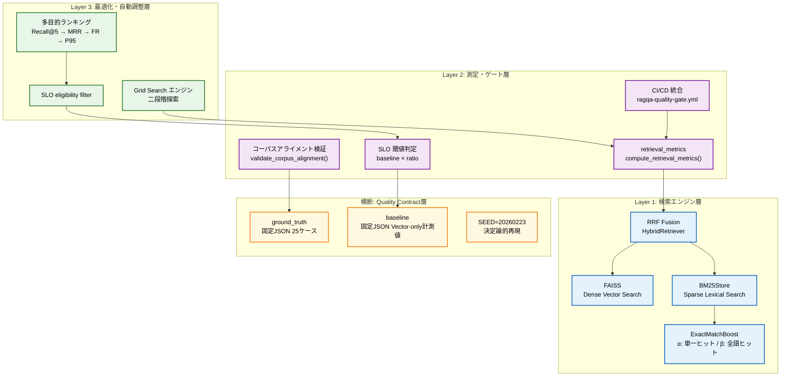
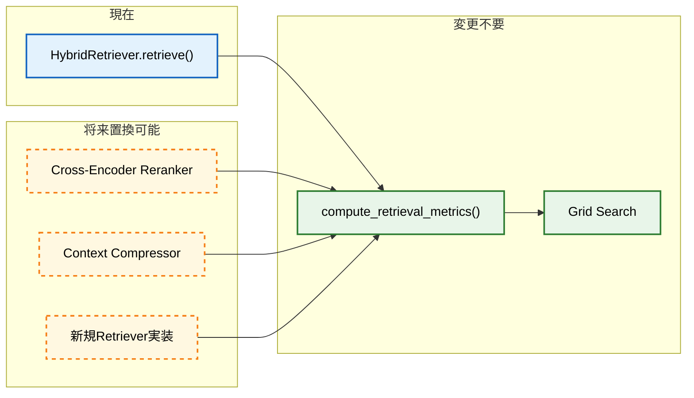
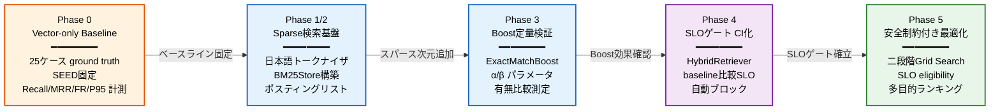
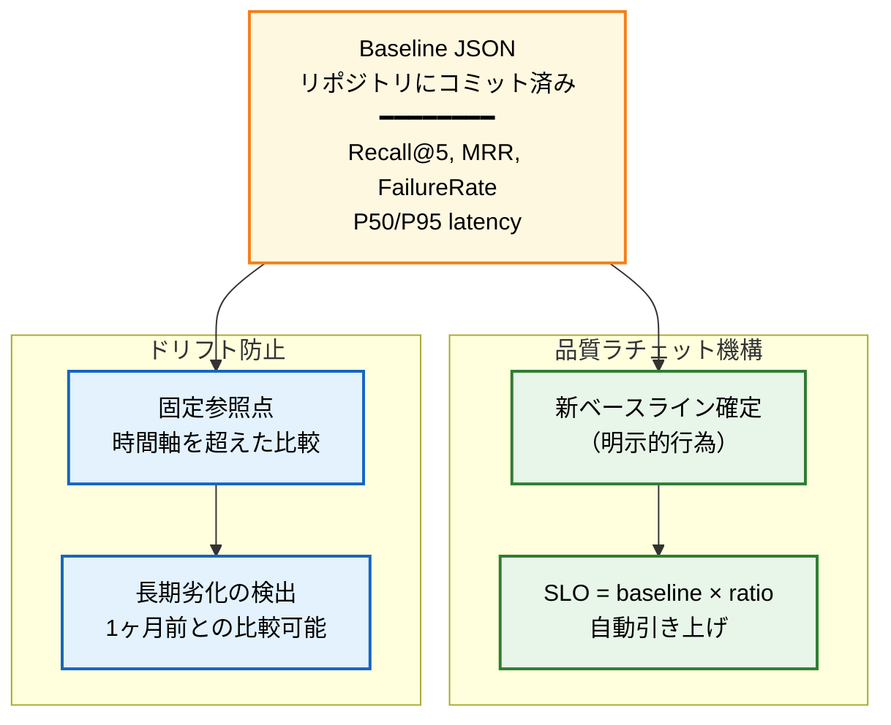
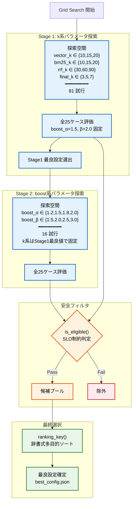
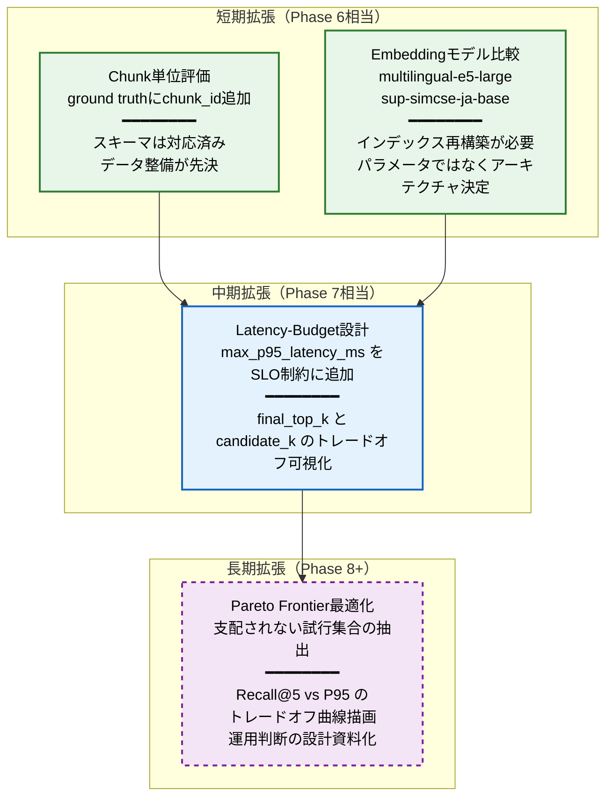

# Retrieval品質管理システム 全体設計書

**情報設計最適化版** | 作成日: 2026-03-02 | spec-rag-qa

---

## Executive Summary

> **3行サマリー**
> - Retrievalは「LLMに渡す事実コンテキストの純度」を制御する**ハルシネーション抑制の最終防衛ライン**である。
> - 検索エンジン層 → 測定・ゲート層 → 最適化層の**3層＋品質契約横断層**で構成され、Phase0〜5で段階的に信頼性を積み上げる。
> - 全設計判断を貫く原則は**「再現可能な比較」**であり、変更の善悪を定量的・自動的・継続的に判定する基盤を提供する。

### Retrievalが守るもの

- **事実性の根拠連鎖（provenance chain）**: 回答が「どのドキュメントの、どの記述に基づいているか」を検証可能にする。
- **LLMの出力品質**: Retrievalが失敗すると、LLMはコンテキスト不足を内部知識で補完し、**捏造が構造的に発生**する。
- **ビジネス上の意思決定の信頼性**: 「HTTP 409はメール重複」という事実が、学習パターンではなく`error_code_reference.md`から引用されることを保証する。

### LLM時代におけるRetrievalの役割転換

従来のIRとRAGにおけるRetrievalは、**評価基準が根本的に異なる**。

| 観点 | 従来のIR | RAGにおけるRetrieval |
|:---|:---|:---|
| **目的** | 文書を見つけること | LLMが正確に推論するための事実コンテキスト生成 |
| **評価主体** | 人間（検索結果の適合率） | LLMの下流タスク品質（応答の正確性） |
| **独立評価の必要性** | 低い（人間が直接判断） | **極めて高い**（LLM評価は高コスト・非決定的） |
| **本質的役割** | 情報アクセス | **精度と再現率のトレードオフを制御するバルブ** |

> **本質**: Retrieval品質をRecall@K・MRRで**代理評価**する設計は、LLM APIコスト・非決定性・ネットワーク依存を回避するための**工学的必然**である。

---

## 全体アーキテクチャ図（拡張版）

> **3行サマリー**
> - 3つの概念層（検索エンジン → 測定・ゲート → 最適化）と、全層を横断する**Quality Contract層**から構成される。
> - 各層は**一方向の依存関係**を持ち、下位層の実装を知らずに上位層が機能する疎結合設計である。
> - Phase0〜5は各層に分散配置され、段階的に品質保証の成熟度を引き上げる。



### レイヤー間の依存方向

- Layer 3 は Layer 2 の **測定結果を報酬信号** として消費する。
- Layer 2 は Layer 1 の **出力（citationsリスト）だけ** を受け取る。アルゴリズムを一切知らない。
- Quality Contract は **全レイヤーに横断的に参照** され、変更されると全フェーズの比較可能性が失われる。

> **なぜこの構造か**: 測定コードがRetriever実装に依存すると、**実装のバグと評価のバグが分離不能**になる。
> Layer間の独立性は「障害原因の局所化」のための設計制約である。

---

## レイヤー別責務表

> **3行サマリー**
> - Layer 1は「クエリを受けて上位Kチャンクを返す」実装レイヤーであり、アルゴリズム的多様性を担う。
> - Layer 2は「出力品質を数値化し、SLO違反を検知する」レイヤーであり、アルゴリズムに依存しない。
> - Quality Contract層は「評価一貫性の不変式」を担い、変更には明示的なベースライン再確定が必要である。

| レイヤー | 責務 | 知っていること | 知らないこと | Phase |
|:---|:---|:---|:---|:---|
| **Layer 1**<br/>検索エンジン層 | クエリから上位Kチャンクを返す | FAISS, BM25, RRF, Boost の実装詳細 | 品質指標の定義、SLO閾値 | Phase 0, 1, 2, 3 |
| **Layer 2**<br/>測定・ゲート層 | 出力品質の数値化、SLO判定 | `citations`リストと`expected_sources` | Retrieverの内部アルゴリズム | Phase 3, 4 |
| **Layer 3**<br/>最適化・調整層 | 超パラメータ空間の探索 | Layer 2の測定結果、探索空間定義 | なぜその指標値になったか | Phase 5 |
| **Quality Contract**<br/>横断層 | 評価一貫性の不変式 | Ground Truth, Baseline, SEED | 全フェーズの実装詳細 | 全Phase |

### 各レイヤーの拡張性設計



> **本質**: `compute_retrieval_metrics(cases, details)` は Retriever実装を知らない。
> `citations`リストを受け取り`expected_sources`と照合するだけ。
> Retriever実装を変更しても評価コードは**一切変更不要**である。

---

## フェーズ進化マップ

> **3行サマリー**
> - Phase0〜5は「機能追加の歴史」ではなく、**比較の信頼性を段階的に強化する歴史**である。
> - 各Phase は前Phase の出力を**固定された前提条件**として消費し、変数を一つずつ定数化していく。
> - この設計により、品質変化の帰属（どの変更が原因か）を明確にする**因果推論**が可能になる。



### 各Phaseの役割と設計根拠

#### Phase 0: 信頼できる出発点の確立

- **本質**: 「何もしない状態」の品質を最初に記録することが最重要。
- **なぜ**: ベースラインなき改善は「改善」と「変化」を区別する手段を持たない。
- **結果**: 以後全フェーズの比較基準（**絶対座標系**）が確立される。

具体的構成:
- **SEED=20260223** による決定論的コーパス生成（`DOC_SPECS` 15文書、うちノイズ3文書）
- **25ケース**の評価セット（evaluable 20、no-source 5）
- 8種のクエリタイプ: `factual_basic`, `paraphrase`, `priority_conflict`, `cross_doc`, `misleading`, `ambiguity`, `omission_detection`, `opinion_guard`
- Vector-only（FAISS + `all-MiniLM-L6-v2`）でのRecall@1, Recall@5, MRR, FailureRate, P50/P95 latency計測

#### Phase 1/2: スパース検索インフラの構築

- **本質**: Dense vectorが**固有表現の検索に弱い**という構造的限界への対処。
- **なぜ**: `USER_ID`、`HTTP 409`、`POST /api/signup`は意味的類似性ではなく**完全一致**で検索されるべき語彙。
- **結果**: 日本語BM25トークナイザ + ポスティングリストにより、Hybrid化のための基盤が整備される。

#### Phase 3: Boostメカニズムの定量的検証

- **本質**: `detect_special_tokens()`が識別する特殊語彙に対する**BM25スコア加算**の効果検証。
- **なぜ**: Boostが「効いている」ことを示すには、**Boost有/無の同一クエリセットでの比較**が不可欠。
- **結果**: `boost_alpha`（単一ヒット加算）と`boost_beta`（全語ヒット加算）の設計根拠が数値で確立される。

Boostスコア計算式:
```
bm25_boosted = bm25_raw + α × exact_hit_count + β × all_hit_flag
```

#### Phase 4: SLOゲートのCI/CD統合

- **本質**: 手動品質チェックから**機械的閾値判定への移行**。
- **なぜ**: 手動チェックはレビュアーの注意力とスケジュールに依存し、品質が揺れる。
- **結果**: コミットごとに品質保証が**自動**で実行され、SLO違反はマージをブロックする。

SLO閾値:
- `Recall@5 ≥ baseline × 0.90`
- `MRR ≥ baseline × 0.90`
- `FailureRate ≤ baseline × 1.20`

#### Phase 5: 安全制約付き最適化の体系化

- **本質**: Phase 4の「**現状を守る**」に対して、Phase 5は「**より良くする**」ための探索エンジン。
- **なぜ**: 無制約な最適化は評価セットへの過学習を招くため、**SLO通過が探索の前提条件**。
- **結果**: 「改善を求める行為がシステムを壊す」矛盾を**構造的に防止**する。

---

## 品質統治構造図

> **3行サマリー**
> - ベースラインの固定は「退行とは何か」を定義するための**設計上の制約**である。
> - SLOは数値目標ではなく**品質の契約**であり、違反すればリリースが自動停止する。
> - 実験（Grid Search）と本番保護（PRゲート）は**トリガー・責務・コスト構造が異なる**ため分離される。

### ベースライン固定の設計意図



#### なぜベースラインを固定するのか

- **本質**: 評価基準の可変性は**リスクそのもの**。
- **なぜ**: 毎回再計算されるベースラインは「今より良ければ良い」という相対基準になり、**長期的なドリフトを検出できない**。
- **結果**: 固定ベースラインは時間軸を超えた絶対的参照点として機能する。

技術的には、ベースラインファイルはリポジトリにコミットされている。
CI環境でも**同一バイトの参照が保証**される。
環境差異（ローカルでは通る、CIで落ちる）の影響を局所化する。

#### なぜSLOを設けるのか

- **本質**: SLOは数値目標ではなく**品質の契約**。
- **なぜ**: 目標は努力方向を示すだけだが、SLOは「下回ればリリースが止まる」ことで**人的要因を構造的に排除**する。
- **結果**: ベースライン刷新 → SLO自動引き上げ → 退行不許可、という**品質ラチェット**が成立する。

SLOは絶対値ではなく**ベースラインに対する比率**で定義される。
この設計の意図:  ベースライン品質が向上したときSLOも**自動的に引き上げ**られる。

### PR vs Nightly の責務分離

| 観点 | PRゲート (`ragqa-quality-gate.yml`) | Nightly探索 (`phase5-grid-search.yml`) |
|:---|:---|:---|
| **トリガー** | push / pull_request | cron `0 2 * * *` / workflow_dispatch |
| **責務** | 変更が既存品質を**破壊しない**ことの確認 | 新しい最良設定を**探す**積極的探索 |
| **性質** | 保守的チェック（**守り**） | 積極的探索（**攻め**） |
| **計算コスト** | 低（1回の全ケース評価） | 高（最大97試行 × 25クエリ） |
| **失敗時の影響** | PRをブロック | 結果を候補として蓄積、人間が採用判断 |
| **ジョブ構造** | unit-test → retrieval-gate → evaluate（直列） | 単一ジョブ |

> **なぜ分離するか**: 保守と探索の責務を同じトリガーで実行すると、**開発速度がGrid Search実行時間に束縛**される。
> PRゲートの3ジョブ直列は**フェイルファスト設計**（前段失敗で後段の無駄な計算を打ち切る）。

### 再現性担保の3軸

CI環境での再現性は3つの軸で担保される。

| 軸 | 機構 | 保証すること |
|:---|:---|:---|
| **データ再現性** | SEED固定の決定論的コーパス生成 | 同一コードで**同一バイト列**のドキュメント |
| **評価再現性** | Ground Truth・Baseline JSONのリポジトリ固定 | 評価ケースとSLO計算基準の不変性 |
| **モデル再現性** | `TRANSFORMERS_OFFLINE=1` + `actions/cache@v4` | `requirements.txt`変更なしなら**同一モデル重み** |

### オフライン実行制約の設計

- **本質**: Retrieval評価は**全てローカル計算で完結**させ、LLM評価（OpenAI API）とは分離する。
- **なぜ**: LLM APIはコスト発生、非決定的レスポンス、ネットワーク依存があり、PRゲートの中心に置くと**開発速度がAPI状態に依存**する。
- **結果**: Phase 4 retrieval-gateがPRブロッカーとして機能し、LLM評価は後段で実行。

> **トレードオフ**: Retrieval品質が良くてもLLM応答品質が悪いケースは検出できない。
> その検出はnightlyのend-to-end評価に委ねるという**役割分担**で対処。

---

## 最適化制御フロー図

> **3行サマリー**
> - Phase 5のGrid Searchは**二段階探索**（Stage1: k系パラメータ → Stage2: boost系パラメータ）で計算量を管理する。
> - 全試行はSLOフィルタを通過したもののみが候補となる**安全制約付き最適化**である。
> - 最良設定の選択は**辞書式多目的ランキング**で行い、優先順位自体がシステムの価値判断を表明する。



### なぜGrid Searchなのか

- **本質**: Grid Searchは最もナイーブだが、**再現性と説明可能性が最高**。
- **なぜ**: Bayesian Optimizationは確率モデルの更新に依存し、「なぜこのパラメータに収束したか」の事後説明が困難。
- **結果**: 全探索点が決定論的に評価され、**完全な監査証跡**として残る。

探索空間は**意図的に小さく**定義されている。
81試行（Stage1）+ 16試行（Stage2）= **最大97試行**でGrid Searchが現実的に完了するスケール。

### 多目的ランキングの優先順位

`ranking_key()` は以下の辞書式順序でソートする。
優先順位自体が**システムの価値判断**を構造的に表明している。

| 優先順 | 指標 | ソート方向 | 表明する価値判断 |
|:---:|:---|:---:|:---|
| 1 | **Recall@5** | 降順 | 必要な情報を見つけられるかが**最重要** |
| 2 | **MRR** | 降順 | できれば最初の1件で見つかってほしい |
| 3 | **FailureRate** | 昇順 | 取りこぼしは少ないほど良い |
| 4 | **P95 Latency** | 昇順 | ユーザー体験の劣化を抑える |
| 5 | **Recall@1** | 降順 | 一発命中の精度 |
| 6 | **trial_id** | 昇順 | 同一指標なら早い試行を優先(安定性) |

### 安全制約付き最適化の構造

- **本質**: `is_eligible()` によるSLOフィルタは、最適化に**実行可能領域の制約**を加える。
- **なぜ**: 制約なしだと「Recall@5は最高だがFailureRateがベースライン2倍」という設定が選ばれうる。
- **結果**: SLOを下回る設定は候補から除外され、**最適化が既存契約を破る自由を持たない**。

SLO eligibility 条件（AND）:
- `recall_at_5 ≥ baseline_recall_at_5 × 0.90`
- `mrr ≥ baseline_mrr × 0.90`
- `failure_rate ≤ baseline_failure_rate × 1.20`

`MIN_GAIN=0.01`（1%有意差フロア）は、ノイズレベルの変動を「改善」と**誤認することへの防御**。

---

## リスク管理マトリクス

> **3行サマリー**
> - 過学習リスク: 25ケースという小規模評価セットの**Goodhart's Law的罠**。
> - 指標依存リスク: Recall@5/MRRは「LLMの推論に役立ったか」を**直接測定していない**。
> - ベンチマーク劣化リスク: 合成コーパスと実コーパスの**ギャップが検証されていない**。

| リスク | 発生メカニズム | 影響度 | 現状の緩和策 | 残存リスク |
|:---|:---|:---:|:---|:---|
| **評価セットへの過学習** | 25ケースへの適合を最大化するGrid Search | **高** | 8種のクエリタイプ混在 | 定量的カバレッジ保証なし |
| **評価指標の不完全さ** | doc粒度のhit判定が楽観的バイアスを持つ | **中** | `parse_source_ref()`のchunk粒度対応 | chunk粒度ground truth未整備 |
| **合成コーパスのギャップ** | `_build_doc()`の人工文書が実仕様書の構造を再現しない | **中** | 意図的な曖昧語彙挿入 | 実コーパスとの相関未検証 |
| **ベンチマーク陳腐化** | コーパス拡張時にground truthが古い事実を期待 | **中** | Ground Truth固定による一貫性 | 自動更新メカニズムなし |
| **Flaky CI** | モデルDL失敗、HF側のバージョン変更 | **低** | `TRANSFORMERS_OFFLINE=1` + cache | キャッシュ期限切れ時の手動対応 |

### リスクの本質的分析

#### 過学習リスク（Goodhart's Law）

「評価指標が制御目標になった瞬間に、良い評価指標でなくなる」。

Grid Searchで発見される「最良設定」は、**この25ケースへの適合を最大化したもの**である。
現実の問い合わせ分布がこの25ケースと乖離していれば、最良設定は実使用では最良ではない。

現状の緩和策:
- 8種のクエリタイプによる**定性的多様性**
- `no-source` ケース（5件）でのハルシネーション検出

残存する課題:
- 定量的なカバレッジ保証がない
- 実クエリ分布との照合がない

#### 評価指標依存リスク

Recall@5・MRRは「正解ドキュメントが取得できたか」を測る。
「取得チャンクがLLMの推論に**実際に**役立ったか」は**測定していない**。

Recall@5=1.0 でも、取得チャンクが正解事実の前後数行であれば LLMは正解を導けない可能性がある。
doc粒度のhit判定は「そのドキュメントの**どこかの**チャンクが取得された」を意味し、正解事実チャンクの取得を意味しない。

#### ベンチマーク劣化リスク

合成コーパス（`_build_doc()`で生成）は意図的に検索を難しくする曖昧語彙を含む。
しかし実際の仕様書が持つ**構造的・文体的特性は再現されていない**。

この合成コーパスと実コーパスのギャップは、システムの評価結果の**外部妥当性**を制限する。

---

## 将来拡張ロードマップ

> **3行サマリー**
> - chunk単位評価とembeddingモデル比較が**精度向上の即効性が高い**拡張である。
> - latency-budget設計はSLOに**ユーザー体験次元**を追加する構造変更である。
> - Pareto frontier最適化は辞書式ランキングから**トレードオフ可視化**への進化である。



### 拡張の詳細

#### Chunk単位評価

- **現状**: ground truthは`expected_sources`に`doc_id`文字列を持つ。`doc_id#chunk_id`形式でのchunk粒度参照は`parse_source_ref()`で**解析可能**。
- **課題**: 現行25ケースは全てdoc粒度参照のみ。
- **必要な作業**: 「どのdocの何番目のチャンクが正解か」というchunk_id付きでground truthを**再定義**（アノテーションコスト増大）。
- **効果**: chunking戦略（chunk size, overlap）の最適化に**直接フィードバック**可能になる。

#### Embeddingモデル比較

- **現状**: `sentence-transformers/all-MiniLM-L6-v2` 単一固定。
- **候補**: `intfloat/multilingual-e5-large`, `cl-nagoya/sup-simcse-ja-base`, ドメイン特化fine-tunedモデル。
- **注意点**: モデル切り替えは**インデックス再構築**を伴い、通常のハイパーパラメータとは異なる探索コスト構造。
- **提案**: パラメータではなく**アーキテクチャ決定**として、別フェーズで評価すべき。

#### Latency-Budget設計

- **現状**: `p95_latency_ms`は多目的ランキング4番目で参照されるのみ。SLO制約には**含まれていない**。
- **必要な変更**: `build_slo_thresholds()`に`max_p95_latency_ms`追加 + `is_eligible()`にlatencyチェック追加。
- **トレードオフ**: `final_top_k`小 → 後段LLMトークン数減少 → E2Eレイテンシ改善、vs `candidate_k`大 → Retriever内部計算量増加 → Median latency上昇。

#### Pareto Frontier最適化

- **現状**: 辞書式ランキングで**最優先指標が最大な一点**を選ぶ。
- **拡張**: Pareto dominance checkで**支配されない試行集合**を抽出。
- **出力**: `report.json`に`pareto_frontier: [...]`フィールド追加。
- **価値**: Recall@5 vs P95のトレードオフ曲線を描くことで、**設計者が明示的にトレードオフ選択**できる設計資料になる。

---

## 用語集

> **3行サマリー**
> - 本アーキテクチャに特有の用語と、一般的な用語がこのシステムで持つ**固有の意味**を定義する。
> - 評価指標の定義を厳密に記載し、チーム間での**解釈のブレ**を排除する。
> - Phase番号と対応する構成要素の紐付けを明示する。

| 用語 | 定義 | 本システムでの文脈 |
|:---|:---|:---|
| **Recall@K** | 正解ソースがある評価ケースで、上位K件に正解docが1件以上含まれる割合 | K=5が主目的指標。K=1はランキング品質の補助指標 |
| **MRR** | 正解ソースがある評価ケースの reciprocal rank 平均 | 「最初に正解が現れる順位」の品質を測る |
| **FailureRate** | `1.0 - Recall@5` | Retrieval miss rate。SLO制約で上限管理される |
| **SLO** | Service Level Objective | 数値目標ではなく**品質の契約**。違反でリリース停止 |
| **Baseline** | Phase 0で計測されたVector-only品質値のJSON | 固定参照点。変更は明示的な再確定行為を要する |
| **Ground Truth** | 25ケースの質問・期待ソース・期待判定のJSON | 固定評価セット。品質比較の**絶対座標系** |
| **RRF** | Reciprocal Rank Fusion | Dense/Sparse結果を`1/(k+rank+1)`で統合する手法 |
| **ExactMatchBoost** | BM25スコアへの加算機構 | `α × exact_hit_count + β × all_hit_flag` |
| **SLO Eligibility** | Grid Search試行がSLO制約を満たすかの判定 | `is_eligible()` による事前除外フィルタ |
| **Quality Contract** | Ground Truth + Baseline + SEED の不変式 | 変更すると全フェーズの比較可能性が失われる |
| **コーパスアライメント** | Ground Truth内のdoc_idがインデックスに存在するか検証 | 不一致で即時終了。誤った高Recall報告を防止 |
| **Flaky Test** | 環境要因で非決定的に失敗するテスト | `TRANSFORMERS_OFFLINE=1`で根本対処 |

---

## このアーキテクチャを一言で表すなら

> **「再現性を基盤とし、安全制約に守られた、LLMハルシネーション抑制のための段階的測定エンジン」**

Phase0〜5の全過程は一つの問いに答えるための設計である:

**「今日の変更はRetrievalを良くしたのか、それとも悪くしたのか」**

その問いに対して**数字で、再現可能に、自動で答え続ける**ことが、このアーキテクチャの本質的使命である。

---

*本ドキュメントはPhase 0〜5の全実装を俯瞰した設計書の情報設計最適化版である。*
*各フェーズの詳細実装は `scripts/` および `src/ragqa/` の各ファイルを参照のこと。*
