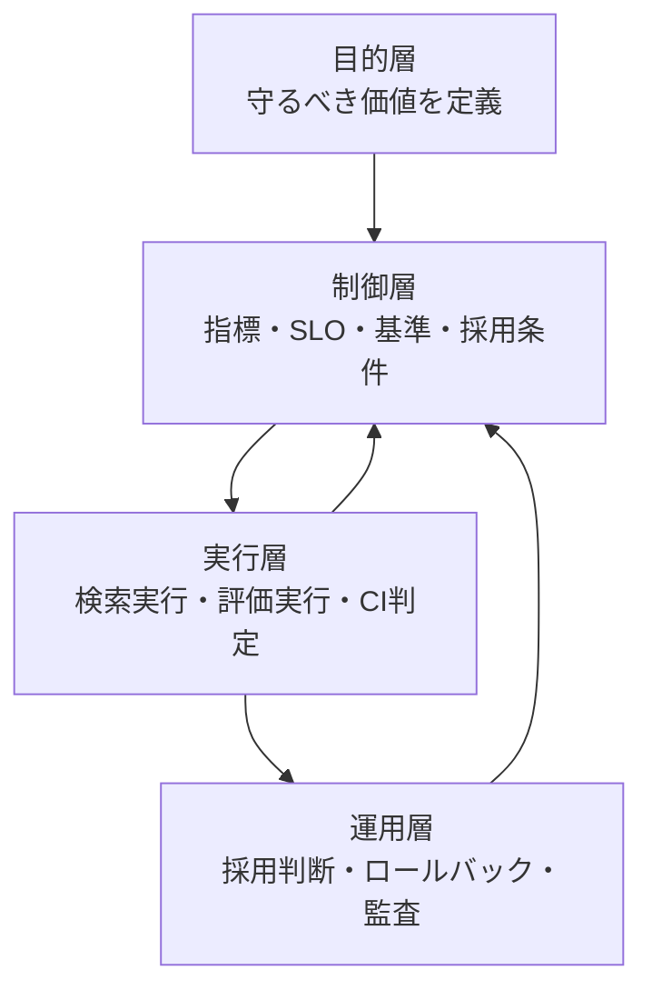
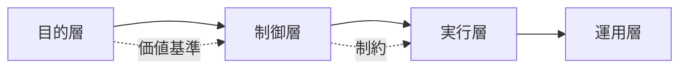
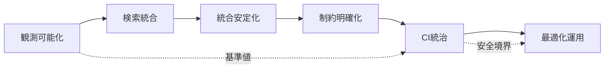
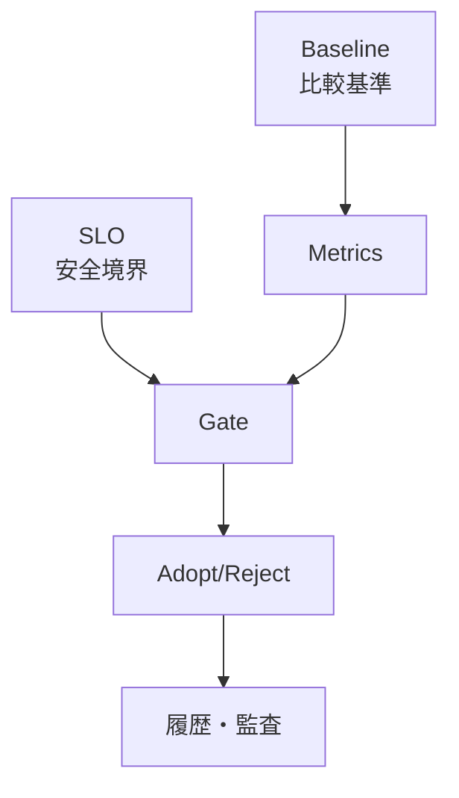
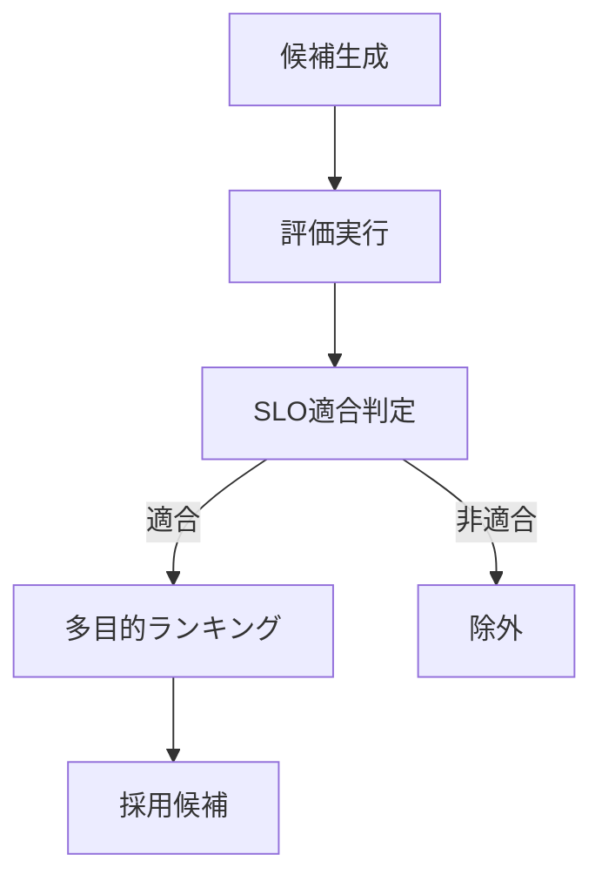
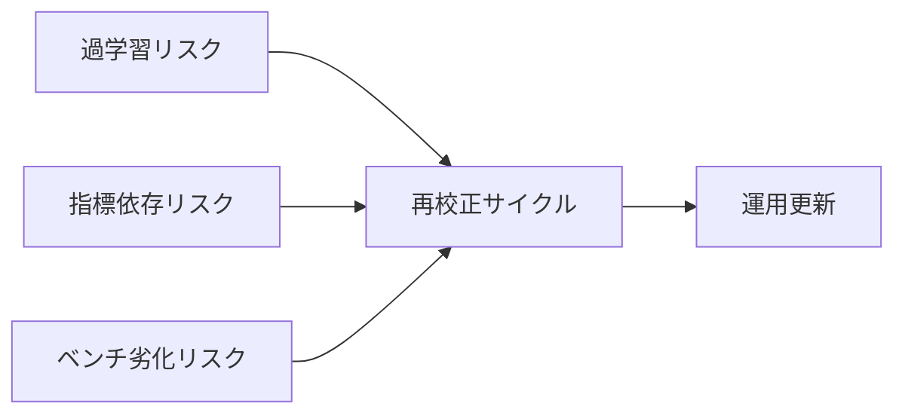
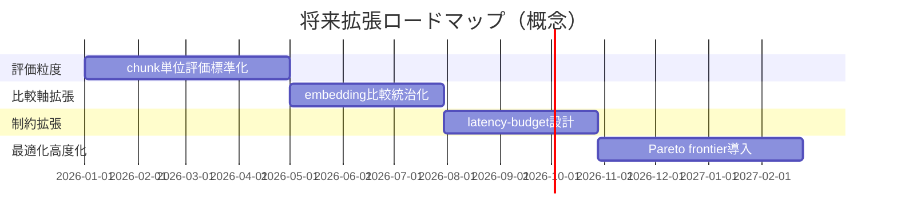
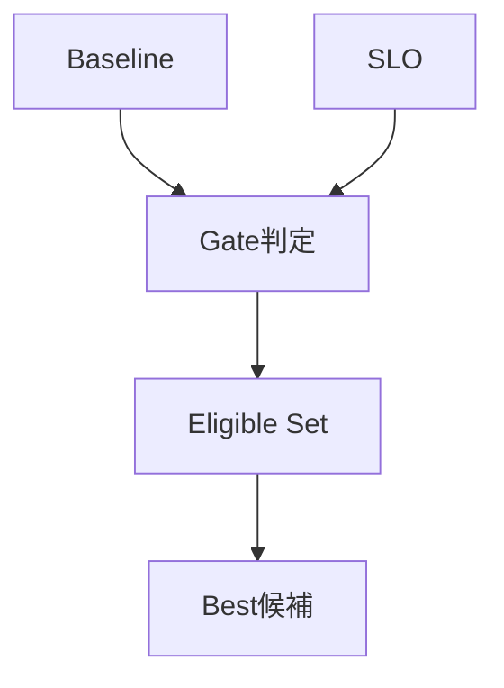

# Retrieval品質管理システム 全体設計書（情報設計リファクタ版）

## Executive Summary
- **3行サマリー 1:** このシステムは、検索精度の追求よりも、**業務判断に使える根拠の信頼性**を守るために設計されている。  
- **3行サマリー 2:** **探索（改善）**と**統治（安全境界）**を同一基盤で分離し、速さと安全性の衝突を制度で解く。  
- **3行サマリー 3:** 目的層・制御層・実行層を分離することで、モデル更新やコーパス変化があっても品質契約を維持する。  

### 本質
この設計の中心は、**Retrievalを生成の補助機能ではなく管理契約**として扱う点にある。  
LLMは表現を高品質化できるが、根拠到達そのものを保証しない。  
そのため、品質事故の主要因は文体ではなく根拠不整合になる。  

本システムは、回答の巧拙を評価の中心に置かない。  
代わりに、**根拠到達率・誤誘導耐性・再現可能性**を管理可能変数として固定する。  
この固定があることで、モデル差し替え時も品質議論の座標軸が失われない。  

### なぜ
LLM時代の失敗は、誤答そのものより、**正しそうに見える誤答**が高速に流通する点で深刻化する。  
人手レビューだけでは速度に追従できない。  
だからこそ、品質判定の権限を機械判定へ移管する必要がある。  

移管を成功させるには、判定基準を固定し、判定経路を再現可能にする必要がある。  
この設計は、その条件を運用上の仕組みに変換している。  

### 結果
結果として、改善施策は「速いかどうか」ではなく、**安全に採用できるか**で評価される。  
技術判断は事業判断へ接続しやすくなり、監査可能な履歴が残る。  
この構造は、単発改善ではなく継続運用に耐える。  

| 観点 | 従来のRAG改善 | 本設計 | 得られる効果 |
|---|---|---|---|
| 品質基準 | 暗黙・属人的 | **指標とSLOで明示** | 判定の一貫性 |
| 改善速度 | 速いが不安定 | 制約付きで管理 | 採用後の事故低減 |
| 説明責任 | レビュー依存 | 基準値で説明可能 | 監査容易性 |

---

## 全体アーキテクチャ図（拡張版）
- **3行サマリー 1:** アーキテクチャは、**目的層→制御層→実行層**の順で責務を固定する。  
- **3行サマリー 2:** フェーズは時系列ではなく、どの層の能力を確立するかで位置づける。  
- **3行サマリー 3:** 上位層の契約が下位層を拘束することで、実装変更時の自己崩壊を防ぐ。  

### 本質
本質は、アーキテクチャを機能分割ではなく**意思決定分割**として設計している点にある。  
目的層は「何を守るか」を固定し、制御層は「どう判定するか」を固定する。  
実行層はその判定を繰り返し実施する実務装置である。  

### なぜ
機能分割だけでは、改善時に評価規則まで同時変更されやすい。  
それでは、改善か基準変更かが混ざり、退行検知が無効化される。  
層分離はこの混在を防ぐための仕組みである。  

### 結果
下位の実装が変わっても、上位の契約が残る。  
このため、変更容易性と品質保証を同時に確保できる。  
改善の自由度は維持されるが、採用可否の論点はぶれない。  

| トレードオフ | 利得 | コスト | 設計上の対処 |
|---|---|---|---|
| 層を厳密分離する | 監査性・再利用性が上がる | 初期設計が重い | 役割を文書化し固定 |
| 実行層を単純化する | 運用が安定する | 局所最適化の自由度が減る | 実験系を別系統で確保 |

---

## レイヤー別責務表
- **3行サマリー 1:** レイヤー責務を明示する目的は、改善速度ではなく**責任境界の固定**である。  
- **3行サマリー 2:** どの層が何を決めてよいかを定義し、境界越えを禁止する。  
- **3行サマリー 3:** フェーズ依存は「成果物の継承」であり、「実装手順の継承」ではない。  

### 本質
責務表は、説明資料ではなく**逸脱検知装置**である。  
ある変更がどの層の権限かを即座に判定できる状態を作る。  
これにより、改善中の暗黙的な基準変更を抑止する。  

### なぜ
改善施策が複数人・複数PRで進むと、境界の曖昧さが品質事故の温床になる。  
特に評価軸と実行ロジックが同時変更されると、退行が不可視化される。  
責務表は、これを構造的に防ぐ。  

### 結果
変更レビューが「コードの巧拙」から「責務違反の有無」へ変わる。  
レビュー効率が上がり、議論の焦点が揃う。  
品質統治が人の記憶ではなく、構造に内蔵される。  

| レイヤー | 主責務 | 非責務 | 主要成果物 | 代表的な依存 |
|---|---|---|---|---|
| 目的層 | 守る価値の定義 | 手段選定 | 品質契約 | 事業要求 |
| 制御層 | 指標・SLO・採用条件 | 個別最適化 | 判定規則 | 目的層 |
| 実行層 | 計測・評価・探索実行 | 契約改定 | レポート・判定結果 | 制御層 |
| 運用層 | 採用判断・監査 | 指標定義変更 | 採用履歴 | 全層 |

| トレードオフ | 本質 | 対処 |
|---|---|---|
| 境界を厳密化すると速度が落ちる | 速度低下と引き換えに事故率を下げる | 実験系を分離して並列化 |
| 成果物を増やすと運用が重くなる | 監査可能性との交換 | 形式をテンプレート化 |

---

## フェーズ進化マップ
- **3行サマリー 1:** フェーズは機能の羅列ではなく、**品質保証能力の段階的獲得**として定義する。  
- **3行サマリー 2:** 後段フェーズは前段成果物を入力契約として依存し、依存を明示する。  
- **3行サマリー 3:** 進化の軸は「性能向上」ではなく「統治可能性の拡張」である。  

### 本質
進化の本質は、検索器を賢くすることではなく、**改善の採用条件を厳密化**することにある。  
観測可能化なしの最適化は、改善理由を説明できない。  
統治なしの最適化は、改善と退行を区別できない。  

### なぜ
段階を飛ばすと、速度は上がるが検証が崩れる。  
結果として、改善施策が運用を不安定化する。  
段階設計は、失敗コストを前段で小さく吸収するための戦略である。  

### 結果
進化の各段階で、次段に引き渡す契約が明確になる。  
そのため、後段で自由度を上げても、前段の保証が消えない。  
最終的に、改善は「実験」から「運用可能な提案」へ変換される。  

| 依存構造 | 依存の意味 | 破ると起こること |
|---|---|---|
| 観測可能化 → 統治 | 何を守るかを計測可能にする | 閾値が恣意化する |
| 統治 → 最適化 | 改善候補を安全集合に限定する | 高性能だが危険な候補が混入 |
| CI統合 → 継続改善 | 判定を人手から機械へ移す | 退行検知が遅延 |

---

## 品質統治構造図
- **3行サマリー 1:** 品質統治の中核は、**ベースライン固定**と**SLO境界**の分離運用である。  
- **3行サマリー 2:** ベースラインは比較基準、SLOは安全境界であり、役割を混同しない。  
- **3行サマリー 3:** 実験系と本番系を分離し、探索自由度と運用安定性の衝突を制御する。  

### 本質
統治は性能を抑えるためではなく、**採用判断の一貫性**を作るために存在する。  
同じ結果に同じ判断を返す構造がなければ、品質管理は成立しない。  

### なぜ
ベースラインとSLOを混同すると、改善の議論がすぐに感覚論へ戻る。  
また、実験と本番を混在させると、探索施策がそのまま障害要因になる。  
分離設計は、改善と運用の責務衝突を防ぐために必要である。  

### 結果
統治構造により、改善候補はまず安全境界で筛われる。  
境界を越えない候補のみが比較対象になるため、採用後の事故率が下がる。  
運用側は、採用理由を契約値で説明できる。  

| トレードオフ | 本質 | 期待効果 | 副作用 |
|---|---|---|---|
| 厳しいSLO | 退行抑止を優先 | 安全性向上 | 改善採用率が下がる |
| 緩いSLO | 探索自由度を優先 | 候補増加 | 本番リスク増加 |
| 実験/本番分離 | 役割衝突を回避 | 運用安定化 | パイプラインが増える |

---

## 最適化制御フロー図
- **3行サマリー 1:** 最適化は「最良値探索」ではなく、**安全制約下の候補探索**として扱う。  
- **3行サマリー 2:** 多目的指標を同時に扱い、単目的の暴走を防ぐ。  
- **3行サマリー 3:** 改善判定は差分閾値を明示し、微小差分の過大評価を防止する。  

### 本質
最適化の本質は、探索速度より**採用後の生存率**を最大化することにある。  
そのため、最適化対象は全候補ではなく、SLO適合集合に限定される。  

### なぜ
Recallだけを伸ばすと、ノイズ増加で実回答が悪化する。  
Latencyだけを削ると、根拠不足が増える。  
多目的最適化は、この競合を管理するために必要である。  

### 結果
結果として、最終候補は高性能であるだけでなく、運用品質境界を満たす。  
改善判定に差分閾値を入れることで、統計的に無意味な微小差を排除できる。  
これにより、改善主張の信頼度が上がる。  

| 指標 | 追求しすぎた場合のリスク | 制御方法 |
|---|---|---|
| Recall@5 | ノイズ増加 | Failure Rate と同時制約 |
| MRR | 上位偏重の過適合 | Recall との同時監視 |
| Failure Rate | 過度保守で改善停滞 | 下限ではなく上限管理 |
| p95 Latency | 品質劣化を伴う高速化 | 予算制約として統合 |

---

## リスク管理マトリクス
- **3行サマリー 1:** リスクは技術欠陥だけでなく、**統治設計の陳腐化**として発生する。  
- **3行サマリー 2:** 過学習・指標依存・ベンチ劣化を同時に監視し、単独最適化を避ける。  
- **3行サマリー 3:** 事後是正より、再校正サイクルを前提にした予防設計を優先する。  

### 本質
リスク管理の本質は、問題を列挙することではなく、**検知可能な兆候**を設計することにある。  
兆候が設計されていないリスクは、管理可能性を持たない。  

### なぜ
品質統治は時間経過で必ず陳腐化する。  
コーパス、問い合わせ分布、モデル特性が変化するからである。  
静的な基準は安心材料ではなく、遅延した劣化要因になる。  

### 結果
リスクは運用会議で発見する対象ではなく、パイプラインで継続観測する対象になる。  
その結果、対策は「発生後の議論」から「発生前の更新」へ移行する。  

| リスク | 発生トリガー | 先行指標 | 主対策 | 残余リスク |
|---|---|---|---|---|
| **過学習** | 固定ベンチ過最適化 | 本番乖離の増加 | 評価集合更新 | 局所最適の再発 |
| **指標依存** | 単一指標偏重 | 指標間乖離 | 多目的制御 | 重み設計の恣意性 |
| **ベンチ劣化** | 資産更新遅延 | 旧基準での過大評価 | 資産鮮度管理 | 更新コスト増 |

---

## 将来拡張ロードマップ
- **3行サマリー 1:** 将来拡張は機能追加ではなく、**統治可能な意思決定空間の拡張**として設計する。  
- **3行サマリー 2:** chunk粒度、モデル比較、遅延予算、Pareto最適化を統合し、競合指標を可視化する。  
- **3行サマリー 3:** 拡張の条件は、既存品質契約を壊さずに探索自由度を増やせることである。  

### 本質
拡張の本質は、アルゴリズムを増やすことではない。  
**選択可能な候補集合を、より安全に広げること**である。  

### なぜ
現在の文書粒度評価では、根拠粒度の誤りを見逃す余地がある。  
また、モデル比較を性能だけで行うと、統治契約との整合が崩れる。  
遅延予算とPareto管理は、この競合を制度で扱うために必要である。  

### 結果
将来は「最適な1点」を選ぶ運用から、**安全な候補集合を選ぶ運用**へ進化する。  
これにより、環境変化時の切り替えコストが下がり、運用継続性が高まる。  

| 拡張テーマ | 目的 | 期待効果 | 主なトレードオフ |
|---|---|---|---|
| chunk単位評価 | 根拠粒度の可視化 | 誤根拠検知精度向上 | 評価コスト増 |
| embedding比較 | モデル選定統治化 | 差し替え安全性向上 | 比較実験が増える |
| latency-budget | 遅延境界の明確化 | 運用SLA安定化 | 高品質候補の一部除外 |
| Pareto最適化 | 多目的競合の可視化 | 意思決定透明化 | 選択ルール設計が必要 |

---

## 用語集
- **3行サマリー 1:** 用語は説明のためではなく、**判断基準の共通化**のために定義する。  
- **3行サマリー 2:** 同じ語を同じ意味で使うことが、監査可能性の前提になる。  
- **3行サマリー 3:** 用語境界が曖昧だと、設計境界も曖昧になり統治が崩れる。  

### 本質
用語集の本質は、文書の補足ではなく**運用契約の辞書**である。  
定義が揺れないことで、判定と報告が再現可能になる。  

### なぜ
同じ語が文脈で意味を変えると、レビューと運用判断が食い違う。  
この食い違いは実装差異より厄介で、長期運用で累積する。  

### 結果
用語を固定すると、変更議論の速度が上がり、誤解コストが下がる。  
結果として、品質統治の運用密度を維持できる。  

| 用語 | 定義 | 重要性 |
|---|---|---|
| **Baseline** | 過去比較の参照点 | 退行判定の錨 |
| **SLO** | 運用上の安全境界 | 採用可否の下限契約 |
| **Eligible** | SLO適合集合 | 危険候補の除外 |
| **Multi-objective** | 複数指標同時最適化 | 単目的暴走の防止 |
| **Pareto Frontier** | 非劣解集合 | 候補選択の透明化 |
| **Latency Budget** | 応答遅延の許容設計 | 品質と性能の両立 |
| **Governance Loop** | 計測→判定→採用→監査の循環 | 継続運用品質の維持 |
